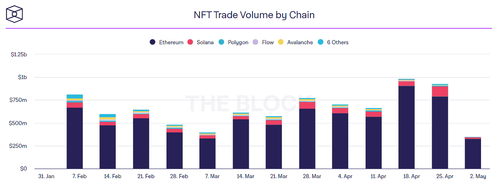

# 索拉纳——最新进展

> 原文：<https://medium.com/coinmonks/solana-latest-developments-ccaadd88e164?source=collection_archive---------10----------------------->

dailyhodl.com

# 介绍

在本文中，我们将研究索拉纳区块链上最近发生的事件，最近的网络崩溃和黑客攻击如何影响它，并评估它的未来潜力。

# 背景

索拉纳于 2017 年由阿纳托利·亚科文科创建，由索拉纳实验室建造，并得到了索拉纳基金会的援助，索拉纳基金会是一家总部位于瑞士的非营利组织，致力于发展社区和为发展融资。这家初创公司在 2020 年 3 月推出 Solana 'beta' mainnet 之前，在私人 A 轮融资中筹集了超过 2000 万美元。

索拉纳设计了塔 BFT 共识机制，其中包括委托证明的利害关系。Solana 的网络架构采用了历史证明，这是一个全球分散的“时钟”，用于为所有参与者创建一个通用的时间表，它将网络扩展到 400 毫秒的块时间，使 Solana 成为当今最快的加密货币，每秒约有 50k-65k 笔交易。

然而，索拉纳仍然有能力统治迅速崛起的密码领域吗？让我们来看看一些关键的发展。

# 索拉纳的定义

*图片来源:defillama.com(05 . 05 . 22)*

Solana 的 DeFi 生态系统价值刚刚超过 50 亿美元，拥有 63 个活动协议，使 Solana 成为 DeFi 中第五大区块链。此外，索拉纳的 TVL 年增长率高达 236%。

**以太坊虚拟机霓虹**

【neon-labs.org】图片来源:T4

为了进一步扩展和增强 Solana 的 DeFi 生态系统，该团队现在正在开发 Neon，这是 Solana 上第一个以太坊兼容的环境，预计将在 2022 年 Q2 奥运会上首次亮相。Neon Labs 在一轮私人代币销售中筹集了 4000 万美元，Jump Capital 在 2021 年 11 月领投了这一轮。

Neon 将使以太坊开发者能够在 Solana 上部署以太坊 dApps，而不需要修改智能合同，同时利用熟悉的编程语言和以太坊工具。由于以太坊拥有数百万用户，在 TVL 超过 1000 亿美元，超过 630 个 dApps，霓虹灯 EVM 将非常有利于进一步发展索拉纳的 DeFi 生态系统。

Neon 打算在其以太坊虚拟机上提供 4,500 TPS 的超低交易成本。

据 Neon 首席执行官 Marina Guryeva 称，一些著名的 DeFi 项目，如 SushiSwap(TVL 98 亿美元，其中 89 亿美元在以太坊上)，Aave(TVL 235 亿美元，其中 160 亿美元在以太坊上)和其他几个项目已经证实他们有兴趣在 Neon EVM 上部署。

为了支持霓虹灯 EVM 的早期采用，该团队正在创建一个赠款计划。

# NFT 市场份额

最大的加密收藏品数字市场 OpenSea 正式开始上市索拉纳区块链上制造的 NFT。

2022 年第二季度，NFT 公海交易量最近达到 32 亿美元，比 3 月份增长了近 30%。

*图片来源:theblockcrypto.com*

索拉纳见证了仅次于以太坊的第二大 NFT 交易量。根据以 Nikolaos Panigirtzoglou 为首的摩根大通分析师的说法，自 8 月份以来，索拉纳区块链一直在以以太坊为代价夺取最大的 NFT 交易量份额，以太坊上 NFT 的市场份额从 2021 年初的约 95%降至约 80%。

# 索拉纳博彩基金

*图片来源:news.coincu.com*

2021 年 11 月，索拉纳风险投资公司(Solana Ventures)与 FTX 和光速公司(Lightspeed)联手成立了一只 1 亿美元的 Web3 游戏联合投资基金。仅仅一个月后，Solana Ventures 宣布为 Solana 开发的游戏建立另一个 1.5 亿美元的投资基金。

这笔资金将促进对视频游戏开发商、科技公司以及区块链和游戏业交汇处的其他项目的投资。

第一批投资之一是对初创游戏开发商 Faraway 的投资。Faraway 最近发布了一款名为 Mini Royale: Nations 的游戏，该游戏拥有超过 200 万注册用户，据称是 Solana 上第一款多人在线游戏。对于 Mini Royale 来说，天空是极限，特别是基于浏览器的设计使用简单，并且集成了 NFTs 和加密令牌。潜力是巨大的，因为领先的移动免费游戏，如中国的王者荣耀和 PUBG Mobile，拥有多达 1 亿的日活跃用户。

除了《遥远的未来》的网络第一人称射击游戏《迷你皇室:国家》,索拉纳区块链还将推出许多新的加密游戏，包括科幻模拟明星阿特拉斯和以玩为赚的幻想游戏 Aurory。

# 索拉纳的幽灵钱包

*图片来源:phantom.app*

Phantom 是为 Solana 设计的非保管式加密钱包。在推出后的短短六个月内获得了超过 200 万的月活跃用户，Phantom 是增长最快的加密钱包，并有独特的机会成为主流的、用户友好的 Web3 网关。

根据 Phantom 首席执行官布兰登·米尔曼(Brandon Millman)的说法，Phantom 钱包在 2022 年 4 月底达到 300 万用户，预计在 2022 年底达到 1000 万至 5000 万用户。

幻影钱包现在可以在 iOS 和 Android 上下载，允许用户存储、发送和接收索拉纳的令牌和 NFT，以及赌注索拉纳的原生令牌 SOL，以获得激励。

Phantom 在 2022 年 1 月获得了由 Paradigm 领投的 1.09 亿美元 B 轮融资。这笔资金将用于加速用户和开发者加入 Web3，以及创新多链钱包用户体验和增加幻影团队。

# 索拉纳薪酬

【solana.com】图片来源:T4

Solana Pay 是由 Solana Labs 于 2 月 1 日推出的。使用区块链技术，顾客将能够直接从他们的加密钱包中存入稳定的硬币，如 USDC，而不需要中介。

Solana Pay 与 Circle 合作，Circle 是 USDC 背后的公司，是加密领域第二大稳定货币，完全由美元和美元计价资产支持，其储备由均富 LLP 公司定期验证。中心联盟的网站上有每月的证明。索拉纳是 USDC 的官方区块链。

然而，Solana Pay 正在进入一个由苹果和谷歌等科技巨头主导的现有支付应用的拥挤市场，那么他们有什么优势呢？

*   对商家来说，USDC 结算几乎是即时的，成本几乎为零，而标准支付网关需要 2 到 3 天才能完成结算。
*   商家可以使用 Circle Yield，它为存款现金提供高收益率，没有任何麻烦。与标准银行利率相比，商户每年可获得高达 4.6%的收益。
*   商家对消费者关系的基石:个性化的优惠，连锁忠诚度计划，以及伴随实物购买的独特的虚拟商品。例如，一名新顾客走进商店购买运动鞋。离开商店时，他们将拥有 NFT 版的新运动鞋，可用于他们选择的任何游戏或虚拟世界。当商店发布新的运动鞋时，顾客的电子钱包将有一个新的报价，提醒他们在商家的商店有新的运动鞋，以及个性化的报价。

然而不得不说，上述优势并不是索拉纳的专属。这项技术可能与任何其他智能合同区块链任何稳定的硬币。然而，给索拉纳一个优势的是通过与 Circle 的合作获得的机构支持。

**为什么圈子伙伴关系很重要？**

Circle 的 USDC 是市场上第二大稳定币，并获得了监管机构的批准。Circle 分别于 2015 年和 2016 年获得美国和英国政府颁发的虚拟货币牌照。此外，VISA 已于 2021 年正式与 Circle 合作。这种合作关系表明，Visa 现在可以使 USDC 成为 Circle 合作伙伴的结算货币。

Visa 的加密负责人 Cuy Sheffield 指出，即使后端性能有所改善，并且能够利用 USDC 余额，人们熟悉的 VISA 体验中面向消费者的方面也不会受到影响。

# 索拉纳基金会

*图片来源:solana.foundation*

2020 年 4 月，索拉纳基金会成立，其使命是推动分散技术作为公共产品的应用。索拉纳实验室将所有与该协议相关的知识产权和 1.67 亿溶胶转让给索拉纳基金会，并计划转让更多。

**赠款**

索拉纳基金会已经开始向有前途的团队提供资助，帮助他们建设从协议基础设施到最终用户应用的项目。

**教育和发展**

对教育和采用分散技术的普遍支持。索拉纳基金会启动了一个 2000 万美元的基金，与区块链基金韩国资本一起进一步扩大韩国的生态系统。

**开发**

为了发起这些努力，索拉纳基金会将支持制定索拉纳议定书。

**研究**

索拉纳基金会将与从事对分散技术发展至关重要的研究的团队合作。

# 集中化、黑客攻击、网络崩溃——这些对索拉纳意味着什么？

**网络崩溃**

索拉纳的网络有频繁和严重中断的历史。最近的一次中断是第七次，让索拉纳陷入停顿。根据索拉纳自己的追踪，今年七次断电中有六次发生在 1 月，即 1 月 6 日至 12 日之间。这些中断持续了八到十八个小时。

*图片来源:status.solana.com*

在这些网络不稳定的时期，由于交易无法在 Solana 的网络上完成，密码交易员往往无法出售他们的头寸，这是这种新兴技术在压力时期如何不可靠的又一个迹象。

**黑掉**

索拉纳遭受了最大的一次黑客攻击。它的虫洞是连接以太坊和索拉纳区块链的最受欢迎的桥梁之一，在 2022 年 2 月的一次明显的黑客攻击中损失了约 3.2 亿美元。

**集中化问题**

Solana 的创始人阿纳托利·亚科文科在一次采访中承认，SOL 只有一个服务提供商，所有的节点验证器都使用这个服务提供商，这引起了人们对网络安全的担忧。

Solana 上验证的另一个关键方面是操作验证器节点的能力。Solana 目前每秒可以处理高达 65，000 个事务，但是高吞吐量意味着运行验证器节点的硬件要求可能非常昂贵。索拉纳实验室现在建议验证器使用 12 核 CPU 和 128GB 内存，这可能要花费数千美元。

主要的问题是，尽管有这些缺陷，索拉纳为什么没有淡出人们的视线？

简单地说，索拉纳拥有巨大的资金和机构火力，这为他们提供了超越竞争对手的优势。

# 索拉纳的制度支持

索拉纳在一个拥挤的智能合同区块链领域竞争。需要强调的是，区块链行业仍处于早期阶段，谁会兴旺，谁会崩溃，谁也说不准。类似于早期互联网初创企业在网络繁荣时期的机构和金融火力，并不是一切，但肯定有所帮助。

**救助**

让我们回到索拉纳的虫洞利用。这是 DeFi 的第二大黑客攻击，但损失的资金很快由 Jump Crypto 补充，Jump Crypto 是有几十年历史的交易公司 Jump Trading Group 的加密货币部门。从虫洞黑客攻击中损失的价值 3 . 2 亿美元的资金得到了补充，这是迄今为止最大的 DeFi 紧急援助。

**ETPs &期货**

接下来，我们有 Solana ETPs(交易所交易产品)。

【21shares.com】图片来源:T2

从瑞士、德国、法国和荷兰交易所上市的 21 只索拉纳·ETP 股票(股票代码:ASOL)开始，市值 5500 万 AUM。随后，FTX 和 CoinShares 以 100 万索尔的种子资本推出实物入股的索拉纳 ETP 公司，该公司将在德国主要的数字市场 Xetra 上市。

2022 年 3 月，全球最大的交易所交易产品赞助商和资产管理公司之一 WisdomTree 将索拉纳(SOLW) ETP 公司在瑞士证券交易所 Xetra 和 SIX 以及泛欧交易所(Euronext)在阿姆斯特丹和巴黎上市。

最大的数字货币资产管理公司 race 与 gray Solana Trust 进入 SOL 竞赛。

全球最大的金融衍生品交易所 CME 集团表示，他们正在考虑推出索拉纳期货。

**圈&索拉纳**

*图片来源:centre.io*

中心联盟宣布索拉纳是 USDC 的官方区块链，尽管 USDC 近 80%的发行量目前在以太坊上使用。

如果美国政府的 CBDC 决定与 Centre Consortium 合作发行自己的数字美元，这一点尤其重要。

**FTX 撑腰**

*图片来源:索拉纳推特*

FTX 的 Sam Bankman-Fried 是一位加密亿万富翁，他最近还购买了一个流行的交易应用 robin hood 7.6%的股份，他一直支持索拉纳，甚至表示他认为索拉纳有可能成为“下一个比特币”。

由于批评者和支持者都在索拉纳网络问题上分享他们的观点，班克曼-弗里德在推特上指出，尽管该网络最近有缺点，但它仍然优于其他连锁店。据 FTX 老板说，索拉纳已经能够处理比所有其他主要网络加起来还多的交易。

早在 2020 年 7 月，FTX 和阿拉米达研究公司(也是由萨姆·B-F 创立)创建了 Serum 基金会，并宣布 Serum 是一种基于索拉纳的新型高速、非托管 DEX(分散式交易所)。在那之后，FTX 参与了索拉纳设立 1 亿美元的博彩基金，并推出了前面提到的索拉纳 ETP。

# 摘要

索拉纳有潜力，因为它有一个才华横溢的团队，一个速度极快、成本效益高、环境友好的区块链，最重要的是，还有重要的机构支持。此外，像索拉纳这样利害攸关的区块链享有广泛的政治和政府支持。

还应该指出的是，索拉纳目前处于测试状态。Solana mainnet 测试版最初于 2020 年 2 月上线，从那以后，它还没有正式离开这个测试期。

到目前为止，Solana 的所有网络故障都是可以修复的，预计到 mainnet 完全发布时情况也会如此。

应该注意的是，Solana 并不是特别分散，风投和内部人士拥有一半的股权。然而，在加密货币受到监管约束的时代，这可能是有利的。

有一点是肯定的:机构和监管者希望它成功，而且它有潜力做到这一点。

*免责声明:本文包含的信息仅用于教育目的，并不构成 Wheatstones 的任何形式的建议或推荐，用户在做出(或避免做出)任何投资决定时也不打算依赖这些信息。*