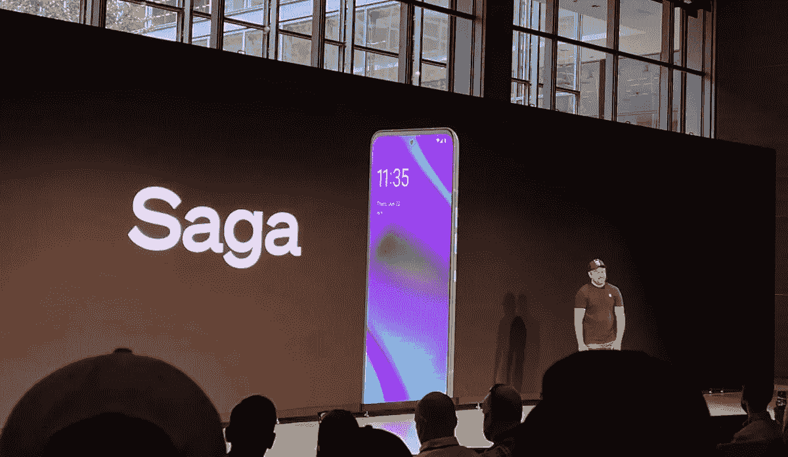

# Solana 推出 Saga 智能手机以改善加密货币与移动设备的关系

> 原文：<https://medium.com/coinmonks/solana-launches-saga-smartphone-to-improve-the-cryptocurrency-mobile-relationship-9ad5b0b5aefa?source=collection_archive---------12----------------------->

Solana Labs 是 Solana 区块链网络创始人和主要贡献者的代表公司，该公司迈出了一大步，宣布发布其面向 Android 移动设备的软件生态系统 [Solana Mobile Stack](https://solanamobile.com/) ，并透露将在新的一年推出一款名为 Saga 的 Android 智能手机。

索拉纳联合创始人兼首席执行官阿纳托利·亚科文科站在纽约市的礼堂前，宣布推出专注于 Android web3 的智能手机 Saga，这是一个类似史蒂夫·乔布斯的时刻。

> “这是我基本上认为该行业需要做的事情”，亚科文科说。“在比特币诞生 13 年后的苹果开发者大会上，我们没有看到一个加密功能”。

亚科文科开玩笑说，人们会在约会中途拿出他们的笔记本电脑，这样他们就不会错过来自 NFTs 的机会。“*所以我认为是时候让加密变成移动的*”亚科文科补充道。

Saga 旨在实现数字资产产品和服务，以便用户可以通过该设备轻松进行加密货币交易，而不是通过笔记本电脑浏览器。

> “一切都变得移动”，FTX 首席执行官山姆·班克曼-弗里德在活动上说。班克曼-弗里德说，在大多数国家，人们日常生活的大部分是通过手机进行的。然而，他说，如今从移动设备上获取加密产品的可能性并不大。

# Solana Mobole 堆栈(SMS)

除了 Saga 的声明之外，亚科文科还分享了 Solana Mobile Stack(简称 SMS)的发布，这是内置于手机中的 Solana 的 web3 层。

> Solana Labs 移动工程主管 Steven Laver 说:“Web3 仍然感觉像是在 2007 年。”。“[短信]可以为社区创造体验…将短信设备视为索拉纳的一等公民”。

Solana Mobile Stack (SMS)是一个开源软件包，旨在支持在 Solana 中创建的原生 Android 应用程序的开发。该套件包括移动钱包适配器，这是一种连接 Solana 移动钱包的协议。据该公司称，这项功能将适用于所有移动设备，而不仅仅是 Android。

另一个名为 Seed Vault 的新功能是一个用于保险库的软件解决方案，它可以保护 Android 设备上的私钥和密码(本质上是解锁加密货币资金的密码)以及其他敏感信息的安全。最后，该短信包括面向 Android 的 Solana Pay，可通过该平台实现移动支付。

# 索拉纳·戴普商店

Solana Labs 还将推出一个专为移动设备设计的新的 Solana dapp 商店，免费提供对 Solana 内置的 Web3 应用程序和钱包的轻松访问。SMS 开发工具包可供下载。

# Solana 移动堆栈的新功能

据该公司称，Solana Mobile Stack 将实现新的功能，如从任何地方切割(即创建和分发)NFT 资产，在 Solana 上更容易进行移动交易，更广泛地访问 Solana 的 DeFi 协议，以及在 Solana 网络上玩基于 Web3 的视频游戏的更多方式。

# 智能手机的价格是多少

这款手机预计零售价约为 1000 美元。索拉纳实验室接受 100 美元的保证金，并将优先考虑名单上的索拉纳开发者。早期购买者将收到限量版 NFT 标志着手机的发布。

亚科文科表示，这款售价 1000 美元的设备将拥有 512 GB 的存储空间，配有 6.67 英寸的有机发光二极管显示屏，可通过 100 美元的定金预订，并将于 2023 年在 Q1 交付。

作为 Solana Mobile Stack 发布的一部分，Solana 基金会将建立一个 1000 万美元的开发者生态系统基金，为手机开发者提供资助:

> “开发人员现在可以将 Solana 的功能带到我们的电脑上，放在我们的口袋里，而不仅仅是放在我们的背包里，”Solana 的联合创始人 Raj Gokal 在一次发布会上说，并补充说:“Solana 可以彻底改变我们的日常工作，但我们需要在我们的移动设备上开辟分散应用的可能性，以便利用这种潜力。”

这一声明也是在加密货币价格大幅下跌的行业困难时期发布的。亚科文科似乎意识到这种设备没有最主流的吸引力，但他认为这种设备可以接触到最专注的加密用户。

> “我们的目标是那些知道自我护理意味着什么的中坚力量。你需要从一个热爱这种产品的群体开始，并在此基础上成长。

*原载于 2022 年 6 月 25 日*[*【https://bitnewsbot.com】*](https://bitnewsbot.com/solana-launches-saga-smartphone-to-improve-the-cryptocurrency-mobile-relationship/)*。*

> 加入 Coinmonks [电报频道](https://t.me/coincodecap)和 [Youtube 频道](https://www.youtube.com/c/coinmonks/videos)了解加密交易和投资

# 另外，阅读

*   [Bookmap 评论](https://coincodecap.com/bookmap-review-2021-best-trading-software) | [美国 5 大最佳加密交易所](https://coincodecap.com/crypto-exchange-usa)
*   [如何在 FTX 交易所交易期货](https://coincodecap.com/ftx-futures-trading) | [OKEx vs 币安](https://coincodecap.com/okex-vs-binance)
*   [CoinLoan 评论](https://coincodecap.com/coinloan-review) | [YouHodler 评论](/coinmonks/youhodler-4-easy-ways-to-make-money-98969b9689f2) | [BlockFi 评论](https://coincodecap.com/blockfi-review)
*   [XT.COM 评论](https://coincodecap.com/profittradingapp-for-binance) | [币安评论](https://coincodecap.com/xt-com-review)
*   [SmithBot 评论](https://coincodecap.com/smithbot-review) | [4 款最佳免费开源交易机器人](https://coincodecap.com/free-open-source-trading-bots)
*   [比特币基地僵尸工具](/coinmonks/coinbase-bots-ac6359e897f3) | [AscendEX 审查](/coinmonks/ascendex-review-53e829cf75fa) | [OKEx 交易僵尸工具](/coinmonks/okex-trading-bots-234920f61e60)