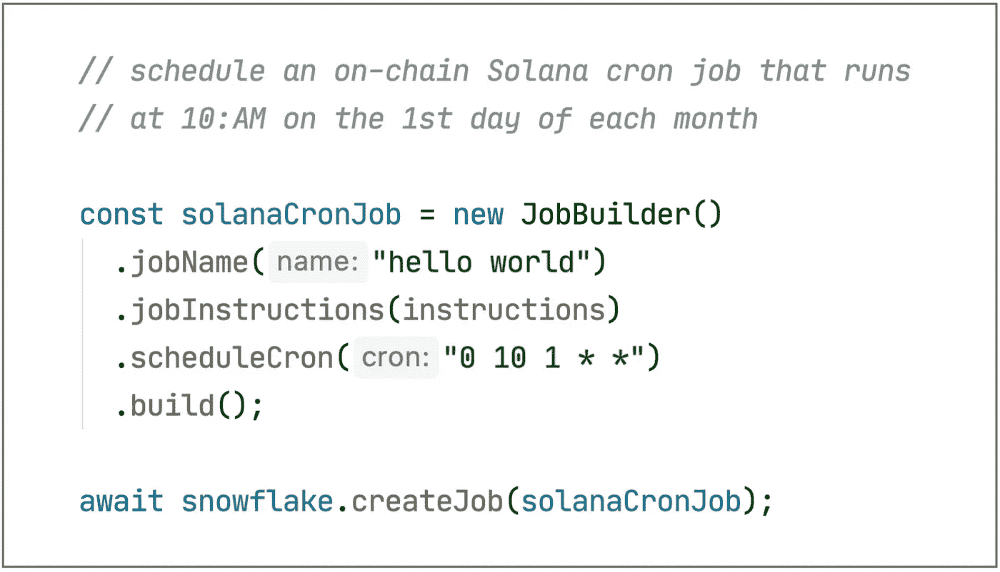
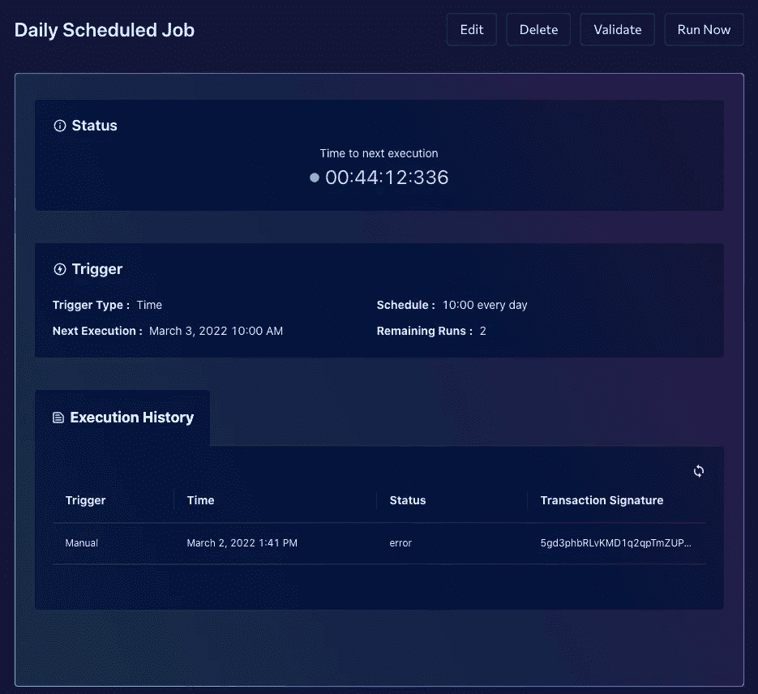

# 索拉纳链上克隆调度程序在这里

> 原文：<https://medium.com/coinmonks/solana-on-chain-cron-scheduler-is-here-7839b7d67c0?source=collection_archive---------6----------------------->

索拉纳链上克隆调度程序终于来了。在 Solana 上安排一个链上 cron 作业只需要 2 行漂亮的代码。



如果你想直接进入代码，我们的 SDK 就在这里。如果你想要一点介绍，那就喝杯茶继续读下去。

# 克朗乔布

Cron scheduler 是应用程序开发的重要组成部分，已经被许多 Web 2.0 开发人员广泛使用。每种语言和每个平台都有一个 cron 库，这是很常见的。想想 Linux 的 *crontab* ，NodeJS 的 *node-cron* ，Rust 的 *tokio-cron-scheduler* ，Amazon 的 *lamda* 等等。

如果您是构建在以太坊或 Solana 上的 Web 3.0 开发人员，您可能会问:

> 智能合约的 cron 调度程序相当于什么？

大多数时候，您得到的答案是智能合约中没有 cron 调度程序。建议的解决方法是构建你自己的外链服务，定期触发你的智能合约。这种方法可能适用于某些团队，但它是以巨大的开发成本、缺乏分散化和牺牲服务可靠性为代价的。一个链上的、分散的 cron 调度程序可以解决所有这三个问题——cron job 3.0 是昨天需要的。

> 毕竟，Web 3.0 的要点是在其所有部分 *去中心化**。***

# 为索拉纳量身打造的链条克朗乔

多年来，已经有许多尝试来解决这个具有挑战性的链上调度问题，主要是针对以太坊。像 [*以太坊闹钟*](https://ethereum-alarm-clock.readthedocs.io/en/latest/) 或 [*意式冰淇淋*](https://www.gelato.network/) 这样的协议随后也因此而产生。

作为 Solana 的建造者，我们从零开始建造一些不同的、独特的、令人愉快的东西。

> 我们希望一流的调度经验为索拉纳开发人员建立的目的。

雪花就是这样。

# 雪花在行动

雪花使得在 Solana 上安排连锁 cron 作业变得容易。您可以通过 Snowflake SDK 或使用 Snowflake Composer Dapp 以编程方式实现这一点。

## 雪花 SDK

为您的 web3 项目安装雪花 SDK。

```
npm i @snowflake-so/snowflake-sdk
```

安排一个将来一次执行一次的作业

```
const job = new JobBuilder()
  .jobName("hello world")
  .jobInstructions(instructions)
  .scheduleOnce(tomorrow())
  .build();

await snowflake.createJob(job);
```

使用 cron 表达式计划重复作业

```
const job = new JobBuilder()
  .jobName("hello world")
  .jobInstructions(instructions)
  .scheduleCron("* * * * *", 10)
  .build();

await snowflake.createJob(job);
```

调度基于开发人员程序中定义的任意条件触发的作业。

```
const job = new JobBuilder()
  .jobName("hello world")
  .jobInstructions(instructions)
  .scheduleConditional(1)
  .build();

await snowflake.createJob(job);
```

找份工作

```
await snowflake.fetch(jobPubkey);
```

你还可以做更多的事情。前往 Github 中的[雪花 SDK 了解更多信息。](https://github.com/snowflake-so/snowflake-sdk)

## 雪花作曲家

Snowflake Composer 使您可以轻松地创建、管理和监控您的 cron 作业。只需前往[https://devnet . snow flake . so](https://app-staging.snowflake.so/#/global)查看你的工作。



在[雪花网络](https://snowflake.so/)，我们的使命是让建设者在 Solana 上构建下一代自主 Dapps 想想循环支付、自动化产量农业、自主 NFT……过去需要几个月的智能合同开发和基础设施工程，现在只需两行代码就能实现。

我们很期待看到你下一步要做什么。在推特上给我们发[不和](https://discord.gg/9qWK2BNaMD)或[DM](https://twitter.com/snowflake_sol)。雪花团队将帮助您解决可能遇到的任何问题。