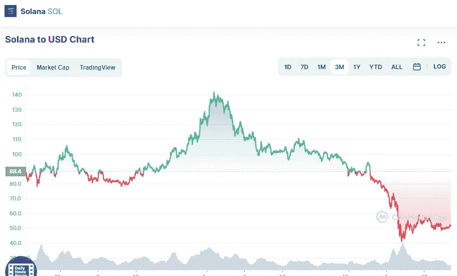

# 索拉纳价格分析 5 月 22 日

> 原文：<https://medium.com/coinmonks/solana-price-analyse-22th-of-may-2db7a98920ab?source=collection_archive---------15----------------------->

Source photo [Solana price today, SOL to USD live, marketcap and chart | CoinMarketCap](https://coinmarketcap.com/currencies/solana/)

最近，索拉纳的价格一直呈下降趋势。更重要的是，当市场波动性降低时，加密货币的价值会以更稳定的变化移动；在这种情况下，价格不易波动。因此，布林线的上限 91.8 美元是 SOL 最重要的障碍。

布林带的底端位于 32 美元，这是最大的…