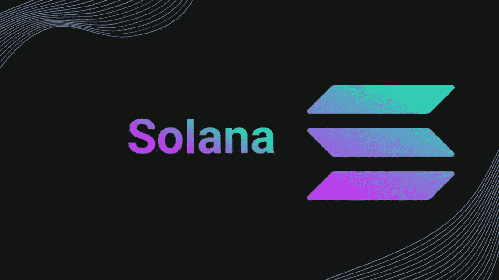

# 茄果类价格预测

> 原文：<https://medium.com/coinmonks/solana-price-prediction-63e6add467e4?source=collection_archive---------39----------------------->

Source photo [solana — Bing images](https://www.bing.com/images/search?view=detailV2&ccid=0bBdC8si&id=B6B1B40FE6AA0356CF7FF336E806411E95A0F0C7&thid=OIP.0bBdC8siAmTD7MgzNj51TgHaEK&mediaurl=https%3a%2f%2fcointopsecret.com%2fwp-content%2fuploads%2f2021%2f08%2fExploring-the-Solana-Ecosystem-Design-1068x601.jpg&cdnurl=https%3a%2f%2fth.bing.com%2fth%2fid%2fR.d1b05d0bcb220264c3ecc833363e754e%3frik%3dx%252fCglR5BBug28w%26pid%3dImgRaw%26r%3d0&exph=601&expw=1068&q=solana&simid=608027856009712050&FORM=IRPRST&ck=D8611AE3814D4E2D6903BEB9F9F19DA5&selectedIndex=0&ajaxhist=0&ajaxserp=0)

由于索拉纳最近的狂喜运行，投资者和交易者正在认真对待股票。尽管有这些限制和网络堵塞，SOL 的价格在去年还是上涨了 563.3%。另一方面，这种持续的下降给许多人敲响了警钟。

你对索拉纳·区块链的未来有什么担心吗？不要担心！正在分析 2022 年及以后的可靠价格预测。我们会…