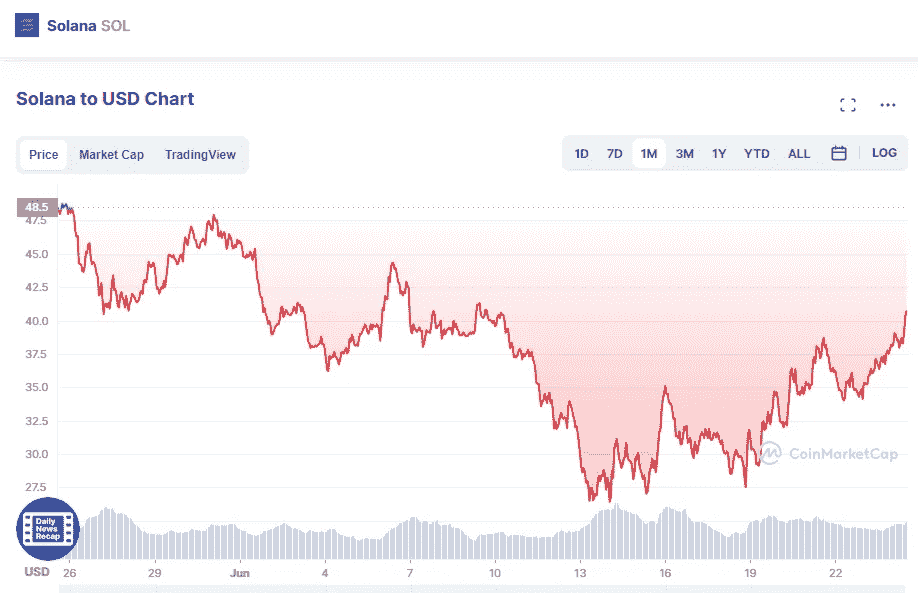

# 索拉纳(SOL)和卡尔达诺(ADA)价格分析 6 月 24 日

> 原文：<https://medium.com/coinmonks/solana-sol-and-cardano-ada-price-analyse-24th-of-june-e7e1e6997ad2?source=collection_archive---------35----------------------->

# 茄属植物

Source photo [Solana price today, SOL to USD live, marketcap and chart | CoinMarketCap](https://coinmarketcap.com/currencies/solana/)

索拉纳唯一的出路是在到达 27 美元支撑位后上涨。结果，溶胶的价格在上周上涨了 32%。因此，它是我们的首选。由于最近突破了 37 美元的阻力位，预计价格将很快尝试 44 美元的阻力位。