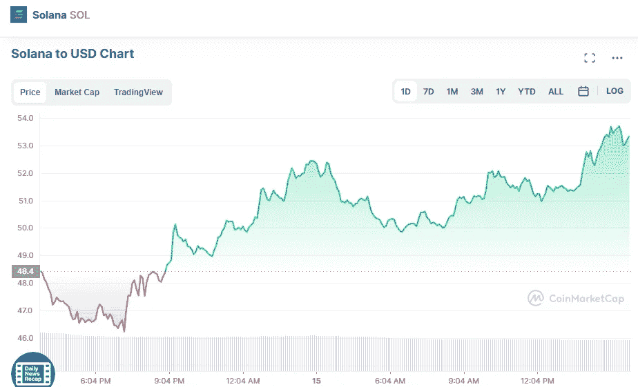

# Solana SOL，Cardano ADA 和 Terra LUNA 月 15 日价格分析

> 原文：<https://medium.com/coinmonks/solana-sol-cardano-ada-and-terra-luna-price-analyse-on-15th-of-may-e86d4cc64986?source=collection_archive---------15----------------------->

# 1.茄呢溶胶(+9.86%)

Source photo [Solana price today, SOL to USD live, marketcap and chart | CoinMarketCap](https://coinmarketcap.com/currencies/solana/)

# 市值 180.2 亿美元

Solana 的当前价格为 54.07 美元，24 小时交易量为 17.95 亿美元。

在过去的 24 小时里，索拉纳的使用率增加了 9.86%。