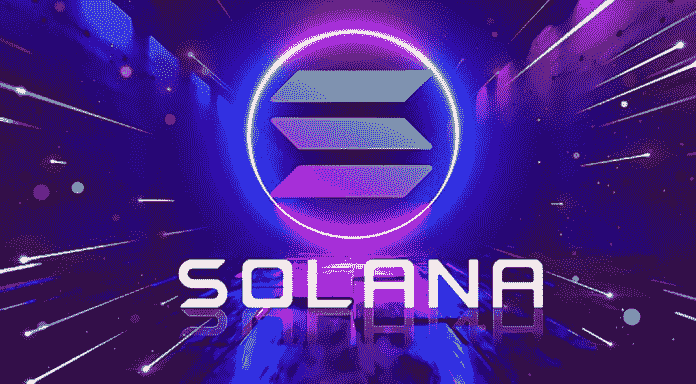

# sola(SOL)的开发人员正致力于网络更新，以应对最近的中断和问题

> 原文：<https://medium.com/coinmonks/solana-sol-developers-are-working-on-network-updates-to-combat-recent-outages-and-issues-a2de04888a47?source=collection_archive---------43----------------------->

索拉纳(SOL)计划引入一种新的收费系统，并对索拉纳区块链进行其他几项改进，作为解决其反复出现的问题和停机的努力的一部分。

根据索拉纳实验室的解释，索拉纳在周末遭遇了网络中断，当时索拉纳的主网测试集群“由于共识停滞而停止生产区块。”一些人所说的中断或“崩溃”对索拉纳来说是一个糟糕的时间，因为竞争对手[以太坊](https://bumblebeecrypto.com/2022/05/04/ethereum-2-0-deposit-contract-surpasses-10-of-total-eth-supply/)已经受到 2021 年 9 月和 12 月公开的网络和性能问题以及 2022 年 1 月的另一个问题的困扰。

Solana 实验室欣然承认，自 1 月初以来，网络遭受了“间歇性拥塞问题”,并表示这些问题是由于针对不可替代令牌(NFT)铸币厂的 bot 活动造成的。据[索拉纳(SOL)称，这也导致了最近的停电。](https://bumblebeecrypto.com/crypto-prices/)

*“大量的入站事务(每秒 600 万)涌入网络，单个节点的流量超过 100 Gbps。没有证据表明这是一次拒绝服务攻击，相反，有证据表明，机器人试图通过编程来赢得一个新的 NFT，这个新的是使用流行的糖果机程序铸造的。”*

Solana 还转发了 Twitter handle“@ solanastatus”的一份声明，解释了 4 月 30 日 7 小时的停电以及对问题原因的调查。

Solana 补充说，网络继续在交易请求水平上工作，交易请求水平是导致 9 月中断的水平的 10，000%，这是一个很大的改进，它归功于自去年 9 月出现问题以来对区块链的升级。

Solana 目前正在研究与核心协议相关的缓解措施，以缓解并可能解决网络遇到的问题。

*“为了影响对网络流量的控制，Solana 核心协议正在 QUIC 之上重新实施，QUIC 是由 Google 构建的一种协议，旨在实现 UDP 等快速异步通信，但具有 TCP 等会话和流量控制。一旦采用，将会有更多的选项可用于调整和优化数据接收。”*

此外，Solana 表示开发人员正在进行费用优先级工作的更新。

Solana 的费用优先级应该只影响特定的州，而不是整个街区。这创造了一个类似于“邻里费”而非“全球费”的系统。支付较高费用但由于已达到对帐户的最大写入限制而无法放入该块的后续交易被溢出并安排到下一个块，但与其他帐户交互的其他交易仍可添加到同一块，即使它们支付的费用较低。"

来源:BumbleBeeCrypto.com

> 加入 Coinmonks [电报频道](https://t.me/coincodecap)和 [Youtube 频道](https://www.youtube.com/c/coinmonks/videos)了解加密交易和投资

# 另外，阅读

*   最佳[区块链分析](https://bitquery.io/blog/best-blockchain-analysis-tools-and-software)工具| [赚比特币](/coinmonks/earn-bitcoin-6e8bd3c592d9)
*   [Cloudbet 赌场评论](https://coincodecap.com/cloudbet-casino-review) | [点火赌场评论](https://coincodecap.com/ignition-casino-review)
*   [加密套利](/coinmonks/crypto-arbitrage-guide-how-to-make-money-as-a-beginner-62bfe5c868f6)指南| [如何做空比特币](/coinmonks/how-to-short-bitcoin-568a2d0b4ae5)
*   [如何在加拿大购买加密货币？](https://coincodecap.com/how-to-buy-cryptocurrency-in-canada)
*   [无聊猿游艇俱乐部(BAYC)回顾](https://coincodecap.com/bored-ape-yacht-club-bayc-review) | [拜比特 vs 比特币基地](https://coincodecap.com/bybit-vs-coinbase)
*   [5 款最佳加密交易终端](https://coincodecap.com/crypto-trading-terminals) | [最佳 DeFi 应用](https://coincodecap.com/best-defi-apps)