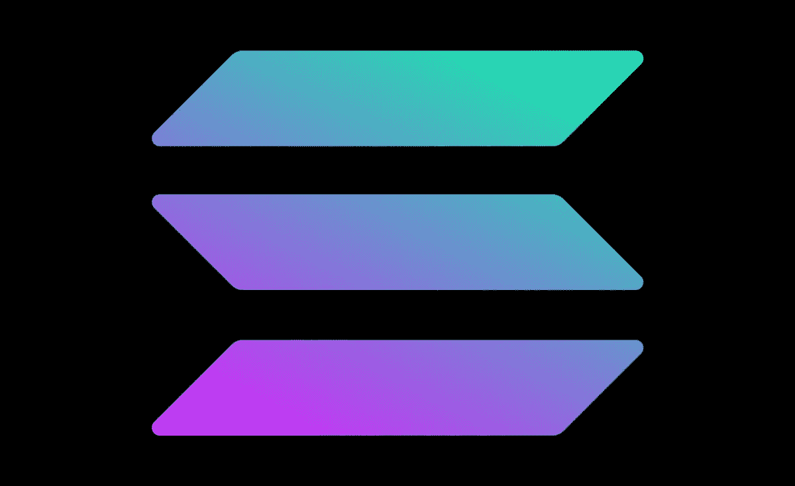

# 索拉纳(SOL)在 60 秒内解释道

> 原文：<https://medium.com/coinmonks/solana-sol-explained-in-60-seconds-aaf0835b4f91?source=collection_archive---------30----------------------->

SOL 是第一个拥有优化共识协议的区块链，这意味着它可以处理比其他区块链更多的交易。它还拥有独特的股权证明算法，可以提高交易速度，降低费用。

Solana 提供快速、可伸缩和廉价的交易。SOL 的阻塞时间为 400 毫秒，这意味着 Solana 网络在确认交易方面非常快。为了让你知道索拉纳有多快，以太坊的封锁时间是 10 秒，比特币是 10 分钟。它每秒钟也能处理比 Visa 更多的交易。Solana 每秒可以处理 710，000 笔交易，而 Visa 每秒只能处理 23，666 笔交易。最后，索拉纳的交易费非常便宜，只有百分之一便士。

总之，索拉纳是闪电般的速度，怪物和廉价。

 [## 你准备好迎接加密经济了吗？加密派

### 每次你打开新闻，阅读报纸，或者浏览你的推特，你很可能会看到一些故事…

www.thecryptopie.com](https://www.thecryptopie.com/) 

> 加入 Coinmonks [电报频道](https://t.me/coincodecap)和 [Youtube 频道](https://www.youtube.com/c/coinmonks/videos)了解加密交易和投资

# 另外，阅读

*   [Cloudbet 赌场评论](https://coincodecap.com/cloudbet-casino-review) | [点火赌场评论](https://coincodecap.com/ignition-casino-review)
*   [加密套利](/coinmonks/crypto-arbitrage-guide-how-to-make-money-as-a-beginner-62bfe5c868f6)指南| [如何做空比特币](/coinmonks/how-to-short-bitcoin-568a2d0b4ae5)
*   [如何在加拿大购买加密货币？](https://coincodecap.com/how-to-buy-cryptocurrency-in-canada)
*   [无聊猿游艇俱乐部(BAYC)回顾](https://coincodecap.com/bored-ape-yacht-club-bayc-review) | [拜比特 vs 比特币基地](https://coincodecap.com/bybit-vs-coinbase)
*   [5 款最佳加密交易终端](https://coincodecap.com/crypto-trading-terminals) | [最佳 DeFi 应用](https://coincodecap.com/best-defi-apps)
*   [比特币基地 vs 瓦济克斯](https://coincodecap.com/coinbase-vs-wazirx) | [比特鲁点评](https://coincodecap.com/bitrue-review) | [波洛涅克斯 vs 比特克斯](https://coincodecap.com/poloniex-vs-bittrex)