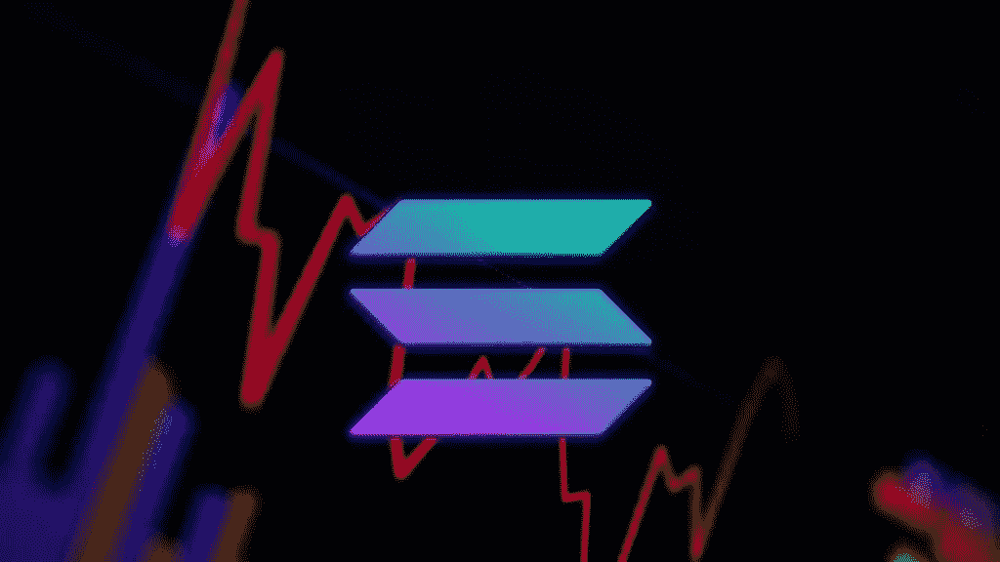

# 索拉纳(SOL)又遭遇了一次网络故障，这是本月的第二次

> 原文：<https://medium.com/coinmonks/solana-sol-suffers-another-network-outage-its-second-in-a-month-e939e9a1d9fe?source=collection_archive---------25----------------------->

Solana (SOL)在过去一个月中遭遇了第二次停电，SOL 的价格在此之后下跌了 12%以上。

最近的索拉纳停电标志着 2022 年内的第五次停电，今年迄今平均每月近 1 次。在过去的 12 个月中，索拉纳区块链号至少发生了 7 次不同的停机事件，这让索尔区块链号度过了艰难的一年。Solana 被许多人称为潜在的“以太坊黑仔”,显然，在名副其实之前，它还需要做一些工作来确保其网络的安全，并保持其可靠性和正常运行时间。

# 什么导致了最近的索拉纳停电？

据 SOL 开发者称，今天 sola(SOL)的中断显然是由一个 bug 引起的。由于 6 月 1 日世界协调时 16:55 分批量生产停止，一个 bug 使索拉纳区块链再次离线。根据 status.solana.com 的[上列出的事件](https://status.solana.com/incidents/m6qzbgc7np9b)  报告，随着验证机操作员设法在世界协调时 21:00 左右重启主网，最近的这次中断持续了大约四个半小时。

索拉纳实验室的联合创始人阿纳托利·亚科文科也在下面的一条推文中对此次中断发表了评论:“持久 nonce 指令导致网络的一部分认为屏蔽无效，无法达成共识。”

*索拉纳实验室的联合创始人在推特上发布关于最近停电的消息*

根据 Solana 的官方文件,“持久事务随机数”本质上是一种解决事务块散列的典型短生命周期的机制。该功能中的一个错误导致节点生成不同的输出，从而导致共识失败，这实质上导致了最近的中断或停机。

Solana 区块链随后在没有启用该功能的情况下重启，根据亚科文科的说法，对该漏洞的修复“将尽快出来”。

Solana 的中断在加密社区引起了一些骚动，许多负面评论通过 twitter 页面指向 Solana。根据 coinmarketcap 的数据，溶胶价格下跌超过 12%,跌至 40 美元以下。索尔加密货币已经从 2021 年 11 月 260 美元的历史高点下跌了 85%。

# 索拉纳·区块链时钟比实际时间慢 30 分钟:

除了断电和增加索拉纳的痛苦，索拉纳区块链时钟现在慢了，比现实世界的时间慢 30 分钟。索拉纳状态网站已经声明，“链上的时间继续落后于挂钟，由于比正常时间长。”

来源:BumbleBeeCrypto.com

> 加入 Coinmonks [电报频道](https://t.me/coincodecap)和 [Youtube 频道](https://www.youtube.com/c/coinmonks/videos)了解加密交易和投资

# 另外，阅读

*   [币安 vs FTX](https://coincodecap.com/binance-vs-ftx) | [最佳(SOL)索拉纳钱包](https://coincodecap.com/solana-wallets)
*   [比诺莫评论](https://coincodecap.com/binomo-review) | [斯多葛派 vs 3Commas vs TradeSanta](https://coincodecap.com/stoic-vs-3commas-vs-tradesanta)
*   [Capital.com 评论](https://coincodecap.com/capital-com-review) | [香港的加密借贷平台](https://coincodecap.com/crypto-lending-hong-kong)
*   [如何在 Uniswap 上交换加密？](https://coincodecap.com/swap-crypto-on-uniswap) | [A-Ads 评论](https://coincodecap.com/a-ads-review)
*   [WazirX vs CoinDCX vs bit bns](/coinmonks/wazirx-vs-coindcx-vs-bitbns-149f4f19a2f1)|[block fi vs coin loan vs Nexo](/coinmonks/blockfi-vs-coinloan-vs-nexo-cb624635230d)
*   [本地比特币评论](/coinmonks/localbitcoins-review-6cc001c6ed56) | [加密货币储蓄账户](https://coincodecap.com/cryptocurrency-savings-accounts)
*   [什么是融资融券交易](https://coincodecap.com/margin-trading) | [成本平均法](https://coincodecap.com/dca)