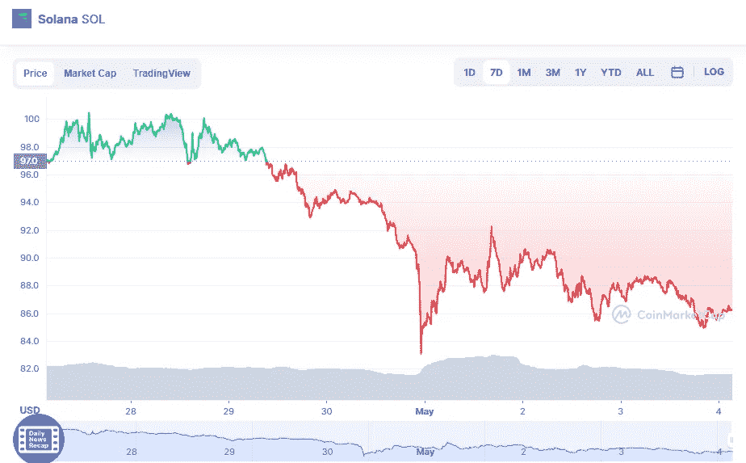

# 索拉纳溶胶技术分析 5 月 4 日

> 原文：<https://medium.com/coinmonks/solana-sol-technical-analyse-4th-of-may-d57073d7b62b?source=collection_archive---------37----------------------->

Source photo [Solana price today, SOL to USD live, marketcap and chart | CoinMarketCap](https://coinmarketcap.com/currencies/solana/)

在过去的几天里，索拉纳的价格分析已经进入了一个负面的波动。随着波动性的降低，硬币的价值也会降低，使得价格更少受波动的影响。因此，SOL 在布林带的上限 108.9 美元附近面临最大的阻力。而布林线的上限在 100 美元，SOL 的最大支撑在 94 美元。