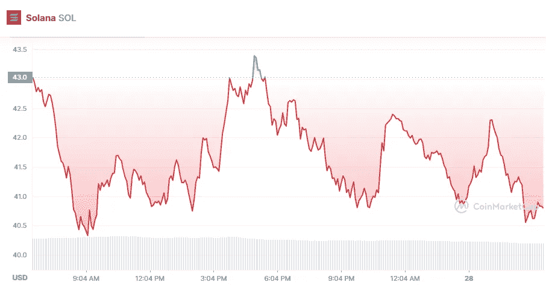

# 索拉纳技术分析 5 月 28 日

> 原文：<https://medium.com/coinmonks/solana-technical-analysis-28th-of-may-7e8fd88302c?source=collection_archive---------30----------------------->

Source photo [Solana price today, SOL to USD live, marketcap and chart | CoinMarketCap](https://coinmarketcap.com/currencies/solana/)

根据 Solana 的价格研究，在过去的 24 小时内，溶胶价格下跌了 5%，在 40.27 美元到 44.73 美元之间。目前，该数字资产的市值为 13，855，860，609.92 美元，交易量为 23 亿美元。该数字资产的市场份额为 1.18%，在数字资产市场份额中排名第九。