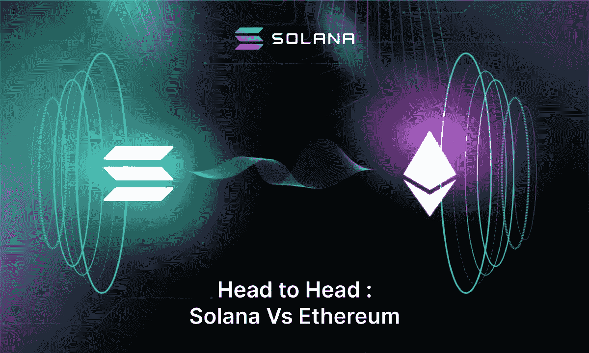
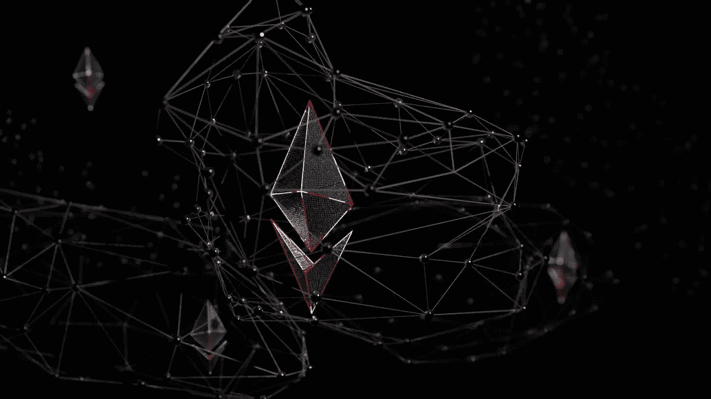
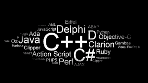
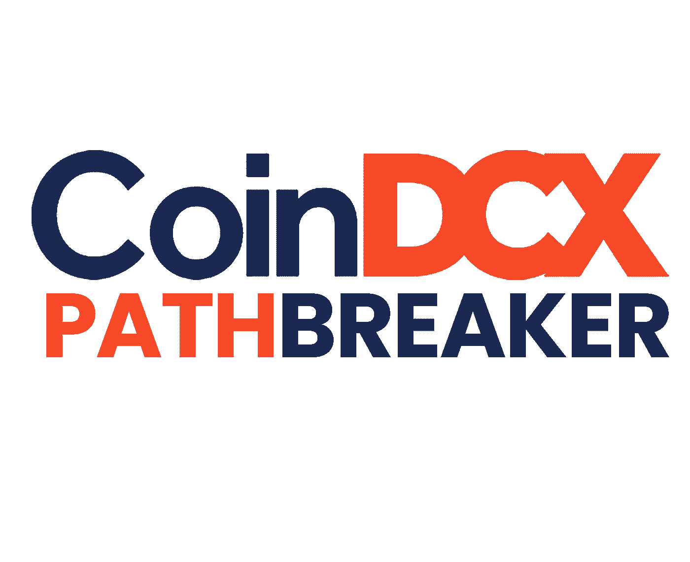

# 索拉纳对以太坊:L1 统治地位之战

> 原文：<https://medium.com/coinmonks/solana-versus-ethereum-the-battle-for-l1-dominance-3f88d06bd8c3?source=collection_archive---------13----------------------->

大约在 2020 年仲夏，第一层连锁店的战斗已经开始。在 2021 年的牛市之前，以太坊毫无疑问是分散金融(DeFi)的庞然大物。这似乎是合法的，因为它有先发优势。

***无论如何，时代在变。***

更重要的是，成为第一个并不总是好的。很明显，以太坊的建筑在大量的 dApps 的建造下一直在吱吱作响。在以太坊白皮书中，Vitalik 提出了目前通常被称为区块链三难困境的观点。基本上:你可以拥有速度、可伸缩性和安全性，但不能同时拥有这三者。这是我们一直试图用不同的 L1·区块链来解决的问题。

此外，很有可能最广告的竞争对手可能是索拉纳。当然，索拉纳是区块链的新秀。尽管如此，尽管只是一个孩子，它还是吸引了一大群持怀疑态度的人和精明的资金支持者。然而，让我们暂时忽略成本开发。在同等条件下，我们应该调查并努力找出哪一个是更好的区块链。

*我们走吧？*

**索拉纳对以太坊:破裂**

新鲜总是意味着糟糕。事实上，以太坊的发展意味着它有机会也有毅力与大量的去中心化应用(dApps)一起生活。大量的这些 dApps 也推动了不同链条上的类似企业。

**共识机制**

Solana 和 Ethereum 的共识组件不能再独特了。比特币和以太坊都利用了工作证明(PoW)。对于比特币这样的交易网络来说，这一切都很好，真的很棒，但以太坊不是这样。

以太坊的工作证明共识依赖于收尾模型，因此客户通过提供将他们的交换包括在下面的块中来竞争。在网络堵塞的季节，你可以想象这种模式可能造成的可怕的供应情况。此外，以太坊上疯狂的汽油支出会损害交易量。用它权力共识系统巩固这一点。这涉及到无休止的开采是能源密集型的。这就是为什么，随着 Eth2.0 的推出，网络正在向利益相关证明(PoS)迈进，据称将在几个月后实现。

*出于什么原因，PoS 被认为优于 power？*

嗯，对于一个人的目的来说，它不太集中精力。显然，PoS 共识的验证器不需要运行专门的设备硬件，而是需要有一个特定的最小度量的本地令牌链。你在网络中投入了多少可以保证你不会违背自己的利益。人们的想法是，作为一个恶意的艺人，你不会对你投入资源的同一个网络三思而行。作为回报，你会因帮助保护网络安全而获得报酬。

巧合的是，索拉纳已经使用了 PoS。此外，它还利用这个名为历史证明(PoH)的创新性小系统对其进行了整合。当我们检查可伸缩性时，我们将在下面更深入地讨论 PoH。目前，要认识到 SOL 和 ETH 都可以在它们各自的网络上使用。尽管如此，对索拉纳来说，加入两个共识成分使它的网络具有高性能。那么，当客户端在区块链上执行时，这里有什么意义呢？嗯，感觉就像要发生的事。很快。(就像，子弹头列车，这感觉不像区块链快。)我可以整天不停地谈论交易成本。索拉纳的交易费微不足道。

**插曲**

就个人时代而言，以太坊受益于 OG 区块链，在早期解决了许多技术难题。虽然网络可能会不时被阻塞，但它永远不会中断，因为它比大多数链更加分散。事实上，这对于解释以太坊与缩放的斗争很重要。这项事业仍然需要一个典型的加密客户端来选择在普通设备上运行以太坊集线器。在以太坊白皮书中，Vitalik 明显倾向于其 L1 网络的局限性。

索拉纳显然仍在经历成长中的痛苦。到现在为止，链家从上线到现在经历了几次免费。值得仔细看看这几集。

所有的关闭似乎都是由分布式拒绝服务(DDOS)攻击引起的。当一个恶意的艺人追逐一个决心要压倒它的网络时，就会发生 DDOS 攻击。在其中两起案件中，攻击者似乎有意指定了网络。结果呢？索拉纳关闭了几个小时，破坏了对我们的金融支持者的信任(他们在平静的沮丧中不禁皱起眉头)。

另一次关闭不是直接攻击的结果。在所有条件相同的情况下，在最初的 DEX 提供过程中，大量的机器人似乎使网络超载。据报道，事故发生时，该网络每秒交易量达到 40 万次。当我最初读这篇文章的时候，我一点也不知道什么会让我更加眼花缭乱。事实上，事故敲响了警钟，所有的头条新闻都集中在索拉纳坠机事件上。还是。我觉得报纸应该强调索拉纳选择处理高达 40 万 TPS 的方式。

**交易速度**

就交换速度而言，索拉纳独占鳌头。说实话，关于交易的处理，索拉纳是比赛中最快的区块链之一。这显然与网络架构有关。再明显不过了，以太坊专注于去中心化，而索拉纳专注于吞吐量。让我们调查一下这些数字。

截至目前，以太坊最多可以监督 30 个 TPS。相比之下，Solana 可以处理超过 50，000 TPS，没有崩溃的机会。需要了解如何面对签证？65，000 TPS，所以数字变得可以比较了。不感兴趣？想想时间刻度。Visa 已经运行了相当长的时间。相反，区块链是一项新兴技术。
此外，事情只是在升温。

*最后，觉得这些数字值得注意？*

然后，在这一点上，想象一下当以太坊报告说它可以选择处理 100，000 TPS 后混合时我的表情。我想，不可能。以太坊才出现了几年。实际上是去中心化的。此外，它声称它可以选择比 Visa 每秒多处理几千笔交易？

**编程语言**

用于在 Solana 上开发的基本编程语言是 Rust C 和 C++。相反，Solidity 是以太坊区块链的主要编程语言。简而言之，这是坚固性和生锈性的对比分析。

最重要的是，以太坊是最受 DeFi 和 NFTs 欢迎的区块链平台。很多 DeFi dApps 都是先在以太坊上建的(也就是有坚固性)。由于以太坊的流行，许多其他 L1 区块链需要通过允许开发者简单地移植他们基于可靠性的智能合同来模仿这一成就。具体来说，除了以太坊本身之外，还有各种兼容以太坊虚拟机(EVM)的区块链，它们与 Solidity 代码一起工作。其中包括像 Fantom Opera、Avalanche Contract Chain (C-Chain)和币安智能连锁(BSC)这样的流行连锁。因此，如果你想尝试学习一种巧妙的合同语言，可靠是一个可靠的赌注。还有助于我思考的是，我已经熟悉了像 Javascript 这样的网络语言。假设你也是，你将不会浪费时间在稳固上。

让我们将这与 Rust real speedy 进行对比，后者目前没有太多区块链明确的应用程序。无论如何，有几个中心问题对 Rust 有用:

1.它绝不是仅限于智能合约的语言。Rust 被用于许多非链应用，包括金融。世界上 Rust 开发人员比 Solidity 开发人员多。

2.铁锈越来越受欢迎。它目前被新 L1 连锁店使用，这些连锁店最近获得了大量的快速运输。尽管索拉纳，一对夫妇的例子是密切和土地。

但是，请记住，你需要花更长的时间来学习生锈。这是因为你需要先熟悉 Rust 句子的结构。扎实的语法是非常重要的。

**可扩展性**

关于可伸缩性，以太坊的根本问题是 PoW 需要一些投资和精力来确认。具体而言，预计所有中心将形成共识，确认区块链的现状。与索拉纳形成对比，索拉纳是一个无状态的链。

索拉纳可以忍受无国籍，因为它的 PoH 共识。PoH 涉及给事务打上时间戳，这保证了事务在顺序请求中得到确认。此外，假设它们在排列中会发生什么？您可以取消对当前状态的一致性检查。此外，还可以去掉 mempool。这是预期验证的块的非永久空间的名称，例如，它类似于块的中间状态。

摆脱了这些功能，Solana 可以更轻松、更轻松地进行扩展。出于同样的原因，Solana 不需要为任何第 2 层解决方案而烦恼。这很简单。然而，它有一个明显的弱点。

与以太坊相比，较少的枢纽意味着索拉纳更加集中。从规模上考虑去中心化是最理想的。不是所有的分权都是好的，也不是所有的集权都是糟糕的。他们有自己特定的用例，以及权衡。以太坊可伸缩性的另一个挑战来自 TVL。当然，就广告资本而言，以太坊无疑是冠军。

*尽管如此，这以后还有效吗？*

其他 L1 连锁店一直在蚕食以太坊在整个行业中的份额。这就是整合会让事情变得迷人的原因。就某个人而言，我想看看这次它是否真的会准时发射。第二，它会带来什么样的新问题？这还不清楚。另一个更真实的担忧是，像 Polygon 这样的 L2 解决方案是否会开始破坏以太坊基础层的 TVL。

***耐人寻味的事态发展。有趣的时代。***

**僵持结果**

索拉纳和以太坊是目前要关注的两个主要连锁店。虽然索拉纳已经非常快了，但它仍然不时受到网络空闲时间问题的困扰。以太坊已经向前发展了一段时间，但也开始揭示它可能有多古老。然而，所有人都在关注欧盟，关注它能否成功实现现代化和规模化。

INDIA’S SAFEST CRYPTO EXCHANGE

[# coindcxpathbaker](https://keep.google.com/u/0/#label/CoinDCXpathbreaker)

> 加入 Coinmonks [电报频道](https://t.me/coincodecap)和 [Youtube 频道](https://www.youtube.com/c/coinmonks/videos)了解加密交易和投资

# 另外，阅读

*   [ProfitFarmers 回顾](https://coincodecap.com/profitfarmers-review) | [如何使用 Cornix 交易机器人](https://coincodecap.com/cornix-trading-bot)
*   [如何匿名购买比特币](https://coincodecap.com/buy-bitcoin-anonymously) | [比特币现金钱包](https://coincodecap.com/bitcoin-cash-wallets)
*   [瓦济里克斯 NFT 评论](https://coincodecap.com/wazirx-nft-review)|[Bitsgap vs Pionex](https://coincodecap.com/bitsgap-vs-pionex)|[Tangem 评论](https://coincodecap.com/tangem-wallet-review)
*   如何使用 Solidity 在以太坊上创建 DApp？
*   [币安 vs FTX](https://coincodecap.com/binance-vs-ftx) | [最佳(SOL)索拉纳钱包](https://coincodecap.com/solana-wallets)