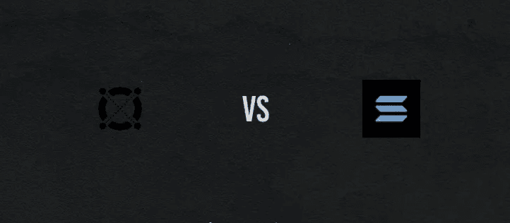

# 索拉纳 vs 埃尔隆德

> 原文：<https://medium.com/coinmonks/solana-vs-elrond-7d2c6e52e515?source=collection_archive---------2----------------------->

智能合约是所有加密技术中最热门的领域之一。

谁将成为智能合约平台中无可争议的王者？你们都知道主要的玩家:以太坊、卡尔达诺、波尔卡多特和币安智能链。

在接下来的几年里，有几个新成员不仅可能与大人物竞争，甚至可能取代大人物。

今天，两个具有巨大潜力的高性能第 1 层区块链将一决高下。这有望成为一场有趣的比赛。

今天我们让索拉纳和埃尔隆德对阵，他们是区块链最好的两位球员，正在慢慢走向巅峰。找出为什么我们喜欢这两种顶级硬币和它们独特的区块链技术。

今天的球队，我们必须在一场史诗般的比赛中为你提供最受欢迎的球队，通过乌克兰走出硅谷，今天的价值略低于 100 美元，所谓的以太坊杀手索拉纳及其本土令牌索尔。

在球场的另一边，直接从罗马尼亚通过瑞文戴尔，今天有点价值

不到 170 美元，就在锡比乌市，伟大而强大的埃尔隆德有着自己的象征 EGLD。

# 索拉纳

Solana 于 2020 年 3 月推出了 mainnet，但其背后的概念在 2017 年爆发，当时其创始人阿纳托利·亚科文科发表了爆炸性的白皮书。

亚科文科的天才在于找到了一种将时间片段编码成数据的方法。

这导致他创建了一个独特的、无需许可的系统，用于确定交易时间，被称为历史证明(PoH)。

为什么历史的证明如此改变游戏规则？当与股份证明(PoS)一起使用时，Solana 的分散时钟功能创建了一个独特的过程。

以可验证的事件顺序形式出现的一系列哈希事务。

这意味着区块链可以以令人难以置信的速度工作，而不会牺牲安全性或分散性。

说索拉纳在功能上是快速、高效或经济的，这是今年最保守的说法。

想想安德森·席尔瓦·区块链的技术吧，它是强大的区块链的成果，具有令人难以置信的可扩展性和吞吐量。让我们深入了解一些数字:

每秒的处理能力在 50，000 到 65，000 个事务之间，理论极限超过每秒 700，000 个事务。

索拉纳在每秒交易量上领先比特币和以太坊几光年，甚至还没有接近。

我可以肯定，阿纳托利·亚科文科在大脑方面也不逊色。

事实上，我们都非常感谢亚科文科在高通的 12 年，他开创了许多我们今天认为理所当然的手机技术。

和索拉纳一起，他几乎发明了区块链泰拳技术。Solana 背后的团队开创了 8 核创新，这些强大的工具结合在一起，成为了密码计时之王。

瑞士表的优雅功能。我是说，索拉纳基金会设在日内瓦是巧合吗？

我们已经谈到了历史的证明，但是另外 8 件武器和索拉纳的武器库中有一件是海平面的。世界上第一个并行智能合同运行时。

你知道有哪个拳手能在落地回旋踢的同时打出上钩拳吗？

没错。

Solana 有一个运行时来处理成千上万的合同和并行。

事实上，运行如此之好，整个应用类以前只是理论上可能的，现在已经成为现实。

在 Solana 上运行的 Oracles 可以每 400 毫秒提供一次价格反馈更新，这将导致每 100 万笔交易仅 10 美元，你可以看到为什么各地的 dApp 开发者都如此热衷于加入进来。

2020 年 10 月，SBF 选择 Solana 作为 Serum DEX，正是因为它是市场上最快的智能合约加密机。但这只是冰山一角。

索拉纳的生态系统日益扩大，事实上，它正在蓬勃发展。

这就是为什么这个区块链获得如此多的炒作和巨大的期望。

因此，它确实是一个有价值的竞争者，我们肯定会非常密切地关注这个项目。

索拉纳生态系统有了所有这些发展、伙伴关系和价格行动，你可能想知道索拉纳何时会最终达到它的最终形式，并带着索尔到月球上去。

简短的回答是，这并不完全清楚，因为索拉纳在拍摄时并没有一个明确的路线图。

在相关的 Reddit 帖子中，Solana 团队的一名成员指出，beta 只是一个可以随时删除甚至保留一段时间的词。

参考索拉纳的 mainnet 测试版。

我能找到的最接近路线图的东西是索拉纳的治理论坛，除了与通胀投票相关的早期更新之外，它是贫瘠的。

说到治理，Solana 治理论坛上最近的讨论主题是关于链上治理的，我认为这是 Solana 发展的最后阶段。

其中一个答案指向了 Solana 的 GitHub 上一个不幸的不相关的存储库，自去年以来，该存储库的提交量也明显下降。

索拉纳在 2021 年成年，现在它坚定地走在与命运幽会的道路上(并有可能在 2022 年开辟新天地)。sola(SOL)被广泛认为是以太坊杀手密码之一，因为它能够克服后者的许多不足，包括可扩展性和速度。你可以在我们关于 SOL 光明未来的视频描述中找到链接，以及为什么它会成为以太坊的竞争对手:

除了速度和可扩展性，SOL 还在许多其他领域为自己赢得了声誉，包括不可替代的令牌(NFT)和去中心化应用。而 SOL(还)没有主持以太坊那么大规模的项目。然而，就像它的 NFTs 一样，相当多的 SOL 项目非常创新，并具有现实世界的效用，这就是为什么它们有可能在 2022 年达到历史最高水平:

**血清**

我们指的不是护肤品系列。Serum 是由 FTX 创建的非托管、去中心化交易所(DEX ),以其更快的交易速度和低廉的成本而闻名。

DEX 的目标是帮助解决 DeFi 的问题，包括高昂的天然气费用、较慢的交易和集中化。

Serum 是目前第一个具有链上中央限价订单簿(CLOB)和匹配引擎的分散式加密货币交易所。

Serum 还支持稳定硬币和跨链资产交换。Serum 希望成为一个完全透明、无信任的交易所，用户通过 SRM 令牌(赋予持有者投票权)管理治理。

**芒果市场**

芒果市场是一个基于血清的 DeFi 衍生品市场，在索拉纳区块链上运作。Mango 的目的是将集中交易的便利性和流动性与 DeFi 的免许可特性结合起来。

当交易者使用芒果时，他们可以从他们的未结头寸、存款和抵押品中获得收入。

血清的完全链上永恒的特点，如订单和现货保证金，有利于芒果。

Mango 上的每一项资产都是交叉抵押的，可以用作建立杠杆头寸的抵押品。

MNGO，Mango 的原生令牌，是一个治理令牌，允许持有者对治理结构的变化进行投票。

自 2022 年 1 月起，MNGO 可在 FTX 交易所或 Gate.io 上获得。

**星际图集**

Star Atlas 被广泛认为是 Axies Infinity 在 NFT 游戏领域的竞争对手。

索拉纳生态系统已经被用来创建星际地图，一个区块链多人探险游戏。游戏的目标是创造一个开放经济的元宇宙，玩家可以在赚钱的同时享受完全的自由

阿特拉斯代币。根据游戏的描述，它提供了“一个充满可能性的世界”(其设定在 2020 年)游戏有一个双重经济(类似于 Axies Infinity)，阿特拉斯作为游戏内的货币，波利斯作为星际阿特拉斯道结构的治理。

随着游戏的进展，玩家将获得地图和 NFTs。

**雷迪姆**

Raydium 是一家基于 Solana 区块链的自动做市商(AMM)，其工作方式类似于 Uniswap。

Raydium 旨在解决之前 AMM DEX 和 DeFi 系统的缺点，例如无法获得其池外的流动性以及昂贵的天然气费用(对于以太坊网络上的用户而言)。

通过将血清涂在茄区块链上，Raydium 消除了所有这些障碍。

第一个 AMM 提高了索拉纳区块链速度和 DEX 限制订单簿，允许无限的流动性供应，无摩擦的产量农业，和速度令牌交换。

由于 Raydium 的血清整合，整个 Solana 生态系统现在可以获得大量的流动性。

除了这些项目，索拉纳·NFT 空间变得越来越受欢迎，甚至川普夫人通过她的网站*melaniatrump.com*在索拉纳上发布了她的 NFT 系列

两个主要的 SOL NFT 市场包括 solar art—solar art . io 和 Solseasolsea.io。最著名的 SOL NFT 项目仍然是退化猿学院。该系列类似于无聊的猿和加密朋克，但 10，000 个卡通猿的独特图像具有轻微的 3D 感觉。

整个系列在不到八分钟内售罄，将索拉纳推向了新的高度。

薄荷的价格只有 6 索尔，但当它到达地板时，它的价值已经翻了一倍多。

总的来说，索拉纳生态系统正在爆炸式增长，有些努力比其他努力表现得更好。

我会睁大眼睛关注这项区块链技术。

# 埃尔隆德

下一个:场地的另一边是埃尔隆德。它是以著名电影《指环王》中一个虚构的精灵角色命名的，但不要让这误导你的判断，因为埃尔隆德在袖子里有强大的功能。

这个区块链可能和甘道夫本人一样强大。回到正题，这是如何直接指向可怕的索拉纳的？非常好，因为它碰巧被称为互联网规模的区块链埃尔隆德的创始人毫不掩饰埃尔隆德在世界舞台上的野心。

埃尔隆德的速度、可扩展性和安全性令人印象深刻。这是一个需要出色的格斗和推倒围栏才能在最高级别比赛的斗士。

埃尔隆德将区块链三难困境击出水面。

挑战者区块链由被称为 Vitalik Buterin 的超级智能首次发现，它结合了真正的去中心化、可伸缩性和安全性。

这些在个案的基础上是足够简单的，但是你的区块链已经能够满足每一个的需求而不牺牲另一个。

让我们从可扩展性和埃尔隆德现象统计开始。值得一提的一个特性是，说到它的原生令牌 EGLD。

埃尔隆德永远不会超过其约 3100 万的最高总供应量。

第一批 2000 万已经铸造出来，剩下的将作为奖励分发给整个网络的验证者。

这使得它的稀缺性类似于比特币，这对其强大而忠诚的社区有明显的好处。

至于网络上的可伸缩性，这是一个非常不同的故事。这在一定程度上要归功于它的基础性创新，即自适应状态分片。

埃尔隆德的开发团队从以太坊 2.0 和 Zilliqa (ZIL)等其他区块链分片中吸取了一些经验教训，将它们结合到一个区块链中，可以满足 DeFi、NFTs，当然还有常规的点对点交易的需求。

简言之，分片意味着将区块链分割成更小的碎片。

通过在不同的验证器节点集群之间划分事务来提高速度。

虽然这个概念不是埃尔隆德独有的，但他们通过实现三种不同类型的分片提高了标准。

1.  状态
2.  处理
3.  网络

这些并行处理埃尔隆德可以处理大量的交易规模。

每秒 15，000 次的惊人速度。根据在测试网上的运行，据说甚至达到了几十万。

这种自适应状态分片的秘密调料是不安全的利害关系证明共识方法，该方法使用共识组的随机采样来确保最佳网络安全性，同时保证每个交易的有效性。

埃尔隆德可能没有无限的资源支持他们，但他们背后有一个令人难以置信的团队。一些最好的技术和正在结合它来创建一个超级功能平台和无缝用户体验。从开发商的角度来看，埃尔隆德是一个诱人的前景。

一个基于对 web assembly 的支持而构建的真正实用的平台，在这个平台上，您可以编写智能契约和许多编程语言，而不仅仅是 Solana 的 C 和 C++、Rust 和 Libra Move。

埃尔隆德欣欣向荣的生态系统反映了这种广泛的吸引力。把它们都列出来会让我睡不着觉。但是就像他们说的，一张图胜过千言万语。

埃尔隆德步法的一个很好的例子是在 Maiar 钱包。这是一个拥有成千上万用户的主网界面，它的产品包含一些非常强大的功能。或者，它不仅仅局限于 EGLD，还可以让你发送和接收 BNB，以太坊，比特币，墨西哥，WUSC，Ride，当然还有电子黄金。事实很可能会证明，这是打开区块链用户大门的钥匙，他们的目标是在 2020 年前拥有超过 10 亿的用户。

现在是这两个聪明的合同，区块链把他们的帽子扔进了八角形。你可能听不到大批埃尔隆德球迷为他们喜爱的球队欢呼。

那是因为他们都是书呆子。因为根据 Picolo Research 的调查，埃尔隆德拥有第二强的加密社区。

仅次于 Cardano (ADA ),这部分归功于他们开创性的技术，但也归功于该团队与社区的广泛接触，他们很好地承担了超过 50%的循环供应。

在区块链扮演他的验证者和授权者。在这个过程中赚了不少 APY。如果你敢惹埃尔隆德，不要惊讶地发现你要听命于一群忠诚的精灵。

埃尔隆德是一个严肃的项目，不仅仅因为它的名字来自于《指环王》。它设法结合了该领域许多领先加密货币的最佳功能，甚至对它们进行了改进，例如:

1.  埃尔隆德的自适应股权分置类似于我们将在以太坊 2.0 中看到的分置，但更好。
2.  埃尔隆德的安全股权证明类似于 harmonies '有效股权证明(PoS ),但更好。
3.  埃尔隆德的阿尔温虚拟机就像宇宙 Cos WASM 虚拟机，但更好。

当你结合这三个特性时，你会得到一个理论上每秒能够处理比任何其他智能合同区块链加起来还多的交易的区块链。

自去年夏天主网启动以来，埃尔隆德的增长一直呈指数级。

从我的角度来看，这种增长是当之无愧的，未来还会有更多。除了扩大第三和第四阶段的参与和奖励，埃尔隆德 DeFi 生态系统可能会推动对 EGLD 的一些严重需求。

如果这种传言会推动比特币基地在今年晚些时候将 EGLD 上市，我不会感到惊讶，eGold 新的和改进的象征经济学应该会加速任何向上的行动。这是假设没有一条埃戈尔德鲸开始出售，不幸的是，我认为一些出售几乎是肯定的。

EGLD 分布是埃尔隆德的致命弱点，因为它揭示了比实际价格阻力更多的东西。

埃尔隆德公开宣称的使命是成为下一代全球金融的基石。

由于其经济属性，EGLD 令牌被该团队反复吹捧为市场上最理想的加密货币。老实说，我绝对认为它在上面。

需要说明的是，埃尔隆德有巨大的潜力，我们将密切关注这个项目。

**结论是什么？**

五轮冠军赛可能需要五年时间，鉴于索拉纳和埃尔隆德的潜力，他们很有可能会成为一个多硬币、多协议世界的一部分。

只有一种方法可以找到答案，那就是长期坚持。

有时候提醒自己我们都有多早是件好事，谁知道未来会怎样。

**但无论结果如何，我们都将踏上一段激动人心的旅程。**

> 加入 Coinmonks [电报频道](https://t.me/coincodecap)和 [Youtube 频道](https://www.youtube.com/c/coinmonks/videos)了解加密交易和投资

# 另外，阅读

*   [麻雀交换评论](https://coincodecap.com/sparrow-exchange-review) | [纳什交换评论](https://coincodecap.com/nash-exchange-review)
*   [支持卡审核](https://coincodecap.com/uphold-card-review) | [信任钱包 vs 元掩码](https://coincodecap.com/trust-wallet-vs-metamask)
*   [Exness 回顾](https://coincodecap.com/exness-review)|[moon xbt Vs bit get Vs Bingbon](https://coincodecap.com/bingbon-vs-bitget-vs-moonxbt)
*   [如何开始通过加密贷款赚取被动收入](https://coincodecap.com/passive-income-crypto-lending)
*   [加密货币储蓄账户](/coinmonks/cryptocurrency-savings-accounts-be3bc0feffbf) | [加密交易机器人](https://coincodecap.com/best-crypto-trading-bots)
*   [BigONE 交易所评论](/coinmonks/bigone-exchange-review-64705d85a1d4) | [CEX。IO 审查](https://coincodecap.com/cex-io-review) | [交换区审查](/coinmonks/swapzone-review-crypto-exchange-data-aggregator-e0ad78e55ed7)
*   [最佳比特币保证金交易](/coinmonks/bitcoin-margin-trading-exchange-bcbfcbf7b8e3) | [比特币保证金交易](https://coincodecap.com/bityard-margin-trading)
*   [加密保证金交易交易所](/coinmonks/crypto-margin-trading-exchanges-428b1f7ad108) | [赚取比特币](/coinmonks/earn-bitcoin-6e8bd3c592d9)
*   [WazirX vs coin dcx vs bit bns](/coinmonks/wazirx-vs-coindcx-vs-bitbns-149f4f19a2f1)|[block fi vs coin loan vs Nexo](/coinmonks/blockfi-vs-coinloan-vs-nexo-cb624635230d)