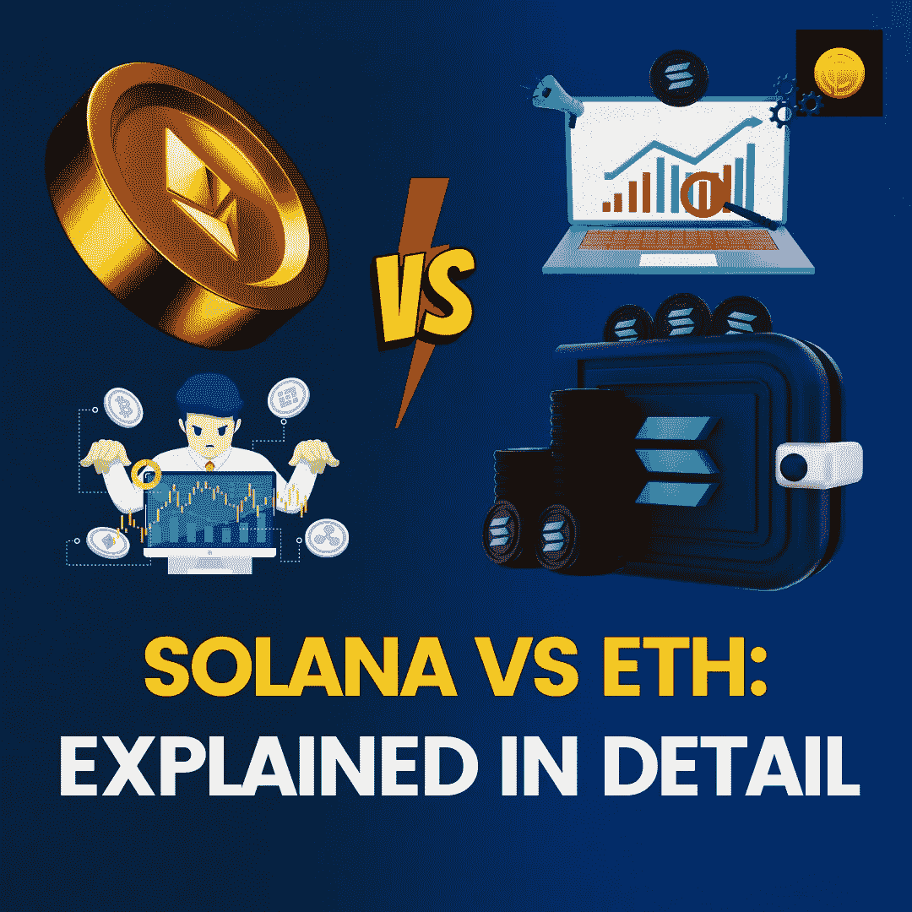

# 索拉纳 Vs ETH:详解

> 原文：<https://medium.com/coinmonks/solana-vs-eth-explained-in-detail-1b8c7a1f3a65?source=collection_archive---------53----------------------->

当智能合同区块链在 cryptoverse 取得进展时，他们彻底改变了我们在分散空间中看待和执行任务的方式。然而，随着时间的推移，似乎很明显，当智能合同区块链通过唤起权力下放的原则开始了改造每个部门的旅程时，他们应该有必要的带宽来应对不断增长的压力。当以太坊在 2016 年开始时，它正在使用 PoW 或工作证明共识机制；这比比特币区块链验证块的时间更短，因此相对而言，每块大小的 ETH 比比特币更快。

然而，需要注意的一点是，仅仅建立一个完整的生态系统并为各个部门提供必要的支持是不够的。Solana 认为这是第 1 层领域的一个机会，并提出了一个不同的共识机制，该机制能够在一分钟内验证多达 65，000 个交易。当你将其与以太坊每分钟 7 笔交易进行比较时，毫无疑问，索拉纳是主导者。但是从安全角度来看这两个区块链，以太坊总是跑得比索拉纳快。这就是为什么几乎 70%到 80%的 Dapps 都托管在以太坊上，而 maximum DeFi 协议更喜欢通过第 2 层的以太坊来与目标受众建立更好的信任。在这个博客中，我们将看到以太坊和索拉纳是如何不同的。

# 什么是[索拉纳](https://www.coindhan.com/trading/solinr)？

Solana 作为一个开源区块链，被设计用来托管分散的可扩展应用程序。区块链的出现是因为在各个部门应用分散式分类账技术时需要可扩展性和吞吐量。

# 什么是[以太坊](https://www.coindhan.com/trading/ethinr)？

以太坊是一个对等网络，引入了智能合约的概念，这有助于自动执行功能，允许在[以太坊生态系统](https://blog.coindhan.com/2022/04/13/best-tips-how-to-successfully-trade-ethereum-coindhan-tips/)之上构建各种用例。在以太坊区块链上，交易记录是分散的、不可变的、透明的。

阅读更多-[https://blog . coin dhan . com/2022/05/20/Solana-vs-eth-explained-in-detail/](https://blog.coindhan.com/2022/05/20/solana-vs-eth-explained-in-detail/)

> 加入 Coinmonks [电报频道](https://t.me/coincodecap)和 [Youtube 频道](https://www.youtube.com/c/coinmonks/videos)了解加密交易和投资

# 另外，阅读

*   [3 商业评论](/coinmonks/3commas-review-an-excellent-crypto-trading-bot-2020-1313a58bec92) | [Pionex 评论](https://coincodecap.com/pionex-review-exchange-with-crypto-trading-bot) | [Coinrule 评论](/coinmonks/coinrule-review-2021-a-beginner-friendly-crypto-trading-bot-daf0504848ba)
*   [莱杰 vs n rave](/coinmonks/ledger-vs-ngrave-zero-7e40f0c1d694)|[莱杰 nano s vs x](/coinmonks/ledger-nano-s-vs-x-battery-hardware-price-storage-59a6663fe3b0) | [币安评论](/coinmonks/binance-review-ee10d3bf3b6e)
*   [Bybit Exchange 审查](/coinmonks/bybit-exchange-review-dbd570019b71) | [Bityard 审查](https://coincodecap.com/bityard-reivew) | [Jet-Bot 审查](https://coincodecap.com/jet-bot-review)
*   [3 commas vs crypto hopper](/coinmonks/3commas-vs-pionex-vs-cryptohopper-best-crypto-bot-6a98d2baa203)|[赚取加密利息](/coinmonks/earn-crypto-interest-b10b810fdda3)
*   最好的比特币[硬件钱包](/coinmonks/hardware-wallets-dfa1211730c6) | [BitBox02 回顾](/coinmonks/bitbox02-review-your-swiss-bitcoin-hardware-wallet-c36c88fff29)
*   [BlockFi vs 摄氏度](/coinmonks/blockfi-vs-celsius-vs-hodlnaut-8a1cc8c26630) | [Hodlnaut 审核](/coinmonks/hodlnaut-review-best-way-to-hodl-is-to-earn-interest-on-your-bitcoin-6658a8c19edf) | [KuCoin 审核](https://coincodecap.com/kucoin-review)