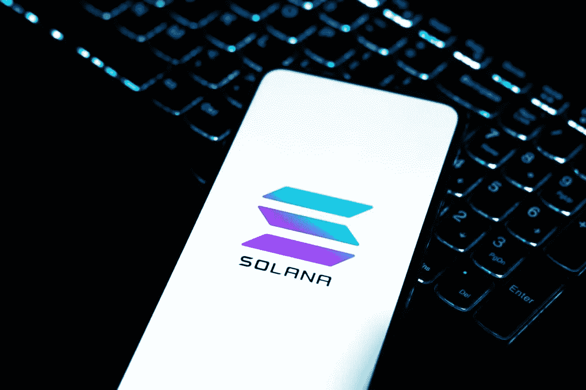

# 索拉纳的智能手机发布并不能保证成功

> 原文：<https://medium.com/coinmonks/solanas-smartphone-launch-doesn-t-guarantee-success-78893e145b78?source=collection_archive---------61----------------------->

6 月 23 日，索拉纳公司(Solana)的联合创始人兼首席执行官在纽约市的一群观众面前宣布推出专注于 Android Web3 的智能手机 Saga 时，经历了一个史蒂夫乔布斯的时刻。

“这是我从根本上认为该行业需要做的事情。在比特币诞生 13 年后的苹果开发者大会上，我们没有看到一个加密功能。

这一推出有可能推动 Solana 成为大型科技巨头，将 DeFi 资产公司从一个只专注于加密货币的世界转移到一个包括苹果(纳斯达克:AAPL)、微软(纳斯达克:MSFT)，当然还有安卓的领域。

强调在移动设备上提供更多的 Web3 选择有可能扩大 Solana 生态系统对更广泛受众的吸引力，并可能鼓励其他加密货币区块链效仿。

这一消息出现在加密货币市场的困难时刻，加密货币的定价已经大幅下降。

此外，亚科文科似乎意识到这种设备对普通公众并没有最大的吸引力，但他认为这种设备可能会接触到加密货币的最忠实用户:

> “我们的目标是那些知道自我监护意味着什么的铁杆人士。你必须从一个喜欢这个产品的群体开始，并从那里成长。”

亚科文科开玩笑说，人们会在约会中途拿出他们的笔记本电脑，这样他们就不会错过制作 NFTs 的机会，“所以我认为是时候让密码走向移动了。”

Saga 打算部署数字资产商品和服务，允许客户在设备上快速使用加密货币进行交易，作为在电脑上使用网络浏览器的替代选择。

除了宣布 Saga 之外，亚科文科还披露了 Solana Mobile Stack(简称 SMS)的首次亮相，这是一个为 Solana 在电话上开发的 web3 层。

SMS 将由各种产品组成，包括种子库、托管解决方案、移动钱包适配器、面向 Android 的 Solana Pay 以及自己的分散应用程序(dApp)商店。

# 加密智能手机并不能保证成功

然而，从历史上看，密码或基于 Web3 的电话的引入并不能自动确保其商业成功。

例如，HTC Exodus 加密手机是下一代设备，结合了智能手机的可用性和加密硬件钱包的安全性，但在加密货币领域仍鲜为人知。

同样，由 Sirin 操作系统支持的 Sirin Labs 区块链手机“The FINNEY”包括一个安全套件层和一个嵌入式冷存储钱包，然而，在加密领域，它仍然相对模糊。

与此同时，由 Pundi X 开发的 Blok on Blok 被称为“世界上第一款区块链手机”，它提供重新控制和拥有你的数据，但未能达到其灵活的目标，即€54，636，只有 42 名支持者资助该项目，只有 46%的目标在活动结束前实现。

最后，其他智能手机，如专为新兴经济体人群设计的电子 M1 手机，在销售方面并没有真正达到预期效果。

最终，拥有 2100 万独立活跃月账户的 Solana 是否会有所不同还有待观察。

点击这里关注我们的更多故事[。](http://t.me/etellworld)

> 加入 Coinmonks [电报频道](https://t.me/coincodecap)和 [Youtube 频道](https://www.youtube.com/c/coinmonks/videos)了解加密交易和投资

# 另外，阅读

*   [加密货币储蓄账户](/coinmonks/cryptocurrency-savings-accounts-be3bc0feffbf) | [YoBit 审核](/coinmonks/yobit-review-175464162c62)
*   [Botsfolio vs nap bots vs Mudrex](/coinmonks/botsfolio-vs-napbots-vs-mudrex-c81344970c02)|[gate . io 交流回顾](/coinmonks/gate-io-exchange-review-61bf87b7078f)
*   [CoinFLEX 评论](https://coincodecap.com/coinflex-review) | [AEX 交易所评论](https://coincodecap.com/aex-exchange-review) | [UPbit 评论](https://coincodecap.com/upbit-review)
*   [AscendEx 保证金交易](https://coincodecap.com/ascendex-margin-trading) | [Bitfinex 赌注](https://coincodecap.com/bitfinex-staking) | [bitFlyer 点评](https://coincodecap.com/bitflyer-review)
*   [Bitget 回顾](https://coincodecap.com/bitget-review)|[Gemini vs block fi](https://coincodecap.com/gemini-vs-blockfi)cmd |[OKEx 期货交易](https://coincodecap.com/okex-futures-trading)