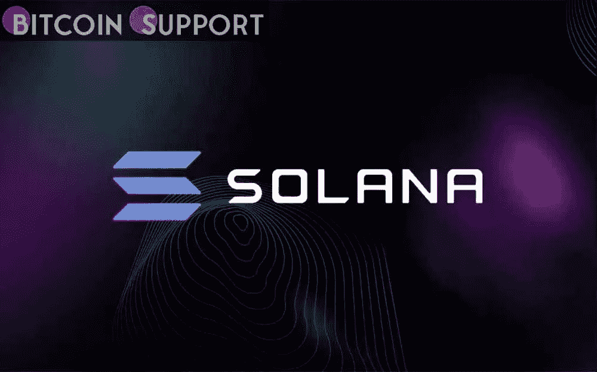

# 索拉纳周末的涨势有变成多头陷阱的风险

> 原文：<https://medium.com/coinmonks/solanas-weekend-rally-risks-turning-into-a-bull-trap-8e4c243d7f93?source=collection_archive---------71----------------------->

[https://bitcoinsupports.com/](https://bitcoinsupports.com/)

现在向下突破的牛市标志为 SOL 提供了更多的看跌信号。

索拉纳(SOL)市场本周末出现反弹，最高价为 90 美元，低于 2 月 21 日的高点 96 美元。因此，SOL 价格技术指标现在将自己置于典型熊市反转的风险之中。

**索拉纳的价格可能跌至 60 美元。当价格在一个共同的支撑位(称为颈线)上形成三个连续的峰值时，技术形态“头肩顶”就会出现。通常情况下，图案的中间峰(称为“头部”)比图案的另外两个峰(称为左肩和右肩)长，这两个峰的高度相似。一旦价格决定性地跌破其颈线，H 型趋势会使价格下跌——下跌的长度等于头部和颈线之间的最大距离。因此，最近形成类似技术结构的索拉纳有跌破 60 美元的风险，跌幅近 30%。**

令人惊讶的是，H&S 下跌目标 60 美元附近在 2021 年 8 月成为支撑，就在索拉纳价格反弹至 250 美元以上的创纪录高位之前。熊市标志的出现增加了下跌的可能性。由于被称为“熊市”的技术形态，索拉纳经历另一次大抛售的风险也增加了

相关:底部临近了吗？随着 SOL 在 1 月份下跌 50%，Solana 绘制了其第一个“死亡十字”。

值得注意的是，SOL 价格已经突破看跌延续形态。其结果是，它现在面临下跌的风险，下跌的长度相当于之前下跌趋势的长度，即所谓的“旗杆”，从突破点开始计算，如下图所示。

因此，SOL 的熊市突破，就像 H&S 模式一样，有可能使其价格跌至 60 美元或更低。

**访问我们的网站:-**[**https://bitcoinsupports.com/**](https://bitcoinsupports.com/)

**免责声明:以上为作者观点，不应视为投资建议。读者应该自己做研究。**

> 加入 Coinmonks [电报频道](https://t.me/coincodecap)和 [Youtube 频道](https://www.youtube.com/c/coinmonks/videos)了解加密交易和投资

# 另外，阅读

*   [最佳期货交易信号](https://coincodecap.com/futures-trading-signals) | [流动性交易所评论](https://coincodecap.com/liquid-exchange-review)
*   [南非的加密交易所](https://coincodecap.com/crypto-exchanges-in-south-africa) | [BitMEX 加密信号](https://coincodecap.com/bitmex-crypto-signals)
*   [MoonXBT 副本交易](https://coincodecap.com/moonxbt-copy-trading) | [阿联酋的加密钱包](https://coincodecap.com/crypto-wallets-in-uae)
*   [Remitano 审查](https://coincodecap.com/remitano-review)|[1 英寸协议指南](https://coincodecap.com/1inch) | [购买 Floki](https://coincodecap.com/buy-floki-inu-token)
*   [MoonXBT vs Bybit vs 币安](https://coincodecap.com/bybit-binance-moonxbt) | [Arbitrum:第二层解决方案](https://coincodecap.com/arbitrum)
*   [买 PancakeSwap(蛋糕)](https://coincodecap.com/buy-pancakeswap)|[matrix export Review](https://coincodecap.com/matrixport-review)
*   [最佳免费加密信号](https://coincodecap.com/free-crypto-signals) | [YoBit 评论](/coinmonks/yobit-review-175464162c62) | [Bitbns 评论](/coinmonks/bitbns-review-38256a07e161)
*   [OKEx 评论](/coinmonks/okex-review-6b369304110f) | [Kucoin 交易机器人](/coinmonks/kucoin-trading-bot-automate-your-trades-8cf0ca2138e0) | [期货交易机器人](/coinmonks/futures-trading-bots-5a282ccee3f5)
*   [AscendEx Staking](https://coincodecap.com/ascendex-staking)|[Bot Ocean Review](https://coincodecap.com/bot-ocean-review)|[最佳比特币钱包](https://coincodecap.com/bitcoin-wallets-india)
*   [霍比评论](https://coincodecap.com/huobi-review) | [OKEx 保证金交易](https://coincodecap.com/okex-margin-trading) | [期货交易](https://coincodecap.com/futures-trading)