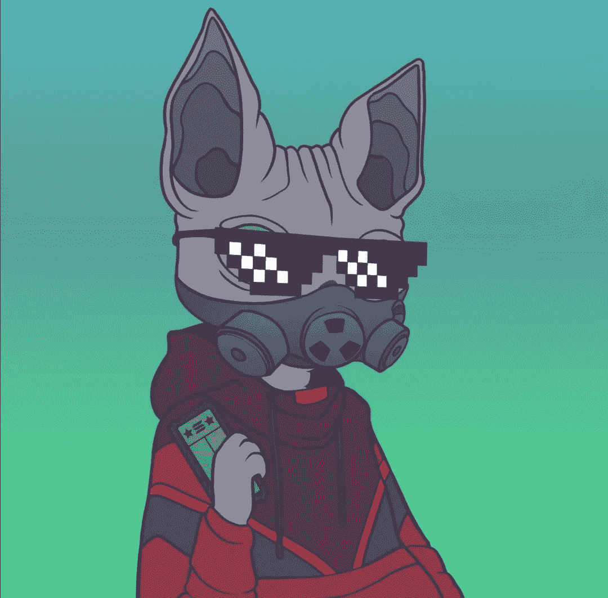
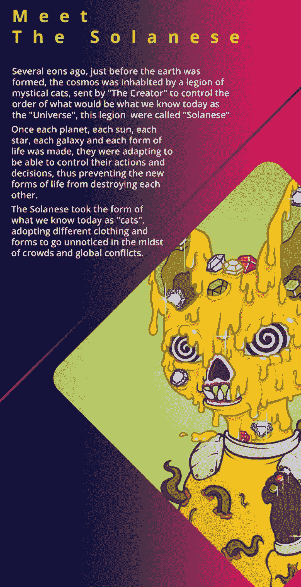

# 索拉纳·CATS 俱乐部:索尔链条上的新 CATS

> 原文：<https://medium.com/coinmonks/solanese-cats-club-the-new-cats-on-the-sol-chain-2bf9a8c89dc1?source=collection_archive---------29----------------------->

如果你听说过 NFT，你可能听说过很多关于类人猿的事情，可能比你理解 NFT 到底是什么还要多。

简单地说，NFT 是不可替换的令牌。加起来了吗？

啊啊啊。这可能是因为你是个初学者，但是别担心，我会帮你搞定的。你们中的一些人可能想直接跳到要点，因为我知道你们已经是翻转 NFT 和表演所有这些好东西的专家了。我得到了所有人，我保证！

因此，像比特币一样，不可替代代币是一种基于区块链技术开发的数字资产，可以用作价值储存手段。通常，这只是在区块链制作的数字艺术。

另一方面，与加密货币不同，NFT 是完全可转让的。换句话说，我可以选择交换我拥有的 NFT，并将它的所有权转让给任何想买它的人。因为比特币是可替代的代币，我钱包里的 1 BTC 永远和别人钱包里的 1 BTC 一样；使其不可转让。这区分了 NFT，因为没有两个 NFT 可以具有完全相同的信息；它们可能有相同的图画，但在区块链上它们永远不会有相同的意义。

因此，拥有一台 NFT 并不像“右击+保存”那么简单

既然我们已经确定了这一点，关键是要理解原始的猿 NFT 是无聊猿游艇俱乐部(BAYC)，这个项目让每个人都在谈论。现在有各种各样的与 ape 相关的非功能性神经干细胞移植，其中一些取得了成功。

然而，加密市场是由趋势驱动的，为了从中获得最大收益，跟踪趋势是至关重要的。

就是这样！如今，类人猿似乎对人类没什么影响，而猫似乎得到了所有的关注。哎呀！我指的是猫相关的非功能性神经营养不良。但是你可以打赌，如果可以的话，我会在现实世界里养一只猫。

让我们做个交易:我会告诉你一个有[白名单](https://nftska.com/what-is-whitelisting-nft-terminology/)景点的新 NFT，以及你应该知道的基本知识。作为交换，你必须读这篇文章！哈哈，我打赌你没想到会有这一天。

**索拉纳 CATS 俱乐部**

在索拉纳区块链，索拉纳猫俱乐部聚集了 12000 只邪恶的神秘动物。

这些猫已经准备好统治元宇宙，将声望和优雅结合在一起。

我相信索拉纳连锁店的汽油费是合理的；这是多年来帮助它脱颖而出的原因之一。

此外，如果你错过了，索拉纳俱乐部 NFT 将只生产 12，000 件限量。如果将它与人一一对应，世界上只有 12000 人会拥有它。如果它成功地被大规模采用，与世界 70 亿人口相比，这将是一个相当大的数字。

每个人都有平等的机会拥有任何提供的薄荷糖(在他们提前进入的情况下)。选择薄荷类型的方法是完全随机的，确保社区的每个成员都有机会拥有最稀有的 NFT 类型之一。任何有机会的地址都可以造币。

Solanese 猫俱乐部的成立是为了应对创作者/艺术家对创作以可爱的斯芬克斯猫为特色的艺术作品缺乏兴趣，斯芬克斯猫是世界上最可爱的古老和昂贵的猫之一。该团队选择讲述这一故事，并向世界展示其独特性。

该项目将“onepaper”整合在一起，揭示了其计划的一部分，类似于白皮书。

**期待什么**

创作者:该项目有许多创作者，他们在艺术方面有着广泛的经验。其中一位艺术家将成为漫威创造者，而另一位将成为卡通城市艺术家。

WL:与其他令人垂涎的 NFT 项目不同，茄尼猫俱乐部计划简化其社区的白名单。

新项目:这是一个全新的项目，如果社区支持，有很大的成长空间。

造币厂:在索拉纳，造币不是火箭科学，汽油费非常合理。

高级优惠:拥有至少一只 NFT 茄尼猫将使你获得该队的高级优惠。这包括项目中的物品、独家不和谐频道和其他 VIP 特权。

Token:该项目将拥有自己的 Cat token，它将在 Solana 网络上开发，用于推动 Solana 经济。

**熟悉索拉纳人 CATS**

12，000 只茄尼猫被相应地分配，每只猫都有自己的种族/设计。它们将以下列格式出现:

平民:这个类别总共包含 6000 只猫。他们经常穿着衬衫或背心，搭配眼镜或面具等简单的配饰，还有各种其他选择。

稍微有趣的平民:顾名思义，这一组中的猫被认为比典型的平民稍微更有吸引力。他们以 3000 人为一组，穿着连帽衫和套头衫，经常穿孔。这种猫的配件包括游戏耳机、3D 眼镜、眼睛颜色和派对帽等。

爱好/职业倾向:随遇而安！他们是一群认真对待工作和喜欢做的事情的猫。他们经常穿着运动服，宇航员服装，角色扮演，以及其他任何表明他们职业的服装。它们被限定为总共 1500 只独特的猫。

精英/商界人士:当然也有精英猫，这并不奇怪。一些猫爬到了顶端。会有 600 只猫穿着奇装异服、奇装异服、化妆舞会服装，甚至可能是黑帮服装——不要问我为什么化装舞会和黑帮会被列入精英团 LOL。

皇帝/皇后:有些猫生来就有不同的个性。当然，600 只猫会打扮得像皇室成员一样。

变种人:我更喜欢称这个群体为反叛者，因为他们是所有人中最稀有的，是索拉纳人中的佼佼者，每一个都与其他变种人不同。总共有 300 个变种人。

最后，将提供 25 幅著名漫画家赫尔穆特·拉乔的手绘作品。但是，它仅适用于赠品活动。这就是它的工作原理；谁都能赢！

[不和](https://discord.gg/solanesecatsclub) | [推特](https://twitter.com/solanesecats?t=NA55c41zAYiocGL-Uibpaw&s=09)

> 加入 Coinmonks [电报频道](https://t.me/coincodecap)和 [Youtube 频道](https://www.youtube.com/c/coinmonks/videos)了解加密交易和投资

# 另外，阅读

*   [5 款最佳加密交易终端](https://coincodecap.com/crypto-trading-terminals) | [最佳 DeFi 应用](https://coincodecap.com/best-defi-apps)
*   [比特币基地 vs 瓦济克斯](https://coincodecap.com/coinbase-vs-wazirx) | [比特鲁点评](https://coincodecap.com/bitrue-review) | [波洛涅克斯 vs 比特鲁](https://coincodecap.com/poloniex-vs-bittrex)
*   [德国最佳加密交易所](https://coincodecap.com/crypto-exchanges-in-germany) | [Arbitrum:第二层解决方案](https://coincodecap.com/arbitrum)
*   [币安交易机器人](/coinmonks/binance-trading-bots-d0d57bb62c4c) | [OKEx 审查](/coinmonks/okex-review-6b369304110f) | [阿塔尼审查](https://coincodecap.com/atani-review)
*   [最佳加密交易信号电报](/coinmonks/best-crypto-signals-telegram-5785cdbc4b2b) | [MoonXBT 评论](/coinmonks/moonxbt-review-6e4ab26d037)
*   [如何在 Bitbns 上购买柴犬(SHIB)币？](https://coincodecap.com/buy-shiba-bitbns) | [购买 Floki](https://coincodecap.com/buy-floki-inu-token)
*   [CoinFLEX 评论](https://coincodecap.com/coinflex-review) | [AEX 交易所评论](https://coincodecap.com/aex-exchange-review) | [UPbit 评论](https://coincodecap.com/upbit-review)