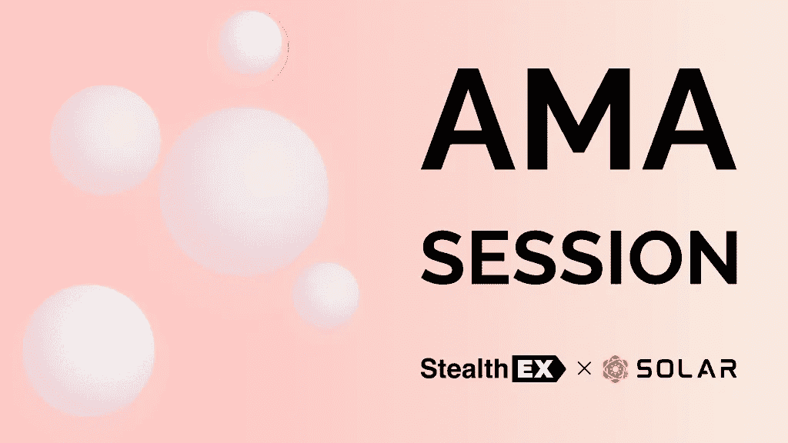
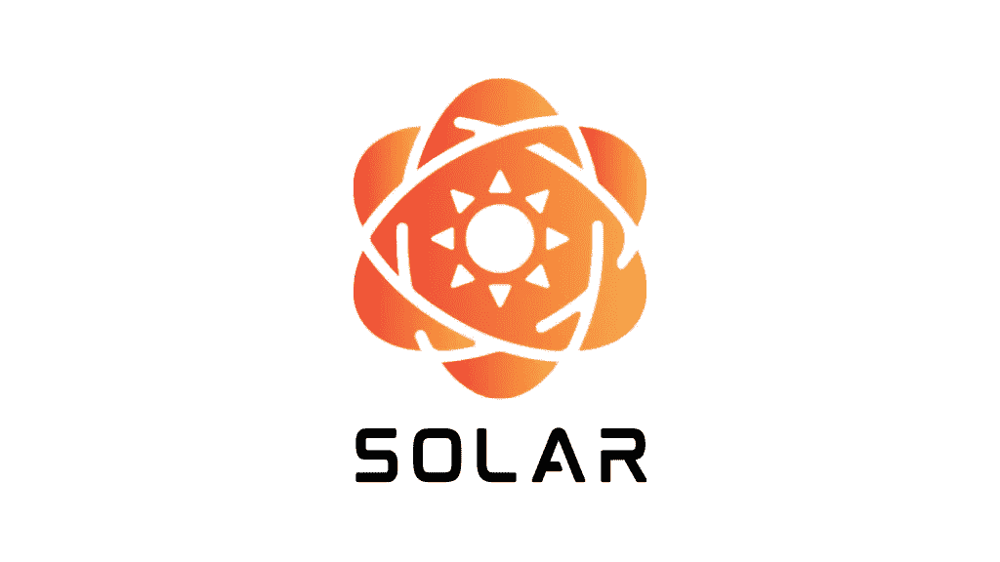

# 太阳能网络和偷窃 X AMA 概述-所有你需要知道的

> 原文：<https://medium.com/coinmonks/solar-network-stealthex-ama-recap-all-you-need-to-know-3fa34338a2cb?source=collection_archive---------28----------------------->

2022 年 2 月 15 日，我们在 [Telegram 社区聊天](https://t.me/StealthEX_io)中进行了[stealth x](https://stealthex.io/)&Solar Network AMA 会议，以下是一份摘要。了解你需要的关于太阳能的一切，一个分散的和高能效的区块链，以及它的本地刷卡 SXP 硬币。开始吧！

我们很高兴 BFX 的加入:太阳能网络的代表和技术顾问！

所以我们都跟上了速度:我们将在关闭聊天的情况下，从 Twitter 的一轮问题开始 AMA。Twitter 上的问题得到回答后，我们将开放几分钟的聊天时间，让每个人都可以提问。

# 来自 Twitter 的问题

**Q1:你能列出 1-3 个让你的项目领先于竞争对手的杀手锏吗？你认为你的平台最有信心的竞争优势是什么？**

BFX:太阳能项目有很多特点，可以让它与其他顶级项目竞争。如果我要列出几个影响最大的协议，第一个肯定是辅助分类账协议(SLP)。此外，Solar 将开发一个元宇宙和一个治理模块，这两个模块都旨在产生较大的影响。

辅助分类帐协议允许创建可替换的(SLP-1，类似于 ERC-20)和不可替换的令牌(SLP-2，类似于 ERC-721)的令牌契约。与其它大多数区块链不同，SXP 为创建这些象征性合约而支付的费用将被烧掉，从而导致通缩。为常规交易和合同互动支付的费用仍将被添加到整体奖励中，并在很大程度上重新分配给选民，而合同创建费用则被完全烧掉。

通过这种方式，太阳能公司旨在抵消通货膨胀，同时在网络上创造大量可能的公用事业。已经有好几家公司，包括一家交易所，确认使用由 SLP 创建的令牌进行运营。

当然，还有许多其他功能正在开发中，所以我强烈建议任何人查看路线图和即将发布的白皮书。

Q2:“太阳能区块链”能解决什么问题，而另一个“区块链”却不能？

**BFX** :区块链核心插件提供的模块化和通过通用事务接口开发定制事务的灵活性，允许在 Solar 上部署大量工具和实用程序。

插件允许新的功能随意添加到区块链核心，同时保持基础小而快。定制交易的一个例子已经可以在 Steam 上的早期接入游戏中看到:由代表 friendsofLittle Yus 创建的 littleyus 之友。他们使用自定义事务来读取、写入、修改和保存链上的玩家数据。类似的事务可以用来保存元宇宙数据。

通过授权的利益证明系统运行分散且(节能)高效的区块链，具有动态且可承受的费用和快速结算时间(8 秒钟)的优势，允许最终用户与链上公用事业快速互动，允许 Solar 扩展并提供可靠的用户体验。

这些特点意味着 Solar 将能够为许多不同的问题和公用事业提供合适的解决方案，这种灵活性在我看来是它区别于其他区块链的地方。

太阳能对 SXP 有什么影响？太阳能如何通过未来的发展提高 SXP 的效用？

**BFX** :太阳能(SXP)公司已经得到了一家大型公用事业公司的支持，该公司将使用 SXP 支付手续费。

我在前面的回答中列举了一些额外的设施，这些设施使太阳能成为其他区块链的真正竞争对手。在即将于 2 月 23 日发布的白皮书中，这方面的大部分内容应该也会涉及到。修订后的路线图已经让我们看到了一些新的进展。

已经有许多开源(社区)开发者为这个网络做出了贡献，因此这种影响不仅仅依赖于一个人，而是由整个社区共享。

**Q4:在区块链方舟上建造太阳能的原因是什么，与其他方案相比有什么优势？**

BFX : ARK 提供了开源的区块链框架，它有一个灵活的模块化核心，可以用来启动新的区块链项目。核心由原始开发人员和许多对其开发做出重大贡献的外部合作者不断维护和增强。

其中一个合作者是 delegate gym，他是一名安全研究员和程序员，在过去几年中发现并修复了许多漏洞，使核心变得更加健壮。在 mainnet 发布之前，他目前正在研究太阳能区块链核心。

就我的理解而言，正如我在前面的问题中所描述的，灵活性和模块化意味着其他选择对于太阳能的目标和用途来说是不可行的。

**问题 5:为什么初创项目开发人员会在太阳能区块链上进行开发？**

**BFX** : Solar 有一个开发网络，这个网络一直由负责 mainnet 的代表们维护。这些代表大多经验丰富，能够帮助任何人启动他们的太阳能项目。

还有许多可用的文档或即将发布的文档，以及许多代码库，如 Python、JavaScript、Go、Typescript 等，供开发人员在 Solar 上构建。

对于 Solidity，将创建一个自定义的事务类型，允许开发人员使用 Solidity 构建应用程序或合同，并在 Solar 上支持它们。

**问题 6:你认为 Solar/SXP 与其他竞争对手相比最重要的区别是什么？**

**BFX** :我认为一个重要的特点是治理模块。它将给予社区控制权，通过投票决定太阳能的未来，提案可以由任何人提出——代表、社区成员和开发者。没有一个人或实体可以控制太阳能，而是任何人都可以提交他们的想法并让他们投票。

加上在 Solar 上创建工具、合同或应用程序的选项，它非常适合任何希望实施区块链来增强其产品或业务的人。无论是有经验的开发者、商人还是爱好者，都可以使用该项目提供的工具来构建 Solar。

**Q7:你能和索拉纳项目的速度竞争吗，或者太阳能/SXP 的优势是什么？**

**BFX:** 众所周知，Solana 项目是最快的区块链之一，然而，这需要巨大的存储和计算能力来处理其完整的链上分类账数据，这是有代价的。通过在 Arweave 上托管他们的分类帐，他们确实提供了运行你自己的节点和下载部分区块链的能力，从而在某种程度上规避了这个问题。这确实意味着，没有高端硬件，你能做的事情存在固有的局限性。

有了 Solar，你可以在自己的服务器上运行整个区块链，即使它只是一个共享资源的虚拟服务器。数据库表易于阅读，存储效率很高。如果你只是想与区块链互动，你可以使用现有的轻钱包，甚至不需要任何存储，而不是应用程序本身使用的东西。

虽然 Solar 目前的阻塞时间为 8 秒，但如果需要的话，可以进行调整。交易结算仍然只需要 53 次确认即可完成。许多其他参数也可以通过使用里程碑来轻松调整，这意味着可以通过小型的向后兼容的核心更新来引入大量的灵活性。

问题 8:你能给出人们应该投资你的项目的理由吗？

**BFX** :首先，我不提供理财建议，任何人都应该做出自己的投资选择——最好是基于自己的研究。

我认为我已经展示了一个很好的起点，描述了一些太阳能能够提供的特性。该路线图(我将在下面包含一个链接)列出了许多我还没能得到的其他特性，所以它肯定应该被检查出来。当然还有下周到期的白皮书！

此外，经验丰富的(社区)开发人员已经开始研究 Solar，一些企业已经确认希望使用 SLP 创建一个令牌，代表们已经开始列出他们(即将到来的)贡献，这让我觉得该项目是其即将到来的 mainnet 发布的一个好地方！

[路线图](https://solar.network/roadmap) & [代表们页面](https://delegates.solar.network/)。

**StealthEX** :现在，我们进入直播环节。我们现在将打开聊天一小会儿，让问题积累起来。然后，我们将关闭聊天窗口，您可以选择所有您最喜欢的问题并进行回复🙂

# 现场提问

Q1:

**BFX** :是的，所有制作代币合同的费用都会被收集起来，按月烧掉！

**Q2:** **用户如何才能及时了解这个项目？有没有渠道，包括本地社区，让用户可以获得最新的更新？**

BFX:是的，有很多社区频道。我认为最简单的方法是去[官方电报聊天](https://t.me/Solar_Network)然后从那里开始。还有一个[不和谐](https://discord.solar.network)有不同语言的多个频道！

许多项目都有用户界面/ UX 的问题，而这个项目让新用户望而却步。您计划如何改善与新用户和加密空间之外的用户的交互？

BFX:将会有很多文档提供给最终用户和开发者。关于用户界面或体验的任何问题都可以在官方渠道提出，或者在您自己的本地社区聊天中提出。也有代表致力于创建文章、视频和工具来帮助您解决所有这些问题！

你能告诉我更多关于 IDO 的细节吗？每个人的时间表和贡献？

**BFX** :没有 IDO，目前 SXP 的持有者可以将他们基于 ERC/BSC 的令牌交换到新的 mainnet。不能也不会为此互换铸造额外的令牌。

营销是每个项目的核心要素，因此每个人都知道一个项目所能带来的潜力对于实现既定目标至关重要。你有什么策略来吸引新用户和投资者到你的平台，并保持他们的长期存在？

**BFX** :营销起初将由前项目负责人负责，但也可以由代表们帮助。此外，将建立一个基金会——太阳能社区基金会——将能够提供赠款和社区成员的资金提案，其中以某种方式或战略进行营销可能是其中之一。

**Q6:** **智能合同很容易失败，许多项目都是这种情况的受害者，让用户损失金钱，项目名誉扫地。您的智能合约有多可靠和安全？你通过任何一方测试过吗？**

**BFX** :所有的合同都可以创建为开源的，并通过公司(代码审计是路线图的一部分)或社区开发人员/安全研究人员进行审计。

**Q7:** **【跑马圈地】是吸引用户并长期留住他们的策略之一。你的大项目有关于打桩的计划吗？？**

有，你可以参考[我的博客](https://github.com/Bx64/Awesome-Solar/tree/main/awesome-blog)上的文章《押上你的 SXP(太阳能网络)》和《投票&奖励稀释》。

**Q8:** **既然现在流行 NFT，有没有 NFT 整合的计划？**

是的，它们是 Side Ledger 协议的一部分，特别是 SLP-2 型令牌合同！

**Q9:** **你现在的主要关注点是什么，是关注社区还是市场/交易所还是产品？**

**BFX** :明确关注项目特点、产品和设施。SXP 已经加入了几个大型交易所，支持互换的交易所将很快推出。然而，全部的焦点是什么增加太阳能的价值；它的功能和实用程序。

就是这样！再一次，非常感谢 BFX 举办了如此令人惊叹的 AMA，这真的很有教育意义，也是对是什么让 Solar Network 成为一个杰出项目的深刻见解！

我们感谢今天聚在一起的每一个人，请度过美好的一周！

别忘了你还可以在 StealthEX 平台上用 400+的资产兑换刷卡 SXP 币😎

# 如何以及在哪里购买 SXP 硬币？

只需遵循这些简单的步骤:

1.  选择兑换的货币对和金额。比如 [BTC](https://stealthex.io/coin/btc) 到 [SXP](https://stealthex.io/coin/sxp) 。
2.  按下“开始交换”按钮。
3.  提供硬币将被转移到的收件人地址。
4.  移动你的加密货币进行交易。
5.  收到您的加密硬币！

*如果你对 StealthEX 交换服务还有其他问题，你可以去我们的* [*常见问题部分*](https://stealthex.io/faq) *找到所有必要的信息。*

*关注我们上* [*中*](https://stealthex-io.medium.com/) *，* [*推特*](https://twitter.com/Stealthex_io) *，* [*电报*](https://t.me/StealthEX) *，*[*YouTube*](https://www.youtube.com/channel/UCeES_XBesX76ge7xf1meuSw)*，以及*[*Reddit*](https://www.reddit.com/user/Stealthex_io)*获取* [如果您在兑换硬币方面有任何问题，我们随时准备为您提供支持。我们的团队尽最大努力保护所有成员并回答他们的问题。](https://stealthex.io/)

非常欢迎您访问[**StealthEX exchange**](https://stealthex.io/)**，看看它有多快多方便。**

*原载于 2022 年 2 月 17 日*[*https://stealthex . io*](https://stealthex.io/blog/2022/02/17/solar-network-stealthex-ama-recap-all-you-need-to-know/)*。*

> 加入 Coinmonks [电报频道](https://t.me/coincodecap)和 [Youtube 频道](https://www.youtube.com/c/coinmonks/videos)了解加密交易和投资

# 另外，阅读

*   [麻雀交换评论](https://coincodecap.com/sparrow-exchange-review) | [纳什交换评论](https://coincodecap.com/nash-exchange-review)
*   最好的[加密税务软件](/coinmonks/best-crypto-tax-tool-for-my-money-72d4b430816b) | [硬币追踪评论](/coinmonks/cointracking-review-a-reliable-cryptocurrency-tax-software-5114e3eb5737)
*   [Stackedinvest 评论](https://coincodecap.com/stackedinvest-review) | [北海巨妖评论](/coinmonks/kraken-review-6165fc1056ac) | [bitFlyer 评论](https://coincodecap.com/bitflyer-review)
*   最佳[加密借贷平台](/coinmonks/top-5-crypto-lending-platforms-in-2020-that-you-need-to-know-a1b675cec3fa) | [杠杆代币](/coinmonks/leveraged-token-3f5257808b22)
*   最佳[加密制图工具](/coinmonks/what-are-the-best-charting-platforms-for-cryptocurrency-trading-85aade584d80) | [最佳加密交易所](/coinmonks/crypto-exchange-dd2f9d6f3769)
*   [比斯勒评论](https://coincodecap.com/bitsler-review)|[WazirX vs coin switch vs coin dcx](https://coincodecap.com/wazirx-vs-coinswitch-vs-coindcx)
*   [7 大副本交易平台](https://coincodecap.com/copy-trading-platforms) | [BuyCoins 点评](https://coincodecap.com/buycoins-review)
*   [my constant Review](https://coincodecap.com/myconstant-review)|[8 款最佳摇摆交易机器人](https://coincodecap.com/best-swing-trading-bots)
*   [Godex.io 审核](/coinmonks/godex-io-review-7366086519fb) | [邀请审核](/coinmonks/invity-review-70f3030c0502) | [BitForex 审核](https://coincodecap.com/bitforex-review)
*   [10 本关于加密的最佳书籍](https://coincodecap.com/best-crypto-books) | [英国 5 个最佳加密机器人](https://coincodecap.com/uk-trading-bots)