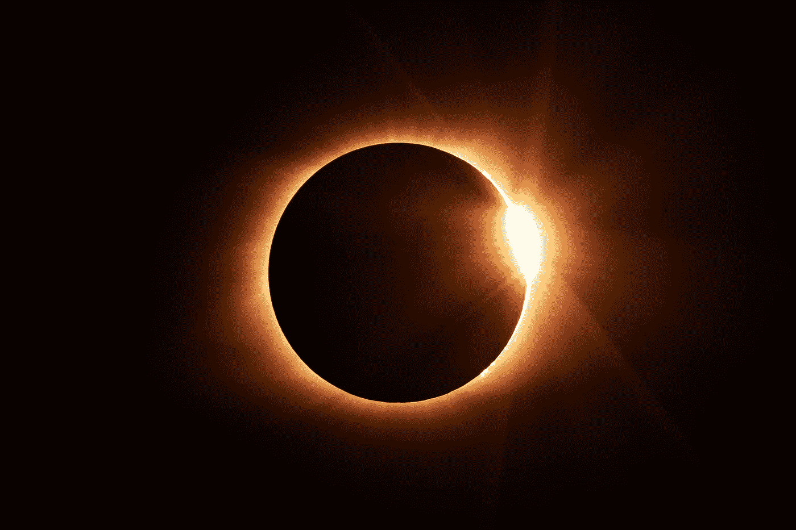
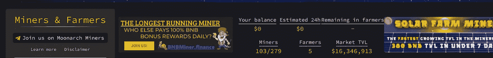

# SolarFarm 的复兴——适者之战

> 原文：<https://medium.com/coinmonks/solarfarms-revival-battle-of-the-fittest-crypto-miner-b66c3e124342?source=collection_archive---------8----------------------->

## SolarFarmV1 (SuperNova 20% ROI)和 SolarFarmV2 将在两天内完成。

***免责声明！！！*** *我写的文章只是我投资的日志，绝不是理财建议。在我的* [*第一篇文章中，*](/@Crypto_Auto/earn-30-day-1000-investment-the-truth-lets-go-a97ff2401510) *我开诚布公地谈一谈这类项目的真相。只投资你能承受的损失，不要把所有的鸡蛋放在一个篮子里。*

Photo by [Jongsun Lee](https://unsplash.com/@sarahleejs?utm_source=medium&utm_medium=referral) on [Unsplash](https://unsplash.com?utm_source=medium&utm_medium=referral)

距离我上一篇关于 [**SolarFarmV1**](http://app.solarfarm.finance/?ref=0x01214f2487dDd5f1532D82C2E7497B395e69c388) 的“死亡”的文章已经过去 10 天了。从那以后，这个团队一直在非常努力地改变几个机制，为启动 V2 和维护 V1 做准备。

# 更新

该团队尚未确认其元宇宙赌场发布日期。但是，已经确认的是，SolarVerse token(用于其赌场)的 20%的买卖税将用于支持 V1 锁定的总价值(TVL)。也就是说，80%将用于支持 V2。如果你现在还不知道，**赌场总是赢**——玩家在赌博中总是输。对于太阳能矿工来说，这是一个惊人的自由支柱。

有 2 个额外的关键事项需要注意。首先，该团队将尝试复活 SolarFarmV1，他们将再次激活**超新星**本***6 月 24 日星期五(UTC)*** 。其次， **SolarFarmV2** 将在 3 天后**6 月 27 日**发布。

SolarFarmV1 的 TVL 已经开始稳定下来。环比增长率为 22%。此外，该团队继续在 MoonArch Miners 等平台上花费广告美元(*截图右侧下方*)。这可能是 ***重新进入*** 的好时机。

秘密市场已经开始稳定，空头正在平仓。我们看到 BNB 跌至 185 美元/BNB，但现在回到 218 美元/BNB 的范围。如果这两天没有任何负面消息发生，SolarFarmV2 和 SolarFarmV1 的超新星将在一个**伟大的时刻**发射。

对于 **SolarFarmV1** ，请访问此处的链接

# 我的投资

我投资 V1 太阳能已经一个多月了。最近熊市反弹带来的恶性通货膨胀和恐慌性抛售导致 V1 TVL 从 1300 点的 BNB 峰值跌至 130 点 BNB。从每天挣 40 多美元开始，我现在每天的奖励是 2 美元(约 0.001 BNB)。

*第 1 天:提款= $ 45/天* ***第 48 天*** *:提款= $ 2/天*

我将于 6 月 27 日准备进入 SolarFarmV2 **。**

*如果你觉得这篇文章有帮助，*👉 ***跟着*******拍手👏*******合用*** 👐*和你的朋友一起吧！***

***如果您决定使用* ***我的推荐链接*** *以上(无压力)！随时打电报联系我(@The_Crypto_Auto)。***

*****查看我的其他投资！:***[*solar farm*](/@Crypto_Auto/solarfarm-day-38-is-it-the-end-c5632543be0f)*|*[*BakedBeans*](/@Crypto_Auto/bakedbeans-day-32-i-made-2-6-returns-per-day-ec69a3b0be80)*|*[*BUSDCropsFarmer*](/@Crypto_Auto/busdcrops-day-20-42-20-day-9426f472ee59)*|*[*BUSDCropsYieldFarmer*](/@Crypto_Auto/busdcropsyieldfarm-how-i-made-10-50-every-single-day-e1bcb9767c73)**

> **加入 Coinmonks [电报频道](https://t.me/coincodecap)和 [Youtube 频道](https://www.youtube.com/c/coinmonks/videos)了解加密交易和投资**

# **另外，阅读**

*   **[WazirX vs coin dcx vs bit bns](/coinmonks/wazirx-vs-coindcx-vs-bitbns-149f4f19a2f1)|[block fi vs coin loan vs Nexo](/coinmonks/blockfi-vs-coinloan-vs-nexo-cb624635230d)**
*   **[本地比特币评论](/coinmonks/localbitcoins-review-6cc001c6ed56) | [加密货币储蓄账户](https://coincodecap.com/cryptocurrency-savings-accounts)**
*   **[什么是融资融券交易](https://coincodecap.com/margin-trading) | [成本平均法](https://coincodecap.com/dca)**
*   **[支持卡审核](https://coincodecap.com/uphold-card-review) | [信任钱包 vs 元掩码](https://coincodecap.com/trust-wallet-vs-metamask)**
*   **[Exness 点评](https://coincodecap.com/exness-review)|[moon xbt Vs bit get Vs Bingbon](https://coincodecap.com/bingbon-vs-bitget-vs-moonxbt)**
*   **[如何开始通过加密贷款赚取被动收入](https://coincodecap.com/passive-income-crypto-lending)**
*   **[BigONE 交易所评论](/coinmonks/bigone-exchange-review-64705d85a1d4) | [电网交易 Bot](https://coincodecap.com/grid-trading)**