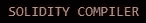
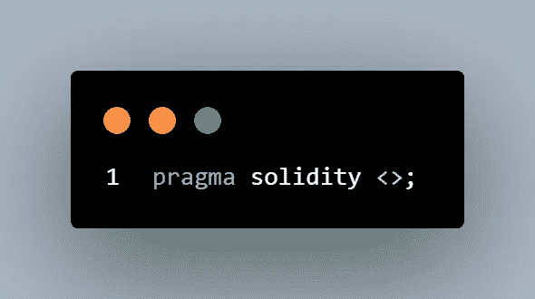
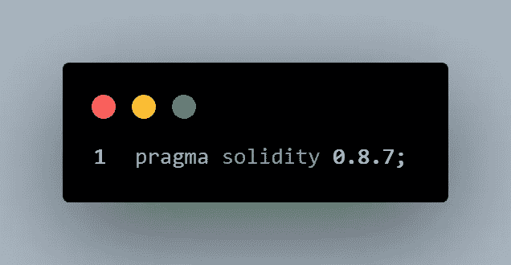
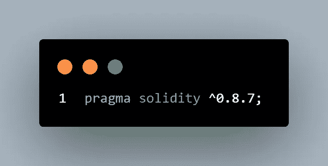
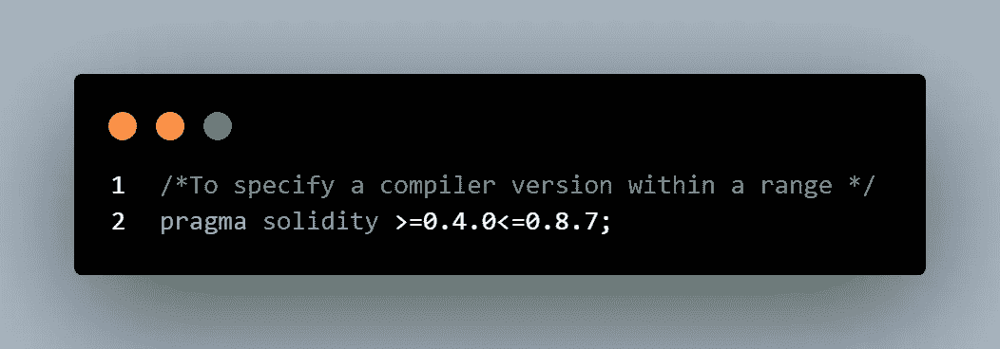
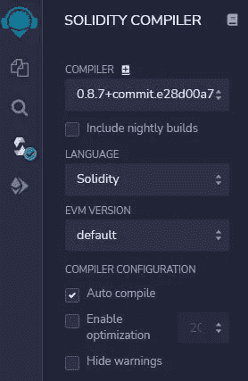

# 可靠性编译器

> 原文：<https://medium.com/coinmonks/solidity-compiler-401e3038a4a?source=collection_archive---------20----------------------->

使用 **Solidity** 编写的代码使用 **solidity 编译器**编译，该编译器输出字节码和部署合同所需的其他工件。

因为 Solidity 语言仍在不断成熟，所以新的编译器版本包含一些无法编译旧程序的变化是很常见的。

***杂注*** 指令有助于避免由于使用较新的编译器而导致的编译器故障，并拒绝使用可能引入不兼容更改的未来编译器版本进行编译。它用于启用某些编译器特性或检查。

一个 ***pragma 指令*** 总是在一个源文件的本地，*所以如果你想在你的整个项目*中启用它，你必须将 pragma 添加到你的所有文件中。

如果导入另一个文件，*该文件中的编译指示不会自动应用到导入文件中。*

下面是 synthax for pragma 指令。

**语用实度<>；**

下面是一个 pragma 指令示例

**pragma 实度 0 . 8 . 7；**

版本号以 **0** 开头，后面跟着一个**主版本号**和一个**次版本号**。
比如版本号 **0.8.7** 指的是主版本 **8** 和次版本 **7** 。

Solidity 可以使用*版本* ***8*** *编译范围*内任何编译版本的编译器。这是一种告诉读者你的程序是为 0.8.7 版本编写的，但是仍然可以为后续版本 8 编译，如上图所示。

脱字符号 **^** 告诉 solidity 它可以在主要版本范围内使用最新版本。所以要指定大于等于 **0.8.7** 的编译器版本，请看下图。

这说明源代码是为 solidity 版本 **0.8.7** 和上面的**编写的。**

要在某个版本范围内指定编译器版本，请参见下图。

这表明源代码是为 0.4.0 到 0.8.7 的 Solidity 版本编写的。

尽管在 pragma 指令中使用插入符号提供了灵活性，但更好的做法是去掉插入符号，并准确地告诉 Solidity 您期望的编译器版本，尤其是当您将契约部署到 **mainnet** 时。

**#加成**
***如何在 Remix*** 中检查实度编译器版本。
点击图标面板中的实体图标，如下图所示

