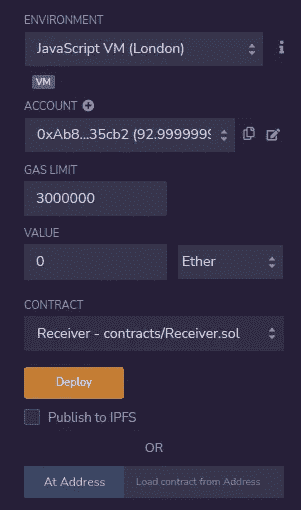
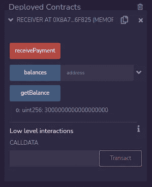
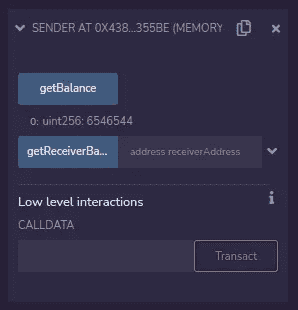
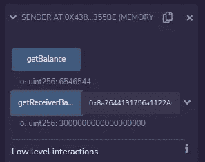
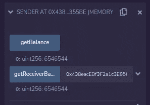
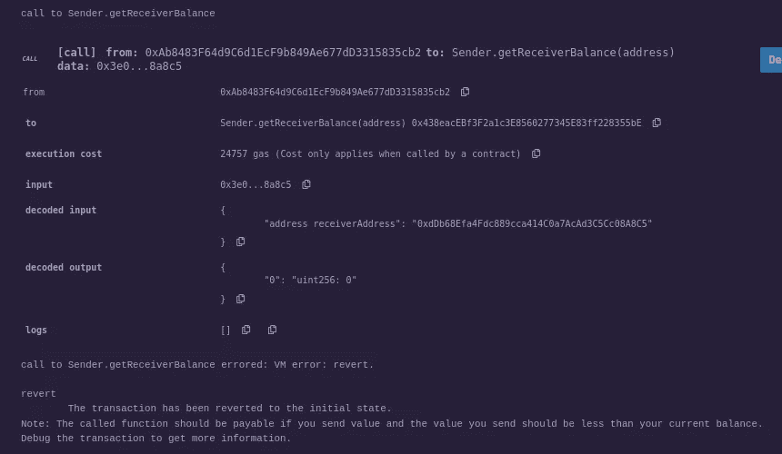
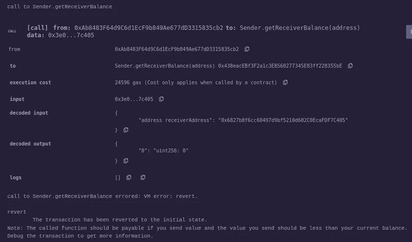

# 可靠性、合同与地址的转换及其缺陷

> 原文：<https://medium.com/coinmonks/solidity-contract-conversion-to-and-from-address-and-its-pitfall-bffc533a96eb?source=collection_archive---------6----------------------->

众所周知，在 Solidity 中，我们可以将地址“强制转换”为契约，也可以将契约转换为地址(契约的地址)，我们可能会认为将地址转换为错误的契约会失败，但它可能不会失败，并且可能会发生意外的行为。

在这篇文章中，我将简要解释在将一个假定的契约地址转换为其假定的契约时，我们可能会发现一些令人惊讶或意想不到的行为。

首先，我们知道我们可以将当前契约转换到它的地址来对它做一些操作:

请注意我们是如何将关键字`this`传递给 address 类型的(它引用了代码正在执行的当前契约),从而有效地将当前契约“转换”成它的地址，以获得它的余额。这是可以的。

现在，让我们假设在我们的契约中有一个契约`A`和一个契约`B`，并且那个契约`B`有一个契约`A a`的引用，我们可以用类似上面的语法得到契约`a`的余额:

查看完整示例:

所有这一切都是有效的，运作良好。

现在，请注意，在上面的构造函数中，我们期望一个地址被传递给我们，具体来说，我们期望一个类型为`A`的已部署契约的契约地址。但是，我们真的确定我们将被传递一个已部署的契约`A`的契约地址，或者一个与契约`A`无关的任何其他契约的地址吗？

如果我们尝试将一个不同契约地址“强制转换”到`A`契约，会失败吗？不，它不会失败，因为 EVM 没有办法知道传递的地址是否属于已经部署的`A`契约实例。

如果我们得到的是外部拥有的地址而不是合同地址，会失败吗？不，它也不会失败，因为契约地址和外部拥有的地址看起来完全一样，所以 EVM 将使用任何有效的以太坊地址将其转换为`A`契约类型，并且不会抱怨它，直到我们尝试实际调用该契约上的函数，然后 EVM 将在运行时注意到这不是一个契约地址，或者被调用的契约不包含我们尝试调用的函数。

> 交易新手？尝试[加密交易机器人](/coinmonks/crypto-trading-bot-c2ffce8acb2a)或[复制交易](/coinmonks/top-10-crypto-copy-trading-platforms-for-beginners-d0c37c7d698c)

现在，如果我们出于某种原因传递了一个有效的契约地址，比如说，契约的`C`地址，而`C`契约具有我们想要在契约`A`上调用的相同功能，会发生什么呢？嗯，EVM 将调用契约`C`上的那个函数，并且不会抱怨它。

为了说明这一点，让我们看看这两个合同，`Receiver`和`Sender`。在两个合同中，我们将拥有完全相同的`getBalance`功能。

契约`Receiver`将能够通过`receivePayment`接受 ether，并将发送方的余额保存在一个余额映射中，并将有一个`getBalance`函数来获取该契约的当前余额:

合同`Sender`将导入`Receiver`。发送方也具有与`Receiver`合同相同的`getBalance`功能，仅用于演示上述内容。

注意`getReceiverBalance`函数是如何接收一个地址的，这个地址应该是一个已经部署的`Receiver`契约地址，但是没有办法确定它是一个`Receiver`契约地址还是任何其他有效的以太坊地址。

然后，在将地址“强制转换”为一个`Receiver`契约后，它通过`Receiver receiver`引用调用`getBalance`函数。

当调用`receiver.getBalance`函数时，可能会发生一些事情:

1.  如果`receiverAddress`是一个合同，但它实际上不是一个`Receiver`合同，并且不具有`getBalance`功能，它将被恢复。
2.  如果`receiverAddress`甚至不是一个契约，而是一个外部拥有的地址，显然，它没有`getBalance`方法，它将恢复。
3.  如果`receiverAddress`是一个契约，但它实际上不是一个`Receiver`契约，但它有一个`getBalance`函数，它将工作并返回一个值。
4.  如果`receiverAddress`是一个`Receiver`合约，它将按预期工作。

对于我们的示例，如果我们部署这两个契约，并将 3 个以太直接发送给`Receiver`契约，并使用正确的`Receiver`契约地址调用`Sender`契约上的`getReceiverBalance`，那么我们将得到发送给`Receiver`契约的 3 个以太作为响应。

但是，如果我们使用`Sender`契约自己的地址调用`Sender.getReceiverBalance`函数，那么它会将这个其他契约地址“强制转换”为`Receiver`引用，并且还会工作并返回我们在`Sender.getBalance`函数中的硬编码值，因为`Sender`契约具有与`Receiver` abi 相同的`getBalance`函数。

让我们在混音中测试一下:

部署完`Receiver`契约后，我使用`receivePayment`函数发送了 3 ether。

这是接收器合同地址:0x8a 7644191756 a 1122 a 63 c0ca 7238 a8f 15706 f 825

现在，让我们部署`Sender`合同:

在部署了`Sender`契约并点击其`getBalance`函数后，我们得到了该函数中的硬编码值。

发送方合同地址为:0x 438 eacebf 3 F2 a1 C3 e 8560277345 e 83 ff 228355 be

现在，如果我们使用接收方合同地址，并将其放入发送方的`getReceiverBalance`函数中，我们会得到:

3 乙醚(300000000000000000 魏)如预期。

现在，让我们将发送者的合同地址放入它自己的`getReceiverBalance`函数中:

有趣的是，它在自己的`getBalance`函数中返回了硬编码的值，即使是在将发送方的合同地址转换为`Receiver`合同类型并通过`Receiver` abi 调用`getBalance`函数之后。

现在我们试着用一个没有`getBalance`函数的契约调用它(0x DDB 68 EFA 4 FDC 889 CCA 414 c 0a 7 acad 3c 5 cc 08 A8 c 5):

不出所料，它恢复了原状。

现在，我们试着用一个外部拥有的地址(0x 6827 b 8 f 6 cc 60497d 9 BF 5210d 602 c 0 ecaf df 7 c 405)调用它:

不出所料，它也恢复了原状。

**结论**

在 Solidity 中，我们可以轻松地将契约转换为地址，将地址转换为契约，但是在契约和地址之间来回转换时，我们需要记住一些事情，因为在将地址转换为契约时，EVM 无法在运行时检查地址是否确实属于该契约类型，并且只有在实际调用的契约没有所请求的函数或者它是外部拥有的地址时，才会在试图通过该契约调用函数时失败。