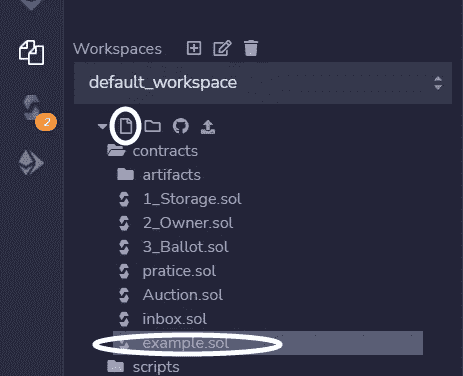
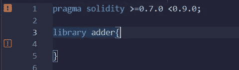
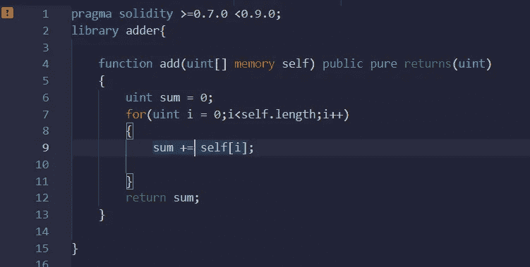
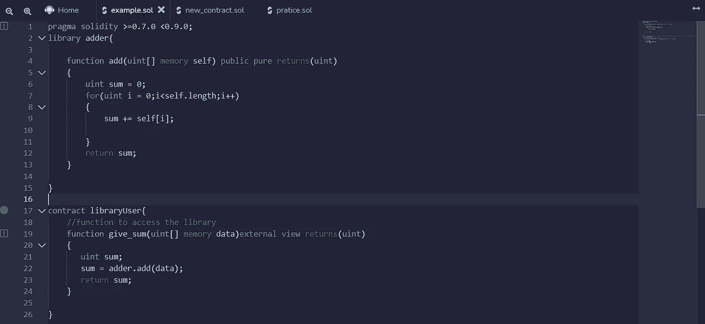
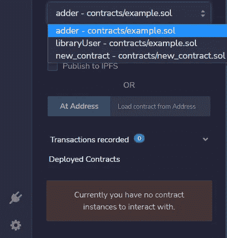
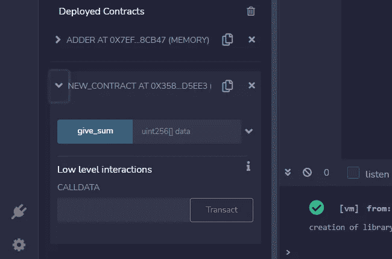
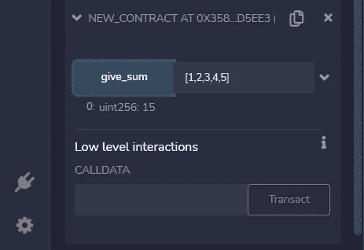

# 开发者的可靠性:可靠性中的库

> 原文：<https://medium.com/coinmonks/solidity-for-developers-libraries-in-solidity-f8c7e348dc24?source=collection_archive---------14----------------------->

## 了解 Solidity 中库的基本原理，并学习创建自己的库

Photo by [Shubham Dhage](https://unsplash.com/@theshubhamdhage?utm_source=medium&utm_medium=referral) on [Unsplash](https://unsplash.com?utm_source=medium&utm_medium=referral)

作为一种编程语言，Solidity 与一些更常见的语言如 Java、JavaScript 和 Cpp 有许多相似之处。然而，有很多特性是 Solidity 所独有的，库恰好是其中之一。

> *这篇文章是我的系列文章* [***的一部分***](/@akshatm408/list/solidity-for-developers-d604c4fd1e2a) *，在这里我用一种对开发者来说既简单又不枯燥的方式解释了可靠性。*

## 什么是图书馆？

库是智能合约的简化版本。就像智能合约一样，您可以在其他合约中使用库的功能。但是与智能契约不同，库不能有任何状态变量，也不能继承其他契约。

这个库的目的很简单，它位于区块链上，包含可以被其他契约使用的代码。

# 在 Solidity 中创建一个图书馆

对于本文的全部内容，我们将使用 [Remix IDE](https://remix.ethereum.org/) ，因为它使得整个契约的部署、执行和调试变得非常容易。

## 创建文件

要创建一个新文件，打开 Remix 导航选项卡并点击 ***新文件*** 按钮。出于我们的目的，我们将该文件命名为 ***example.sol.***

Creating The File

## 定义杂注

编写任何可靠性代码的第一步是定义编译指令。这些年来，坚固性发生了很大的变化，编译指示定义了我们的坚固性代码有效的 EVM 编译器的版本。

Defining The Pragma

## 库声明

就像智能合约一样，我们用 ***库*** 关键字声明库，后跟标识符。我们将我们的库命名为 ***加法器***

## 图书馆方法

我们的库将包含一个函数，它执行一个 uint 数组中所有数字的求和。

## 定义函数

就像在 JavaScript 中一样，Solidity 中的函数是使用 ***function*** 关键字声明的。该函数接受一个参数，该参数是一个 uint 数组，带有内存修饰符。

## “纯”修饰词

内存修饰符告诉编译器，我们的变量将要访问区块链的内存，pure 是一个修饰符，本质上意味着这个函数不读，也不写任何状态变量。

## 定义退货类型

最后一个关键字***returns(uint)***描述了这个函数返回的值的类型，在我们的例子中，我们返回一个数组中所有整数的和，所以我们返回一个 uint 类型的变量。

## 最后一眼

这是我们完成的图书馆的最后一眼。

# 在智能合同中使用库

随着我们库的完成，我们现在可以在智能合同中使用它。如果这个库与契约存在于同一个文件中，就没有必要进行任何导入。

## 访问同一文件中的库

访问存在于同一文件中的契约中的库需要任何种类的 so import 语句。

为了访问这个库，我们创建了一个简单的智能契约，其中包含一个调用我们的库的 add 函数的函数。因为库和契约存在于同一个文件中，所以不需要任何 import 语句。

## 理解合同

给定的契约只有一个函数， ***give_sum*** 函数接受整数数组类型的单个参数，并使用库方法 ***add*** 来产生总和。

external 是一个访问说明符，它声明这个方法函数只能从当前契约的外部调用。

## 从不同的文件访问

要从不同的合同中访问该库，我们需要使用***【import】***语句。在 Solidity 中，我们可以导入 URL 和文件路径。

在 import 语句中，我们导入与当前契约位于同一文件夹中的库，为此我们使用相对路径。

# 运行智能合同

要运行我们的智能契约，我们必须部署契约后面的 ***加法器*** 库。

在部署了这两个文件之后，我们可以看到我们已经在***Deployed Contracts***部分部署了这两个契约。

我们现在可以通过传递一个整数数组来测试我们的智能契约。

事实上，这很有效。这意味着我们的库已经成功地执行了不同的合同。

# 结论

这很好地总结了什么是库，以及如何创建自己的库。如前所述，它们只是智能合约的简化版本，使用库而不是继承智能合约的一个很大的好处是，它们节省了汽油成本。

如果你喜欢这篇文章，或者碰巧发现它对你有帮助，一定要看看我的列表 [**开发者的可靠性**](/@akshatm408/list/solidity-for-developers-d604c4fd1e2a) **。**

# 其他文章

[**用 Python 创建加密交易机器人**](https://coinsbench.com/automate-crypto-trading-with-python-1e2bcd6e7031)

[**用 Python 生成密码**](/@akshatm408/generating-passwords-with-python-2ed088d5f1)