# 坚固性:Merkle 树

> 原文：<https://medium.com/coinmonks/solidity-merkle-tree-41c2d2b1071f?source=collection_archive---------1----------------------->

T 今天我们来看一个有趣的话题——使用智能合同(可靠性)实现 Merkle 树。你能用它做什么？例如，您可以为 NFT 集合实现白名单逻辑。

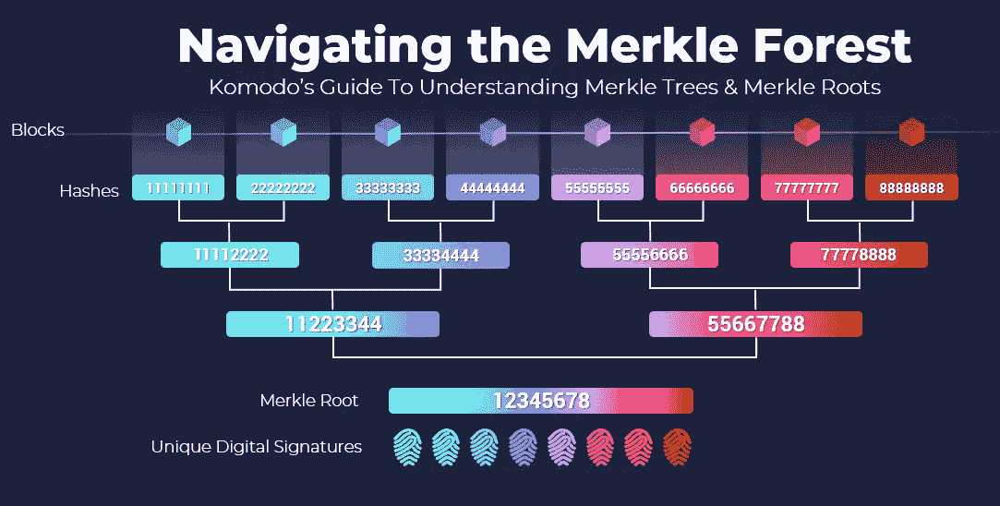

# 介绍

假设我们有 8 个合并到一个块中的事务。我们需要确保:
*1)这个块没有被篡改
2)其中的所有事务都真正被表示了*

要做到这一点->为每笔交易(或任何其他数据)计算其散列(H₁，H₂…).这将被视为一张“表”。然后，我们基于两个散列产生一个新的散列(第 2 层),依此类推，直到根散列。

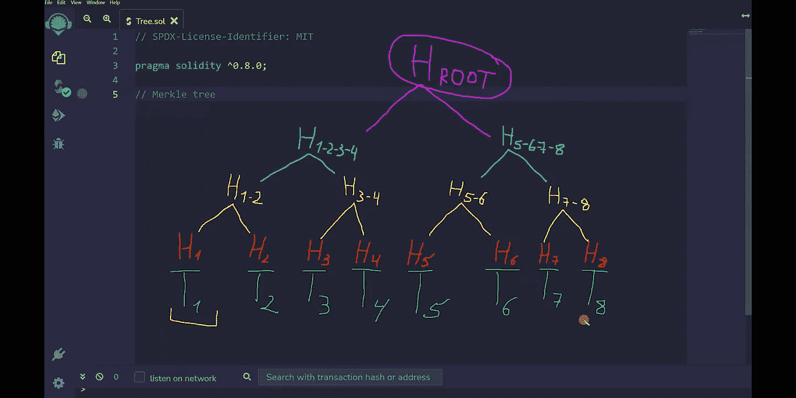

我们如何确保事务(例如 T₅)确实在块(根)中？
*我们有一个将要比较的根哈希。*

1.  我们取事务 hashes(H₅和 H₆)并重新计算散列 H₅-₆
2.  我们取 hashes(H₅-₆和 H₇-₈)并重新计算 H₅-₆-₇-₈
3.  取(H₁-₂-₃-₄和 H₅-₆-₇-₈)，计算新的根哈希，并与原始根哈希进行比较

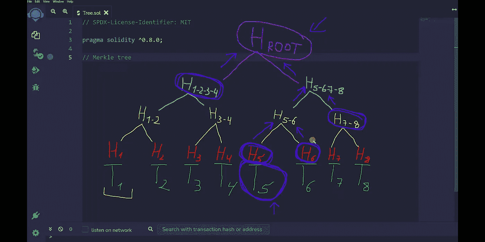

如果根哈希值匹配，则事务是正确的，并且其中没有任何更改。
注意，我们不需要所有的事务散列。

> 重要提示:树中的叶子数量不是任意的，它被限制在以下值内 2ⁿ
> 下图中的例子不适用

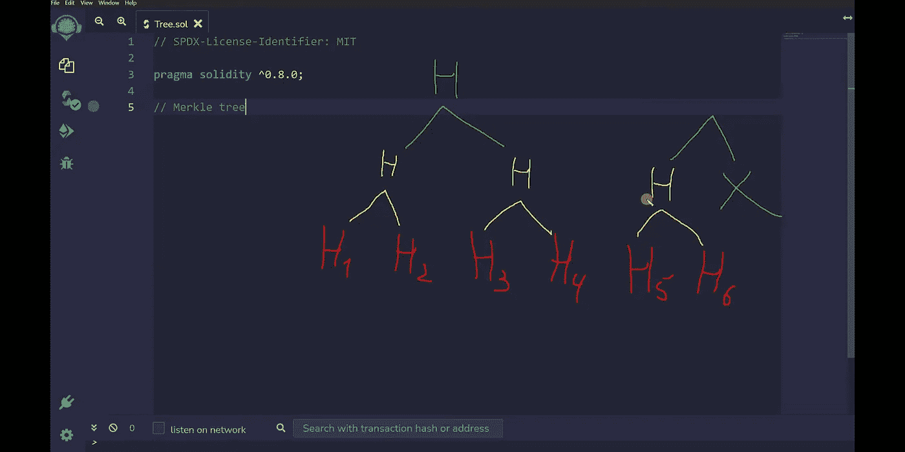

# Merkle 树编写可靠性代码

下面是使用 solidity 编写的智能合同实现哈希树的代码。别怕，下面我就把这段代码拆开😉

**考虑变量:**
`bytes32[] public hashes` —一个数组，我们将在其中存储我们所有的散列，它们将代表树；
`string[4] transactions = [...]` —模拟交易的字符串数组。这可以是任何种类的数据；

**让我们写一个哈希函数:**

```
function makeHash(string memory input) public pure returns(bytes32){        
  return keccak256(
    abi.encodePacked(input)
  ); 
}
```

*keccak256* 返回一个预定义长度为 **32 字节**的 hash，但是它需要传递一个正确编码的值，这是我们用 *abi.encodePacked()* 得到的。

## **我们将在构造函数中产生散列:**

1.  遍历事务数组，为所有事务生成散列，并将它们添加到散列数组中

```
constructor() {        
  for(uint i = 0; i < transactions.length; i++) {                   
    hashes.push(makeHash(transactions[i]));  // H1 H2 H3 H4        
  }
  ...
}
```

2.现在我们需要组合这些散列。请记住，在每一个连续的级别，叶子的数量会减半。数一数给定时刻有多少片叶子`uint count = transactions.length //number of leaves`。
让我们实现 *while(count > 0)循环{…}* 。因为我们要去更高的水平，我们需要添加一个新的变量`uint offset = 0;`

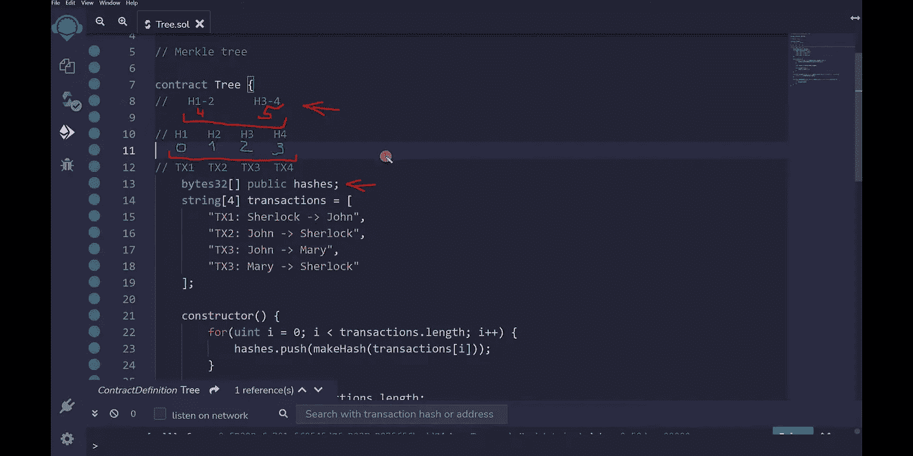

对于哈希的组合，我们实现了 *for()* 循环。照片显示了循环的迭代(红色—第一，第二；绿色—第三；紫色—第四次迭代，不会执行)。

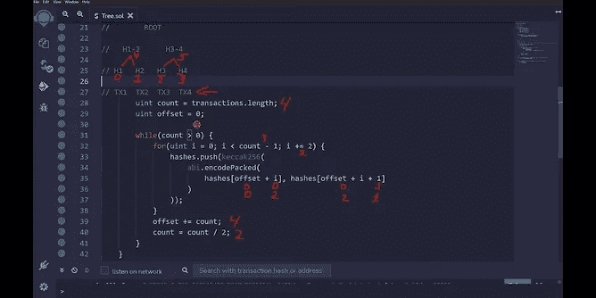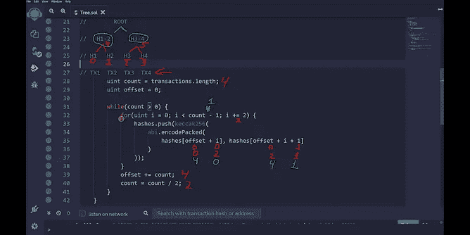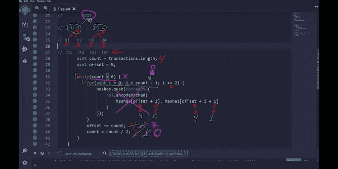

这就是我们如何计算根哈希和其他。

## **检查功能**

让我们实现事务验证功能。假设我们想知道 T₃(H₃).的真实性我们需要 2 个 hashes(H₄，H₁-₂)来做这件事。我们将把这些元素存储在数组`bytes32[] memory proof`中。

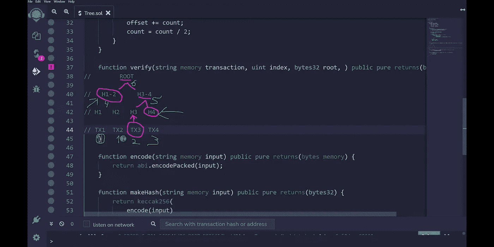

变量`bytes32 hash = makeHash(transaction);`存储我们将要检查的事务的散列。
接下来，我们编写一个 for()循环来遍历证明数组。
请注意，我们正在检查`element`(索引)的奇偶校验，因为如果元素是偶数(例如 H₃)，我们必须将元素放在右边(H₄)，反之亦然，以构建总散列。

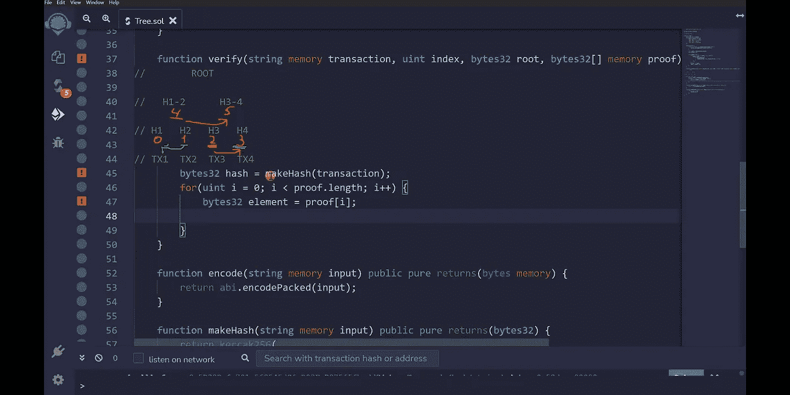

根据元素的奇偶性，我们满足以下条件 *if-else* :

```
function verify(...) public pure returns(bool) {      
  bytes32 hash = makeHash(transaction);
  for(uint i = 0; i < proof.length; i++) {            
    bytes32 element = proof[i];  
    if(index % 2 == 0) {                
      hash = keccak256(abi.encodePacked(hash, element));
    } else {               
      hash = keccak256(abi.encodePacked(element, hash));
    }
}
```

那我们就要上一级了。我们记得这将元素的数量减半，所以我们添加了`index = index / 2;`。最后，我们将原始的根哈希与我们统计的结果进行比较`return hash == root;`。

# 功能检查

转到 [Remix](http://remix.ethereum.org) ，在 */contracts* 文件夹中创建一个新文件，并从这个[库](https://github.com/kumancev/study_algorithms/blob/main/MerkleTree/MerkleTree.sol)中复制/粘贴代码(别忘了放一个 star⭐).
*1)编制本合同。2)部署合同。
3)尝试检查交易*

我将使用索引 2 检查交易。部署之后，您可以从 **hashes** 按钮(您在输入中写入您想要的散列的索引)中获得散列。
根哈希将是哈希数组中的最后一个元素。
与 2(H₃指数交易的证明数组)将包括 H₄和 H₁-₂.散列
我得到以下数据:

```
// transaction expm: "TX3: John -> Mary"
// index: 2
// root: 0x4aebbc948c21be9df7ac8d63e2f1c6d9a58998d4edfba9b192a6f8d4d7d07958
// H4: 0x69a40d72d1258df801a7ae1e36dd586717a112334f8d9ca4664a339168874ef5
// H1-2: 0x83d2dbc9a1246936e38d7f1d4de7709616ac8c32e5159f4a79b5587800249d24
```

如果我将这些值放入*验证函数*调用，我会得到**真值**。如果任何数据有哪怕是最轻微的变化，我们都会得到**假**。

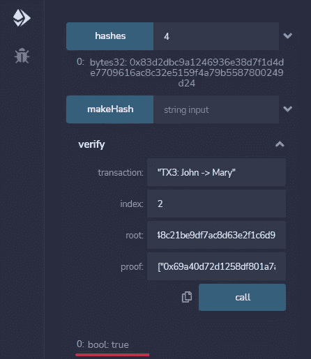

唷，那真的很多，但是现在你明白了如何实现以及智能合同中的 **Merkle 树**如何工作。将来，我可能会使用 Merkle 的树来分解白名单(allowlist)的实现。

*我期待你和 comments✍的反应🏻*

> **重要提示**:这段代码不适合真实世界，如果你想为你的收藏创建空投/白名单，请阅读这篇[文章](/@kumancev1/nft-airdrop-whitelist-implementation-with-merkletree-1afbaf4c0935)