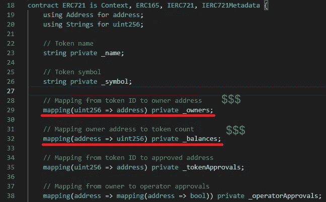
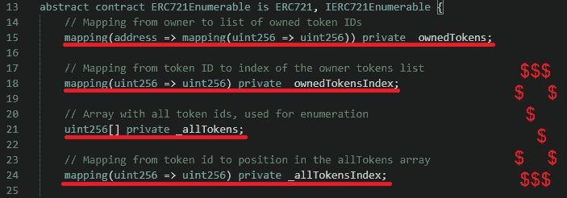
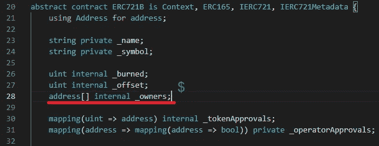

# 坚固性:简单省油

> 原文：<https://medium.com/coinmonks/solidity-simple-gas-savings-e0e0cb4cf893?source=collection_archive---------2----------------------->

今天，一位客户让我解释一下来自 [Alex Becker](https://medium.com/u/8ec9b65faefd?source=post_page-----e0e0cb4cf893--------------------------------) 的这条推文。感谢这两者，我将分享简单明了的方法来节省你的智能合同的汽油。

🙃很明显我在过去的生活中做了一些错事；减少气体不仅仅是避开气泡。请稍候，我去买一些$BYTES。… …完成-我的博客现在由 NeoTokyo 资助，我可以放弃这个幽灵了。

# 一个一个**的分析**

开[齐柏林](https://medium.com/u/4e5199c3ee0a?source=post_page-----e0e0cb4cf893--------------------------------)和 ERC721 vs

**你存储在链上的每个**变量将使用 25，000 个气体单位。花点时间回顾一下直接从 OpenZeppelin 复制的合同定义，并计算一下 s̶a̶v̶i̶n̶g̶s 成本。

***Exhibit A*:** OZ ERC721 uses 2 on-chain variables to store token data. This uses at least 50,000 gas units during mint.

***Exhibit B*:** OZ ERC721Enumerable adds 4 more on-chain variables to store token data. This uses at least 150,000 gas units during mint.

输入 [Squeebo](https://medium.com/u/30a8c50920b7?source=post_page-----e0e0cb4cf893--------------------------------) : 1 变量= 25000 气体单位

Exhibit C: Squeebo’s ERC721B and ERC721EnumerableLite only use 1 variable to store token data. 25,000 gas units 😃

这是为你的铸币商和交易商省钱的第一步，也是最大的一步。尽情享受吧！

-斯奎博

附注:请关注 [GoldenX](https://twitter.com/GoldenXnft) 开源我们的内部库:-)