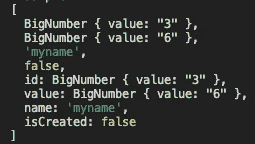
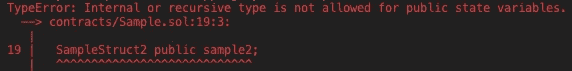

# 坚固性——结构+例子

> 原文：<https://medium.com/coinmonks/solidity-structs-examples-635578c83bcc?source=collection_archive---------7----------------------->

Photo by [Florian Olivo](https://unsplash.com/@florianolv) on [Unsplash](http://Unsplash.com)

在 Solidity 中编写智能合同有一些奇怪的地方。这些问题中的许多都与引用或映射数据类型有关，也就是说，因为这些数据类型比典型的普通值类型(标准布尔、整数、字符串等)更复杂。

这第一篇文章将进入结构。

一些注意事项:

*   我不会讨论数据位置的细节。你可以在这里阅读更多关于 T4 的内容。
*   我总是偏爱例子——因为没有什么比在 StackOverflow 上看到一个雄辩的理论答案更令人沮丧的了，然而却没有实例代码来做实际的事情。
*   在下面所有的例子中，变量都是公共的，这意味着 Solidity 中会自动创建 getters 来访问它们。([创建一个变量](https://docs.soliditylang.org/en/v0.8.12/contracts.html#visibility-and-getters) `[private](https://docs.soliditylang.org/en/v0.8.12/contracts.html#visibility-and-getters)` [或](https://docs.soliditylang.org/en/v0.8.12/contracts.html#visibility-and-getters) `[internal](https://docs.soliditylang.org/en/v0.8.12/contracts.html#visibility-and-getters)`只能防止其他合同读取或修改它，但它仍然对区块链之外的任何人可见。)
*   这里的一切都参考了 [Solidity v0.8.12](https://docs.soliditylang.org/en/v0.8.12/index.html) ，这是撰写本文时的最新当前版本。
*   您可以在这里跟随示例[的源代码。](https://github.com/yan-man/sample-structs)

# 结构

简单地说，结构是一种定义新的自定义类型的方法，它包含其他类型的成员。这是一个用 Solidity 编写的简单结构的例子。

请注意，该结构是在契约的顶部定义的，与其他状态变量放在一起。您还需要声明这个结构的某个实例变量(否则，有什么意义呢？)因为 struct 仅仅是一个*类型*。

这里有三种方法可以初始化你的`sample1`变量，用`SampleStruct1`数据填充它。

我倾向于方法 2——因为它是最明确的，也是可读的。

结构还可以包含更复杂的类型作为成员，如映射、数组或其他结构，但结构不可能包含其自身类型的成员(创建一种变量无限循环)。

这里是另一个更复杂的例子，`SampleStruct2` struct，包含一个成员数组(`values`)。在这种情况下，初始化会稍有变化。

注意，在方法 2 和方法 3 中，现在需要显式地将数组的第一个元素转换为`uint256`类型；[否则，常量的类型假定为](https://docs.soliditylang.org/en/v0.8.12/types.html#array-literals) `[uint8](https://docs.soliditylang.org/en/v0.8.12/types.html#array-literals)`。使用方法 1 时，您不需要这样做。

还要注意，我们将成员数组(`values`)显式定义为固定大小的类型(长度为 3)，而不是动态大小的数组——这将在赋值过程中引入更多的复杂性。如果将`values`改为`uint256[]`，那么方法 2 和 3 将不是声明`sample2`的有效方式——因为在那些情况下，您实际上是将一个固定大小的数组分配给一个动态大小的数组，这是不可能的。

相反，您将不得不使用方法 1 或一些变体——动态数组也有类似于 Javascript 中的[成员函数](https://docs.soliditylang.org/en/v0.8.12/types.html?highlight=dynamic%20array#array-members) `push`和`pop`:

我们将继续使用更简单的固定大小的数组。

## 吸气剂

如前所述，Solidity [自动为公共变量创建一个 getter](https://docs.soliditylang.org/en/v0.8.12/contracts.html?highlight=public#getter-functions) 。下面是如何使用 [Hardhat](https://hardhat.org/) 和 ethers.js 在 Javascript 中访问新创建的结构。

接下来，在我们的例子中，调用设置变量值的函数(`setSample1()`)。然后使用 getter(以`publicVariable()`的形式提供)来访问数据——记住我们的变量名为`sample1`。

注意，我们使用 spread 操作符来检索结构中的每个单独的元素。来自 getter 的原始数据(即`await sample.sample1()`)包括重复值的无关键，所以我们只选择相关的键:

js console.log output of sample1

在`SampleStruct2`的例子中，我们只有两个成员——一个`uint256`和一个`array`。在 getters 中，结构中的映射和数组被省略[，因为](https://docs.soliditylang.org/en/v0.8.12/contracts.html?highlight=public#getter-functions)“没有好的方法来选择单个结构成员或为映射提供一个键。”因此，在我们的例子中，我们将只从 getter(T4)接收一个元素，所以在这种情况下没有必要使用 spread 操作符。

就是这样！Solidity 中设置和获取结构的几个具体例子？

感谢阅读！

参考资料:

*   [https://jeancvllr . medium . com/solidity-tutorial-all-about-structs-b 3e 7 ca 398 B1 e](https://jeancvllr.medium.com/solidity-tutorial-all-about-structs-b3e7ca398b1e)
*   坚实度[文件](https://docs.soliditylang.org/en/v0.8.12/index.html)

*最后一点——我可能已经发现了一个可靠性错误，但是定义一个只包含*的结构*一个数组抛出一个`TypeError`，因此:

error thrown by a struct containing only a member array

> 加入 Coinmonks [电报频道](https://t.me/coincodecap)和 [Youtube 频道](https://www.youtube.com/c/coinmonks/videos)了解加密交易和投资

# 另外，阅读

*   [如何开始通过加密贷款赚取被动收入](https://coincodecap.com/passive-income-crypto-lending)
*   [加密货币储蓄账户](/coinmonks/cryptocurrency-savings-accounts-be3bc0feffbf) | [加密交易机器人](https://coincodecap.com/best-crypto-trading-bots)
*   [BigONE 交易所评论](/coinmonks/bigone-exchange-review-64705d85a1d4) | [CEX。IO 审查](https://coincodecap.com/cex-io-review) | [交换区审查](/coinmonks/swapzone-review-crypto-exchange-data-aggregator-e0ad78e55ed7)
*   [最佳比特币保证金交易](/coinmonks/bitcoin-margin-trading-exchange-bcbfcbf7b8e3) | [比特币保证金交易](https://coincodecap.com/bityard-margin-trading)
*   [加密保证金交易交易所](/coinmonks/crypto-margin-trading-exchanges-428b1f7ad108) | [赚取比特币](/coinmonks/earn-bitcoin-6e8bd3c592d9)
*   [WazirX vs coin dcx vs bit bns](/coinmonks/wazirx-vs-coindcx-vs-bitbns-149f4f19a2f1)|[block fi vs coin loan vs Nexo](/coinmonks/blockfi-vs-coinloan-vs-nexo-cb624635230d)