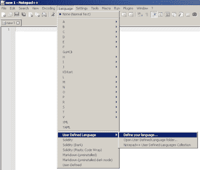
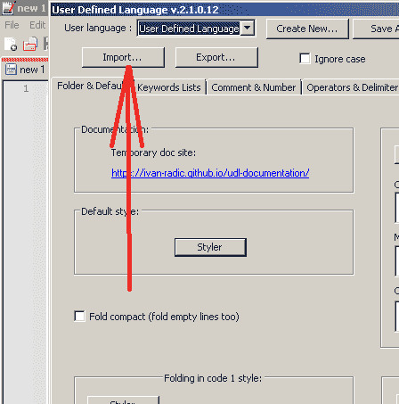

# Notepad++中突出显示的实体语法

> 原文：<https://medium.com/coinmonks/solidity-syntax-highlight-in-notepad-4419a7975634?source=collection_archive---------17----------------------->

只是一个简短的帖子。我在寻找 Notepad++的一些语法高亮插件，以便更好地处理 Solidity 代码，刚刚发现了这个关于这个的 [StackExchange 帖子](https://ethereum.stackexchange.com/questions/15321/is-there-an-userdefined-language-of-solidity-for-notepad-available)。参考并感谢 github 用户 [alin1popa](https://github.com/alin1popa/solidity-notepadplusplus-userdefined-highlight) 和 [MegaManSE](https://github.com/MegaManSE/SolidityDark) 提供了这样的模板。

所以，你要做的是:

1.  下载。这些存储库中的一个 xml 文件。例如，Solidity.xml
2.  将文件保存到% AppData % \ notepad++ \ userDefineLangs；
3.  从记事本++中，转到语言->用户定义语言->定义您的语言>导入并指向文件；
4.  关闭记事本++并打开。sol 文件。

干杯，

减压阀。

> 加入 Coinmonks [电报频道](https://t.me/coincodecap)和 [Youtube 频道](https://www.youtube.com/c/coinmonks/videos)了解加密交易和投资

# 另外，阅读

*   [最佳免费加密信号](https://coincodecap.com/free-crypto-signals) | [YoBit 评论](/coinmonks/yobit-review-175464162c62) | [Bitbns 评论](/coinmonks/bitbns-review-38256a07e161)
*   [OKEx 评论](/coinmonks/okex-review-6b369304110f) | [Kucoin 交易机器人](/coinmonks/kucoin-trading-bot-automate-your-trades-8cf0ca2138e0) | [期货交易机器人](/coinmonks/futures-trading-bots-5a282ccee3f5)
*   [AscendEx Staking](https://coincodecap.com/ascendex-staking)|[Bot Ocean Review](https://coincodecap.com/bot-ocean-review)|[最佳比特币钱包](https://coincodecap.com/bitcoin-wallets-india)
*   [霍比评论](https://coincodecap.com/huobi-review) | [OKEx 保证金交易](https://coincodecap.com/okex-margin-trading) | [期货交易](https://coincodecap.com/futures-trading)
*   [比特币基地跑马圈地](https://coincodecap.com/coinbase-staking) | [Hotbit 点评](/coinmonks/hotbit-review-cd5bec41dafb) | [KuCoin 点评](https://coincodecap.com/kucoin-review)