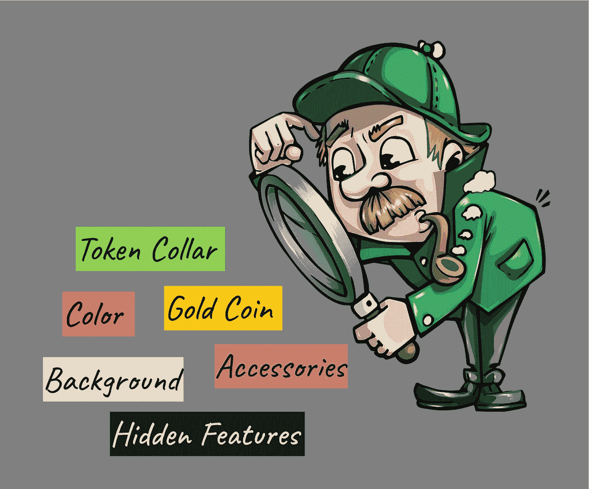
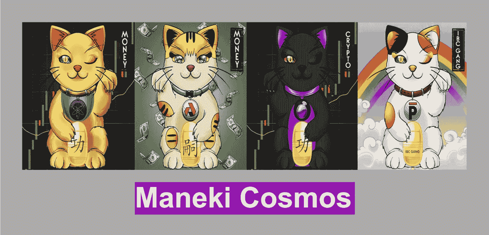
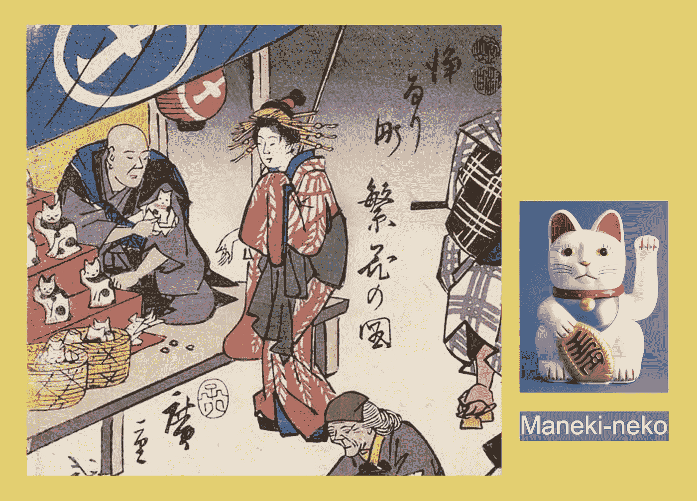
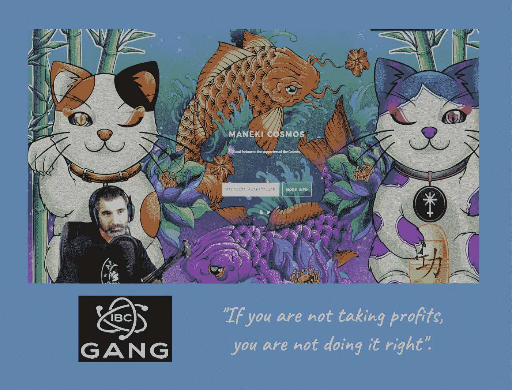
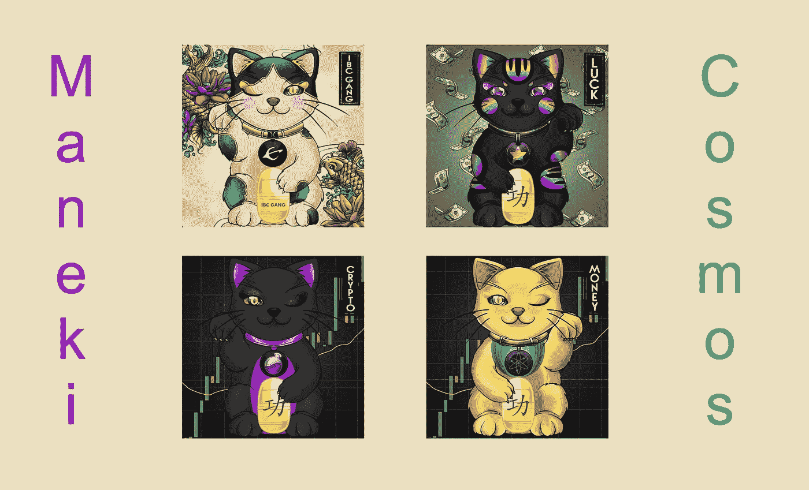
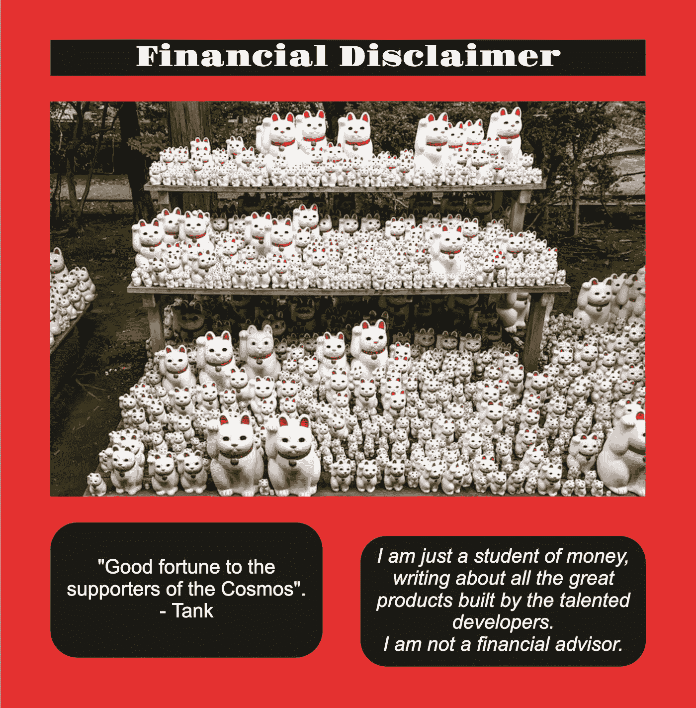

# 解开谜团:名木宇宙

> 原文：<https://medium.com/coinmonks/solving-the-mystery-maneki-cosmos-8c30135d4db8?source=collection_archive---------13----------------------->

围绕着 IBC 帮派团队提出的新 NFT 倡议的神秘感一直在稳步增长。新的限量版 NFT 系列将在不到两周的时间内发布，正如你将在下面看到的，我们已经知道了很多。然而，这个项目还有一个神秘的方面尚未透露。

让我们先回顾一下我们所知道的。

## **我们所知道的关于万木宇宙的 10 件事**

1.  这是 1，000 个 NFT 的新集合。
2.  造币日期是 2022 年 7 月 11 日。
3.  铸造活动将在星际地带举行。
4.  新的价格是 200 美元。
5.  造币价格将由星星代币支付。
6.  该系列是 IBC 帮派团队的创意。
7.  NFTs 是由 NOTs NFTs 团队设计的。
8.  国家森林公园的衣领上装饰着来自不同区块链和宇宙生态系统项目的标志。
9.  有稀有特征。
10.  一项奖励已经揭晓:如果你的 NFT 上有写着“IBC 帮”的硬币，你将收到一件印有你的 NFT 的 t 恤。

## **我们知道的关于名木内子的 10 件事**

1.  这是一个日本小雕像。
2.  直译是*招手猫*。
3.  抬起的爪子象征着招手的手势。
4.  传统上，这个小雕像代表一只印花布日本短尾猫。
5.  在日本，maneki-neko 雕像由各种材料制成，包括瓷器、粘土、木材、玉石，甚至黄金。
6.  小雕像上装饰着具有不同含义的配饰:

*   颈饰，如铃铛、围兜和项圈，用来追踪猫或表示信仰
*   金币或 kobans，代表金钱(ryo，日元的早期前身)
*   锦鲤鱼，代表财富或富足
*   钱袋，为了财富
*   大理石或宝石，代表智慧
*   扇或鼓，代表生意上的好运。

7.凸起的爪子也有不同的含义:

*   右爪——带来好运和财富
*   左爪——吸引顾客到商业场所或邀请结婚
*   双爪——提供保护。

8.maneki-neko 的颜色也有特殊的含义:

*   白色——积极和纯洁
*   黑色——抵御邪恶
*   黄金——财富和繁荣
*   红色——预防疾病
*   绿色——教育、健康和家庭安全
*   蓝色——聪明、智慧和成功
*   粉色——爱和浪漫
*   黄色——稳定、健康和关系。

9.这些小雕像在日本和亚洲的商业中很受欢迎。

10.在许多日本传说中，名木内子是很重要的。

Tank 在 YouTube 上的直播流中说的很多事情一定揭示了一些帮助我们解开这个谜的线索。这是我的候选人名单。

## **10“坦克主义”**

1.  “我们是不同的”
2.  “我们希望与我们的社区一起建设，而不是脱离我们的社区”
3.  “当我做事时，我做事是有原因的”
4.  “可以用不同的方式完成”
5.  “我正试图颠覆 NFT 游戏”
6.  “我正努力为启动 NFT 项目树立标杆”
7.  “当涉及到你的钱时，你就是滥用者”
8.  "一切都发生在两个人之间"
9.  “如果你不获利，那你就做得不对”
10.  “我们需要不惜一切代价保护社区”。

关于 Maneki Cosmos NFTs 还有许多问题没有得到回答。

## **10 名宇宙未解之谜**

1.  其中哪个 token logo 最稀有？
2.  金色是最受追捧的颜色吗？
3.  什么配饰稀有度最高？
4.  眨眼有意义吗？
5.  标语的重要性是什么？
6.  哪种背景最能增加稀有度？
7.  稀有分数计算器会发布吗？
8.  这枚金币的价值是多少？
9.  除了免费的个性化 t 恤，印有 IBC 帮的金币还有什么价值？
10.  有没有什么隐藏的功能，还没有透露出来？

## **解开名木宇宙之谜**

IBC 小组对这些新的非功能性测试的一些附加方面一直很神秘；因此，他们提高了社区的兴奋程度。显然有一个重要的价值元素还没有被揭示出来。这肯定与缓解这些艰难的市场状况有关。我没有内幕消息，但下面是我的猜测。

> 交易新手？试试[密码交易机器人](/coinmonks/crypto-trading-bot-c2ffce8acb2a)或[复制交易](/coinmonks/top-10-crypto-copy-trading-platforms-for-beginners-d0c37c7d698c)

## **10 个可能神秘的候选人揭秘**

1.  计划在不久的将来空投更多的 Maneki Cosmos 附件 NFT。
2.  来自合作项目的 NFTs 空投将提供给 Maneki Cosmos NFT 持有者。
3.  折扣铸造成本将提供给 Maneki 宇宙 NFT 持有人，由 NFT 合作伙伴项目支持这次发射。
4.  Stargaze Zone 将为 Maneki Cosmos NFT 持有者提供打折铸造机会。
5.  衣领上突出的宇宙项目已经承诺了他们的一些代币的奖品。
6.  每个 NFT 都有与项圈上的标记相匹配的奖励。
7.  拥有 IBC 帮印花金币的非关税壁垒有资格获得特殊的一次性象征性奖励。
8.  与 IBC 帮邮票金币的非功能性交易有资格铸造一个额外的限量版 NFT。
9.  印有 IBC 帮金币的 NFT 会有持续的赌注奖励，与项圈上的标记相匹配。
10.  举办这些 genesis NFTs 代表了一个大元宇宙项目的创始会员资格，该项目尚待开发。

未解之谜将在未来几周揭晓；然而，我有一种感觉，IBC 帮派团队将不会休息，直到社区中的每个创世纪所有者将榨出铸造他们的 Maneki 宇宙 NFT 的每一分钱的价值！

Veel 成功— Opa。

## **来源、参考资料和进一步阅读**

Maneki Cosmos 推特— @ManekiCosmos

NOTs NFTs — @NotsNfts

https://app.stargaze.zone/marketplace NFT 市场

Stargaze Twitter — @StargazeZone

https://www.youtube.com/c/IBCGANG IBC 帮 YouTube 频道—

IBC 帮推特— @IBC 帮

坦克的推特— @CryptoTank_

布伦布的推特—@布伦 _B07

https://discord.com/invite/ibcgangIBC 帮派不和邀请—

维基百科—[https://en.wikipedia.org/wiki/Maneki-neko](https://en.wikipedia.org/wiki/Maneki-neko)

马内基·猫:猫的事实和虚构——[https://web . archive . org/web/2013 03 14191210/http://www . darumamagazine . com/new/articles-decessors/maneki-neko-caterpillar-Fact-Fiction/](https://web.archive.org/web/20130314191210/http://www.darumamagazine.com/new/articles-excerpts/maneki-neko-feline-fact-fiction/)

> 加入 Coinmonks [电报频道](https://t.me/coincodecap)和 [Youtube 频道](https://www.youtube.com/c/coinmonks/videos)了解加密交易和投资

# 另外，阅读

*   [Bookmap 评论](https://coincodecap.com/bookmap-review-2021-best-trading-software) | [美国 5 大最佳加密交易所](https://coincodecap.com/crypto-exchange-usa)
*   [加密交易机器人](/coinmonks/crypto-trading-bot-c2ffce8acb2a) | [造币评论](https://coincodecap.com/coingate-review)
*   最佳加密[硬件钱包](/coinmonks/hardware-wallets-dfa1211730c6) | [Bitbns 评论](/coinmonks/bitbns-review-38256a07e161)
*   [新加坡十大最佳加密交易所](https://coincodecap.com/crypto-exchange-in-singapore) | [购买 AXS](https://coincodecap.com/buy-axs-token)
*   [红狗赌场评论](https://coincodecap.com/red-dog-casino-review) | [Swyftx 评论](https://coincodecap.com/swyftx-review)