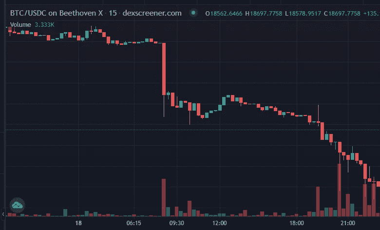
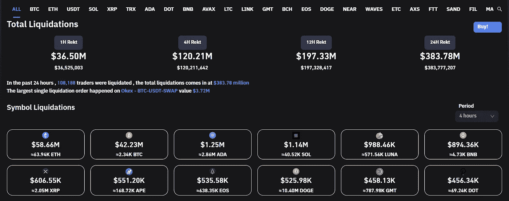
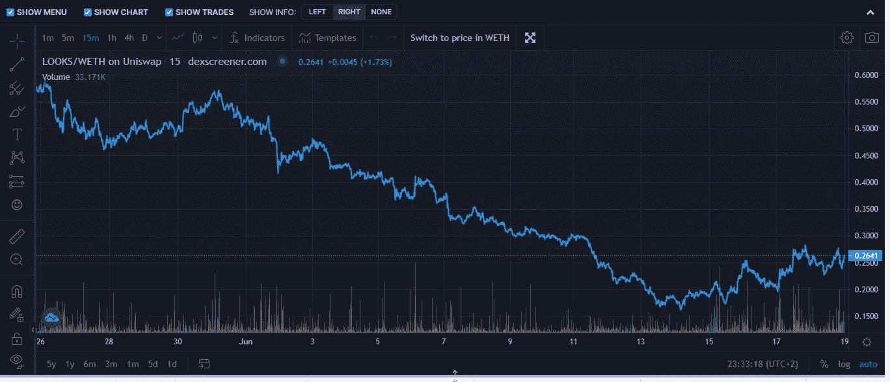
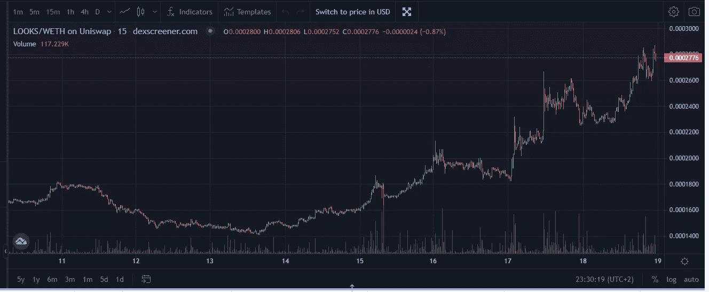
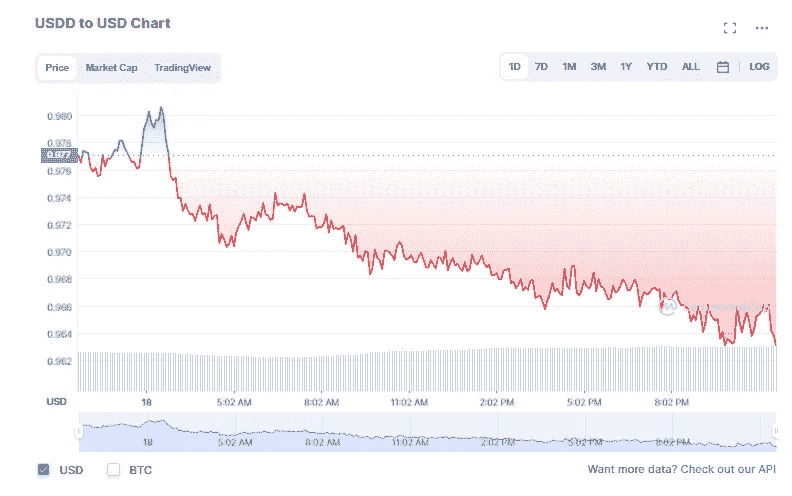
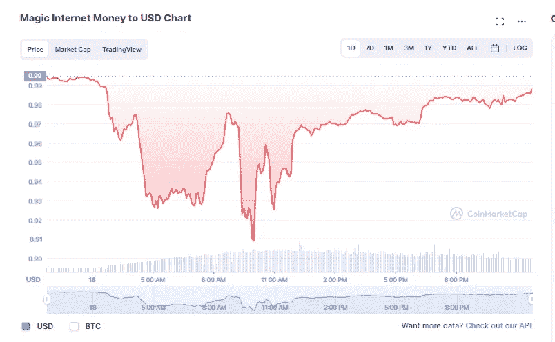
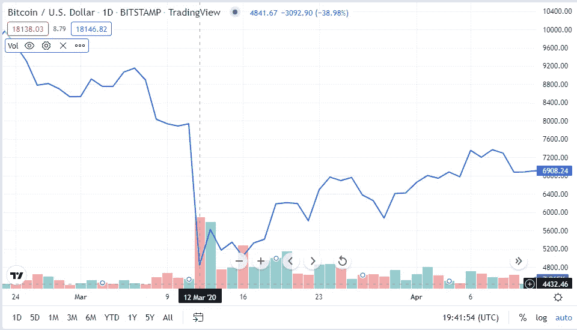

# 熊市暴跌的一些(初步)观察

> 原文：<https://medium.com/coinmonks/some-preliminary-observations-from-the-bear-market-plunge-cc574ca2991f?source=collection_archive---------27----------------------->

所以请耐心听我说(双关语)，因为我将把我上周观察到的和思考到的一些真正相关的事情说出来，希望能让一些人清醒过来。然而，一如既往，请不要认为这是财务建议，因为这些只是来自互联网上一个随机的家伙的随机观察。请做你自己的研究，找到什么投资可能最适合你。

**1。不仅仅是地下室里的 16 岁少年会变得退化**

即使当市场像疯了一样崩溃，我发现令人惊讶的是有多少人仍然继续采取杠杆，仍然继续被清算。到目前为止，在过去的 24 小时内，大约有 3.83 亿美元的人被清算，这个比率看起来并没有减少:

最重要的是，我们已经了解到像 Celisus 这样的平台，以及像 3AC 这样的所谓的“聪明钱”正在进行大量的杠杆操作，这基本上欺骗了他们的投资者。这引出了我的下一个观察:

**2。如果你决定做 CeFi，透明度是关键**

当一个平台的通讯中断时，这是一个非常不好的信号。在最近的市场暴跌之后，闪亮的灯光迅速而清晰地做出了反应——Crypto.com、迈达斯和航海家，仅举几个例子。我认为这种透明度很重要，不管消息是好是坏。一个例子是比特币基地，它宣布裁员 [18%的员工。即使这不是好消息，但它肯定显示了一定程度的透明度，至少让投资者知道该平台如何应对市场，以及它在用他们的资金做什么。其他平台，如 BlockFi，并没有真正交流他们如何应对，这对投资者来说不是一个好兆头。](https://www.cnbc.com/2022/06/14/coinbase-lays-off-18percent-as-execs-prepare-for-recession-crypto-winter.html)

如果没有官方信息出来，那么你必须在加密的 twitter 上阅读它们，这从来都不是一件好事。

**3。因为一切都很糟糕，这可能是一个摆脱你的狗屎硬币的好时机。**

我持有了相当长一段时间的亏损股票，但随着瑞士联邦理工学院和 BTC 股价如此之低，实际上让我把低价股票重新变成蓝筹股变得更有吸引力。美元看起来就是一个很好的例子，与美元相比，美元最近的价格走势如下:

然而，如果你看看 ETH 的价格，它看起来非常惊人:

因此，如果你在熊市期间的目标之一是积累尽可能多的蓝筹股代币，这肯定是要考虑的事情，尤其是如果你是那些认为熊市将消灭 99%低价位的人之一。

**4。****UST 沦陷后，人们还没有从动荡中吸取教训**

我在这里不是要告诉你“我早就告诉过你了”，因为说实话，我真的很想看到算法稳定的代码起作用。但在过去的几天里，令人担忧的是看到稳定资本如此显著地依赖$USDD(目前总市值排名第 52 位):

此外，尽管看起来它的钉住汇率正在恢复，但过度抵押的稳定货币，如$MIM，似乎也面临风险，今天早些时候跌至 0.91 美元的范围:

就像我之前说的，我不想看到这些失败，但我确信这些压力测试会让人们缩短寿命。

**5。许多 OG 会告诉你，这次市场崩溃比过去的崩溃要快得多，但我认为这不一定是真的。**

我一遍又一遍地听到，这次市场崩盘的速度比以往任何一次都要快。由于我们实际上仍处于熊市，我认为这些评论是相当主观的，但它确实激发了我的兴趣，让我看到了 BTC 最近的几次崩盘，看看距离价格真正触底还有多长时间。到目前为止，最近一次单日跌幅可能是在 2020 年 3 月，当时 BTC 单日跌幅约为-38.98%；

与上周发生的最近一次暴跌相比，在一周的时间里，BTC 总共下跌了-31.93%，6 月 13 日的单日最大跌幅约为-15.55%。相比之下，如果 BTC 股市上周单日跌幅为-38.98%，而不是-15.55%，那就像 BTC 股市单日从 3 万跌至 1.8 万。不管怎样，这还是很糟糕吗？当然是的……但是说当前的崩溃正在以更快的速度发生，这有点不诚实。这就引出了我的下一点，也许是最令人沮丧的一点:

**6。不幸的是，我认为我们还没有达到最大痛苦**

我知道有很多人在猜测我们已经触底，但老实说，我没有看到任何迹象表明我们已经触底。没有迹象表明经济受到控制，宏观环境不断传出越来越多的坏消息。房间里一些最聪明的人打电话说，他们预计 BTC 底部在 25k 左右，但因为它突破了那个底部，所以真的没有束缚，我们正处于未知的，极其不稳定的领域。

这一点，加上这些大红色蜡烛出现得如此之快，我认为我们可能会得到多少积极的消息并不重要——熊市将使价格持续暴跌。

**结论:**

让我们面对现实吧，我们将不得不准备至少再过几个月的艰苦岁月。引用 Cryptoverse 中 Benjamin Cowen 关于低价竞标的话——当价格下跌 85%时，可能仍然不是买入的好时机，因为价格很容易再下跌 85%。

话虽如此，我希望我是错的，我希望多头会回来。但与此同时，是时候准备冬眠了。再次感谢你的阅读，如果你喜欢阅读这篇文章，请考虑在 twitter 上关注我，以获得我所有的最新帖子和更新:【https://twitter.com/CryptosWith

> 加入 Coinmonks [电报频道](https://t.me/coincodecap)和 [Youtube 频道](https://www.youtube.com/c/coinmonks/videos)了解加密交易和投资

# 另外，阅读

*   [本地比特币评论](/coinmonks/localbitcoins-review-6cc001c6ed56) | [加密货币储蓄账户](https://coincodecap.com/cryptocurrency-savings-accounts)
*   [什么是融资融券交易](https://coincodecap.com/margin-trading) | [成本平均法](https://coincodecap.com/dca)
*   [支持卡审核](https://coincodecap.com/uphold-card-review) | [信任钱包 vs 元掩码](https://coincodecap.com/trust-wallet-vs-metamask)
*   [Exness 点评](https://coincodecap.com/exness-review)|[moon xbt Vs bit get Vs Bingbon](https://coincodecap.com/bingbon-vs-bitget-vs-moonxbt)
*   [如何开始通过加密贷款赚取被动收入](https://coincodecap.com/passive-income-crypto-lending)
*   [BigONE 交易所评论](/coinmonks/bigone-exchange-review-64705d85a1d4) | [电网交易 Bot](https://coincodecap.com/grid-trading)