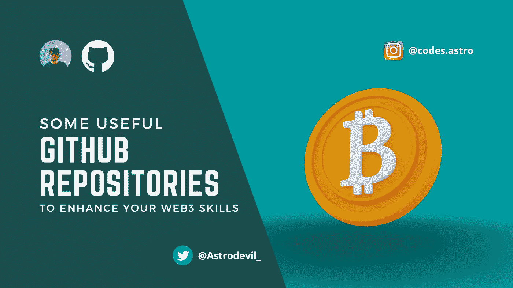

# 一些有用的 GitHub 库来提高你的 Web3 技能

> 原文：<https://medium.com/coinmonks/some-useful-github-repositories-to-enhance-your-web3-skills-3307ac7a6b33?source=collection_archive---------7----------------------->

随着世界走向新技术，Web3 是其中最具趋势的。开发者学习这项新技术的速度非常快，许多公司也在转向分散的区块链技术。要成为一名优秀的 web3 开发者，你需要良好的技术相关技能，为此，他们需要 web3 技术的实用知识。比如在区块链工作或制作项目。

在这篇文章中，我将分享一些有用的 GitHub 库，你可以对它们做出贡献并增强你对 web3 技术的实用知识。

# 1.[百日网 3](https://github.com/FrancescoXX/free-Web3-resources)

这是大量免费 Web3 资源的列表。

这主要是针对以太坊开发者的，但许多概念是在不同的区块链之间共享的，或者涉及不同的区块链。

 [## GitHub-Francesco xx/FREE-Web3-resources:一个免费资源列表，使 web 3 可以被…

### 免费资源列表，让每个人都能访问 Web3。-GitHub-Francesco xx/free-web 3-resources:一个列表…

github.com](https://github.com/FrancescoXX/free-Web3-resources) 

# 2.[令人敬畏的坚固性](https://github.com/bkrem/awesome-solidity)

⟠一个令人敬畏的固体资源，图书馆，工具和更多的策划列表。

 [## github-bkrem/awesome-solidity:⟠awesome solidity 资源、库、工具的精选列表

### 智能合约开发的最佳实践(yos.io，Yos Riady，2019) -智能合约开发人员手册…

github.com](https://github.com/bkrem/awesome-solidity) 

# 3.[枪](https://github.com/amark/gun)

用于同步分散图形数据的开源网络安全协议。GUN 是一个工具包，允许您创建社区运行的加密应用程序，如开源 Firebase 或分散式 Dropbox。互联网档案馆和数百个其他应用程序正在使用 GUN。Twitter 的蓝天计划包括枪！

 [## GitHub - amark/gun:一个用于同步分散图形数据的开源网络安全协议。

### GUN 是一个工具生态系统，可以让你构建社区运行和加密的应用程序——就像一个开源的 Firebase…

github.com](https://github.com/amark/gun) 

# 4. [Web3 Ui](https://github.com/Developer-DAO/web3-ui)

Web3 的 React UI 库。一个专门为 web3 用例设计的 UI 组件库。

 [## GitHub - Developer-DAO/web3-ui:一个用于 web3 的 React UI 库

### Web3 的 React UI 库。通过在 GitHub 上创建一个帐户，为 Developer-DAO/web3-ui 开发做出贡献。

github.com](https://github.com/Developer-DAO/web3-ui) 

# 5.[移动元蒙版](https://github.com/MetaMask/metamask-mobile)

移动网络浏览器，提供对使用以太坊区块链的网站的访问。

 [## GitHub-meta mask/meta mask-Mobile:移动网络浏览器，提供对使用…

### MetaMask 是一款移动钱包，可以轻松访问使用以太坊区块链的网站。到…为止

github.com](https://github.com/MetaMask/metamask-mobile) 

# 6.[核物理](https://github.com/nucypher/nucypher)

基于代理重加密的分散门限密码网络。

 [## GitHub - nucypher/nucypher:一个集中于代理的分散式门限加密网络…

### 一个分散的密码网络提供可访问的，直观的，可扩展的运行时和界面…

github.com](https://github.com/nucypher/nucypher) 

# 7. [Nft Api](https://github.com/nft-api/nft-api)

NFT API，返回已解析的元数据，包含所有 NFT 集合、用户和事务的所有信息。跨链 NFT API。

 [## GitHub - nft-api/nft-api: NFT API，返回已解析的元数据，并拥有所有关于…

### NFT API，返回已解析的元数据，并拥有关于所有 NFT 集合、用户、事务的所有信息

github.com](https://github.com/nft-api/nft-api) 

# 8. [Matic.js](https://github.com/maticnetwork/matic.js)

这个存储库包含 maticjs 客户端库。maticjs 使那些可能不太熟悉智能合约开发的开发人员能够轻松地与 Matic Network 的各种组件进行交互。

这个库将帮助开发人员将资产从以太坊链移动到 Matic 链，并使用欺诈证明从 Matic 退出到以太坊。

 [## GitHub - maticnetwork/matic.js:用于与 maticnetwork 交互的 Javascript 开发人员库

### 这个存储库包含 maticjs 客户端库。maticjs 让开发人员很容易，他们可能没有深入…

github.com](https://github.com/maticnetwork/matic.js) 

# 9.[区块链书籍](https://github.com/BlockchainBooks/blockchainbooks.github.io)

一本帮助人们学习和变得更棒的区块链书籍集。

 [## GitHub-block chain Books/block chain Books . GitHub . io:区块链书籍

### 区块链书籍，以帮助人们学习和变得真棒加入技术革命，这是采取金融…

github.com](https://github.com/BlockchainBooks/blockchainbooks.github.io) 

# 10. [web3](https://github.com/life-itself/web3)

理解 web3 和加密。关键概念和思想介绍。对正反两方面的关键主张进行严格、建设性的分析。看看更深层次的希望和愿望。

 [## GitHub-life-self/web3:理解 web 3 和加密。关键概念和思想介绍…

### 理解 web3 和加密。关键概念和思想介绍。对关键主张进行严谨、建设性的分析…

github.com](https://github.com/life-itself/web3) 

# 11.[学习 Web3 Dapp](https://github.com/figment-networks/learn-web3-dapp)

这个 Next.js 应用程序旨在与 Figment Learn Pathways 一起使用，以帮助开发人员了解各种区块链协议，如 Solana、NEAR、Secret、Polygon 和 Polkadot！

 [## GitHub-figment-networks/learn-web 3-dapp:这个 Next.js 应用程序是为 fig ment 设计的…

### 这个 Next.js 应用程序旨在与 Figment Learn Pathways 一起使用，以帮助开发人员了解各种…

github.com](https://github.com/figment-networks/learn-web3-dapp) 

## 如果你❤️我的内容！在 [Twitter](https://mobile.twitter.com/Astrodevil_) 上联系我，或者[给我买辆 Coffee☕](https://www.buymeacoffee.com/Astrodevil) 来支持我！你也可以在我位于 [Gumroad](https://astrodevil.gumroad.com/) 的商店购买数码产品

> 加入 Coinmonks [电报频道](https://t.me/coincodecap)和 [Youtube 频道](https://www.youtube.com/c/coinmonks/videos)了解加密交易和投资

# 另外，阅读

*   [Bookmap 评论](https://coincodecap.com/bookmap-review-2021-best-trading-software) | [美国 5 大最佳加密交易所](https://coincodecap.com/crypto-exchange-usa)
*   最佳加密[硬件钱包](/coinmonks/hardware-wallets-dfa1211730c6) | [Bitbns 评论](/coinmonks/bitbns-review-38256a07e161)
*   [新加坡十大最佳加密交易所](https://coincodecap.com/crypto-exchange-in-singapore) | [购买 AXS](https://coincodecap.com/buy-axs-token)
*   [红狗赌场评论](https://coincodecap.com/red-dog-casino-review) | [Swyftx 评论](https://coincodecap.com/swyftx-review) | [CoinGate 评论](https://coincodecap.com/coingate-review)
*   [投资印度的最佳密码](https://coincodecap.com/best-crypto-to-invest-in-india-in-2021)|[WazirX P2P](https://coincodecap.com/wazirx-p2p)|[Hi Dollar Review](https://coincodecap.com/hi-dollar-review)