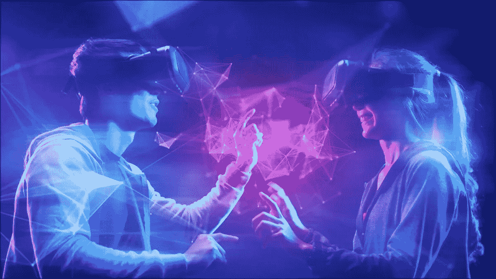

# 元宇宙的六大核心技术

> 原文：<https://medium.com/coinmonks/something-about-the-6-core-technologies-in-the-metaverse-a6bf61329634?source=collection_archive---------39----------------------->



Image quoted from [https://www.howtogeek.com/781537/how-the-metaverse-will-make-money-using-your-face/](https://www.howtogeek.com/781537/how-the-metaverse-will-make-money-using-your-face/)

说到元宇宙，我们不得不提到驱动它的 6 项核心技术。

为了更好地理解这些，让我们试着学习并记住一个新单词，“BIGANT ”。

你也可以把它分成两个单词来记，比如“**大蚂蚁**”。

**那么，什么才是真正的“大人物”？**

“BIGANT”由 6 个英文字母组成，是元宇宙 6 种核心技术的缩写。

第一个字母“ **B** ”代表“**区块链**”。区块链是物理世界个体和虚拟世界个体之间映射的基础工具，它为彼此建立连接。假设你在虚拟世界中拥有一个分身，这个分身以数据的形式创造价值。通过区块链技术定位，这些数据可以判断是你的而不是别人的，这样就可以逐渐形成一个有序的市场。

第二个字母“ **I** ”代表“**交互技术**”。交互技术经常应用于 AR、VR、全息图像、脑机互联等。例如，如果你戴上 VR 眼镜通过计算机互联技术进入元宇宙，你会发现你在元宇宙感受到的一切都可以通过 3D 打印机 holograns 传输到现实世界。通过交互技术的应用，虚拟世界和物理世界的距离似乎没有那么远。

第三个字母“ **G** ”代表“**电子游戏相关技术**”。这款游戏被广泛认为是元宇宙的初始入口。基于视频游戏相关技术，玩家可以在元宇宙中拥有一个虚拟身份，并可以依靠该身份在游戏中进行社交。

第四个字母“ **A** 代表“**人工智能**”。高度自动化的人工智能具有令人难以置信的数据处理速度和能力，这使它成为元宇宙未来最有前途的开发技术之一。依靠 AI 令人难以置信的数据处理速度和能力，AI 可以帮助实现 NPC 响应玩家行为的逼真行为，并帮助设计基于 2D 图像或真实用户的 3D 扫描的更动态和逼真的数字化身。

第五个字母“ **N** 代表“**网络和计算技术**”。元宇宙对网络和计算技术有一定的需求。高同步、低延迟的网络可以帮助用户在元宇宙获得实时、流畅、完美的体验。根据现阶段的数据测试，5G 网络延迟可以控制在 10ms 以内，6G 网络延迟有望降低到 5G 的 1/10，因此 5G 网络和 6G 网络都有可能满足元宇宙的网络需求。此外，元宇宙要求用户使用任何设备登录，随时随地沉浸其中。还需要实时监控数据和大量计算。因此，单个服务器或几个服务器很难支持元宇宙中的巨大计算量。云计算作为一种分布式计算，在元宇宙中有望支持大量用户同时在线。

第六个字母“ **T** ”代表“**物联网(IoT)** ”。物联网满足了随时随地以各种方式访问元宇宙的需求，也为元宇宙获取外部信息源提供了支持。元宇宙的要求之一是方便访问，因此人们与互联网交互的方式将不仅限于手机和电脑，其他物品也将连接到网络，如可穿戴设备、汽车等。此外，物联网传感器可以确保元宇宙从物理世界获得更多信息。

这些是支持元宇宙的 6 项核心技术的简要描述。感谢您的阅读！要了解更多关于元宇宙和区块链行业的信息，请随时关注我们以获得更多积分。

#元宇宙#科技#区块链#互动科技#视频游戏相关科技#人工智能#人工智能#网络和计算科技#物联网#物联网

```
**Join us:**About X-Ra Gameverse:
X-Ra Gameverse(XRG) is a gaming guild providing the best P2E gaming experience for gamers from different alliances to utilize the functionality of guilds and maximize profits.[**Discord**](https://t.co/QVeGJm4eoo) **|** [**Twitter**](https://twitter.com/XRaGameverse) **|** [**Reddit**](https://www.reddit.com/user/X-RaGameverse/) **|** [**Official Website**](http://x-ragameverse.io/) **|** [**Youtube**](https://www.youtube.com/channel/UCCdn2T27HYCPDaVT49629Tw)
```

> 加入 Coinmonks [Telegram group](https://t.me/joinchat/Trz8jaxd6xEsBI4p) 并了解加密交易和投资