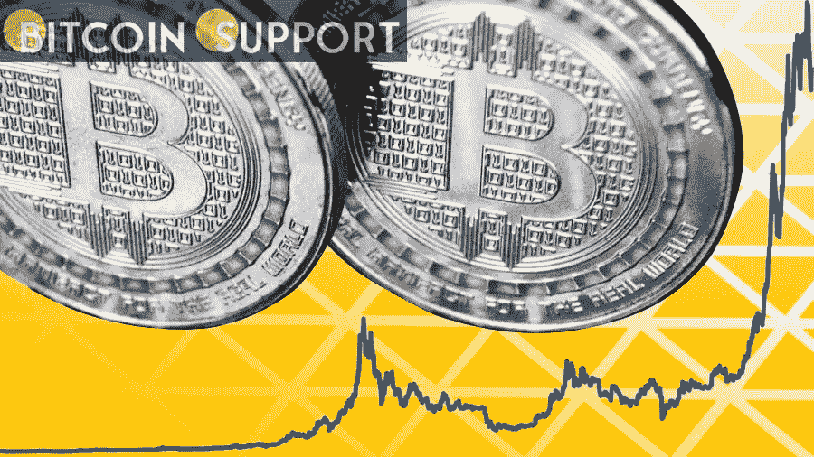
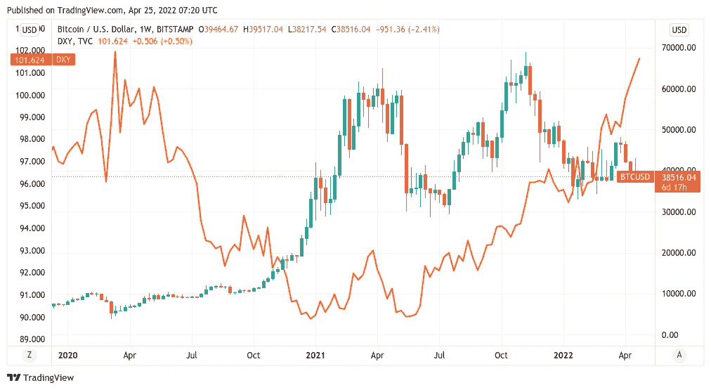
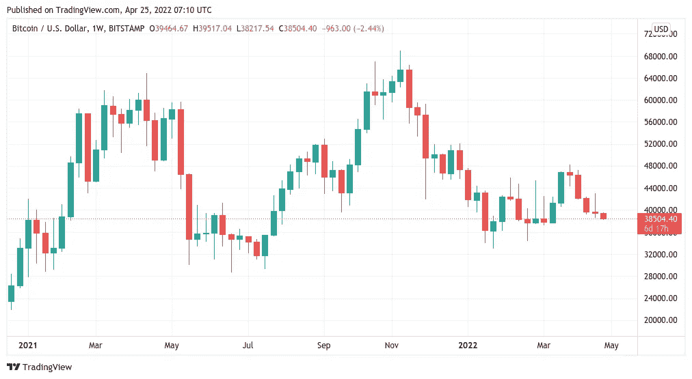
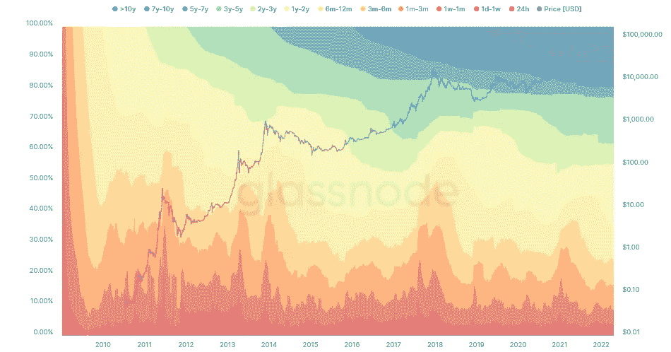
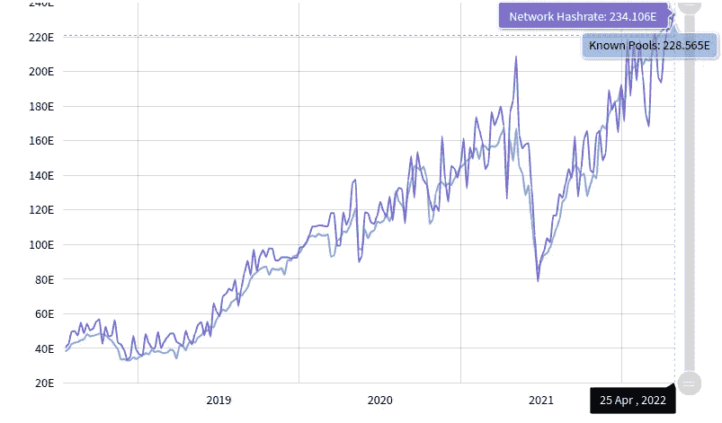

# 好像有什么东西要倒塌了。以下是本周你应该知道的 5 个比特币事实

> 原文：<https://medium.com/coinmonks/something-certainly-feels-as-though-its-ready-to-collapse-5-bitcoin-facts-to-know-this-week-3accbd449ce6?source=collection_archive---------51----------------------->

**Visit our website for full blog:-** [**https://bitcoinsupports.com/something-certainly-feels-as-though-its-ready-to-collapse-5-bitcoin-facts-to-know-this-week/**](https://bitcoinsupports.com/something-certainly-feels-as-though-its-ready-to-collapse-5-bitcoin-facts-to-know-this-week/)

鉴于同样黯淡的宏观经济前景，随着美元飙升引发怀疑，比特币似乎正走向衰落。

比特币(BTC)在不确定的状态中开始新的一周，面对不确定的时代——现在 40000 美元是阻力吗？

最大的加密货币最近连续第四次完成红周蜡烛，这是自 2020 年 6 月以来从未出现过的壮举。随着对宏观经济未来的悲观情绪继续成为常态，本周开始时似乎没有什么可以安慰多头——比特币远未结束下跌。在过去四天下跌 4000 美元之后，价格目标已经转向重新测试流动性水平，进一步接近 30000 美元。并非所有人都是悲观的——长期持有人和矿工等主要参与者对比特币作为一种投资表达了更乐观的看法。

**亚洲的困难已经超过了法国大选的喜悦。本周初，影响风险资产的最大外部事件是法国大选，现任总统埃马纽埃尔·马克龙获胜。马克龙的第二个任期让担心极右翼竞争对手马林·勒·庞意外获胜的市场参与者松了一口气，预计这将提振法国股市，尤其是在周一的开盘，以及陷入困境的欧元。

与美国类似，欧盟面临着通货膨胀和债券市场暴跌的强大组合，欧洲中央银行(ECB)不太可能采取明确的行动来提高利率或减少其近 10 万亿美元的资产负债表。

比特币没有受到马克龙获胜的影响，随着中国冠状病毒冲击信心，风险资产已经在为周一的亚洲抛售做准备。香港恒生指数当日下跌 3.5%，而上证综指下跌 4.2%。鉴于加密技术现在与股市走势高度相关，欧洲和美国的重演将提供明显的方向性线索。全球资产管理公司 AllianceBernstein 亚太区固定收益联席主管 Jenny Zeng 对《彭博》表示:“令人担忧的是，由于 Covid 措施放缓了经济活动，政府目前出台的政策支持可能无效。”。甚至在周一的损失之前，市场评论员 Holger Zschaepitz 就强调说，过去的一周对股票来说是艰难的。“全球股市本周市值损失了 3.3 万亿美元，因为美国股市——在周四上午达到顶峰后——经历了持续下跌，因为投资者似乎在重新评估他们在不确定的世界中收购风险资产的决定，”他周日警告 Twitter 粉丝。

**“全球股票市场价值 107.6 万亿美元，相当于 GDP 的 127%。”****

**Visit our website for full blog:-** [**https://bitcoinsupports.com/something-certainly-feels-as-though-its-ready-to-collapse-5-bitcoin-facts-to-know-this-week/**](https://bitcoinsupports.com/something-certainly-feels-as-though-its-ready-to-collapse-5-bitcoin-facts-to-know-this-week/)

随后的一篇帖子指出，所谓的巴菲特指标——美国股市总估值与 GDP 的比率——仍高于 100%，他形容这是“有问题的”

**美元的力量卷土重来。美元是宏观经济环境中一个非常积极的因素——这让秘密交易者们大为惊愕。

在上周徘徊至两年高点后，美元货币指数(DXY)目前似乎正在延续其上升趋势。在撰写本文时，DXY 正在测试其 2020 年 3 月的表现，当时冠状病毒危机导致全球资产暴跌。美元走强很少对比特币有利，尽管一些人质疑这种不利联系，但本月比特币似乎牢牢占据了主导地位。**

**Visit our website for full blog:-** [**https://bitcoinsupports.com/something-certainly-feels-as-though-its-ready-to-collapse-5-bitcoin-facts-to-know-this-week/**](https://bitcoinsupports.com/something-certainly-feels-as-though-its-ready-to-collapse-5-bitcoin-facts-to-know-this-week/)

“看起来好像 DXY 开发商刚刚宣布了令牌燃烧或什么的，”受欢迎的交易商 Crypto Ed 在回应最近的发展时开玩笑说。《投资者》播客网的主持人普雷斯顿·皮什(Preston Pysh)认为有些不对劲。他周一表示:“在日元下跌之际，日本央行开始实施收益率曲线控制，而在美元创下新高之际，美联储准备加息 50 个基点。”。

**“有些东西确实感觉好像要折断了……”**

周线图显示连续第四根红烛。

本周一，比特币似乎心情不太好。虽然周末保持相对平静，但周收盘令人失望，仅略低于上周的水平。然而，根据 TradingView 的数据，这确实意味着现在周线图上出现了四根连续的红蜡烛，这是自 2020 年 6 月以来从未出现过的情况。随后，隔夜市场持续低迷，BTC 兑美元跌至 39，000 美元下方，目前交易于此。

**Visit our website for full blog:-** [**https://bitcoinsupports.com/something-certainly-feels-as-though-its-ready-to-collapse-5-bitcoin-facts-to-know-this-week/**](https://bitcoinsupports.com/something-certainly-feels-as-though-its-ready-to-collapse-5-bitcoin-facts-to-know-this-week/)

尽管乐观的迹象很少，但交易者正在检查大量图表元素，寻找这对组合未来方向的线索。根据著名交易员和分析师 Rekt Capital 的说法，即将到来的 Ichimoku 云将导致比特币的重大损失。https://twitter.com/rektcapital/status/1518278745169317891

[广受欢迎的分析师和交易智慧的创造者切兹正在观察三日图上 200 周期移动平均线下方的可能突破。他在上周末表示:这将是值得注意的，考虑到上一次牛市中出现这种情况是在 2018 年熊市底部。

“这不是预测；这只是一个观察，”他澄清说。

关于 2018 年 12 月及其 3100 美元的下限，推特上的抛物线 Matt Matthew Hyland 提供了那个时代和当前比特币价格运动之间的其他类比。他指出，从长远来看，手头有 37，600 美元现在是“关键”](https://twitter.com/rektcapital/status/1518278745169317891) [https://Twitter . com/MatthewHyland _/status/1517744727369654272](https://twitter.com/MatthewHyland_/status/1517744727369654272)

“等待那场席卷，届时我会寻找一个缓解反弹的迹象来结束它，”推特评论员托尼周一在自己的分析中补充道。

**霍德勒树立了新的标准。**

较低的时间框架由于比特币的“波动”性质，除了最有经验的交易者之外，其他人对比特币的价格变动都不感兴趣。因此，毫不奇怪，大多数霍德勒人更喜欢置身事外，专注于他们最擅长的事情。这一点现在反映在链上数据中，这表明闲置至少一年的比特币供应比例处于历史最高水平。根据经济学家 Jan Wuestenfeld 使用链上分析初创公司 Glassnode 的数据，这导致供应总体上“老化”——按比例来说，更多的硬币被囤积而不是花费。

根据 Glassnode 的数据，一年或更长时间不活跃的供应有史以来首次超过了 64%。

[https://twitter.com/JanWues/status/1518176557843587072](https://twitter.com/JanWues/status/1518176557843587072)

与此同时，显示各种年代的手持硬币的玻璃节点指示器 HODL 波验证了这一趋势。自 2021 年 12 月以来，1-2 年期供应份额的增长速度比其他任何时候都快——从 12 月的不到 10%到本周的约 15%。

此外，3-5 年期的霍德尔硬币扩大了它在 Q1 的流行。

**Visit our website for full blog:-** [**https://bitcoinsupports.com/something-certainly-feels-as-though-its-ready-to-collapse-5-bitcoin-facts-to-know-this-week/**](https://bitcoinsupports.com/something-certainly-feels-as-though-its-ready-to-collapse-5-bitcoin-facts-to-know-this-week/)

基本面继续指向月球。面对黯淡的预测，不仅仅是偶然的死忠霍德勒顽固地拒绝最小化他们在 BTC 的风险敞口。

看看比特币网络的基本面就会发现，在投资方面，矿工们一点也不消极。

今年的一个普通故事，但尽管如此，鉴于价格正朝着相反的方向发展，比特币的网络散列率和难度都有望在本周创下历史新高。根据市场表现，在接下来的两天里，困难应该会增加大约 2.9%，创造 29.32 万亿的新纪录。

为了强调对矿业参与的竞争，散列率(hash rate)增加了难度，散列率是一种衡量分配给区块链的处理能力的指标，它已经达到了历史最高水平。

估计值因来源而异，但来自 MiningPoolStats 的原始数据强调了散列率“只涨不跌”的趋势——一些人声称，这是跟随积极价格表现的关键触发因素。

同时，增加散列率的趋势并不新鲜；随着投资持续扩张，这一预测已经持续多年。

**访问我们的网站获取完整博客:-**[**https://bitcoinsupports . com/something-determinal-fees-as-as-as-that-its-ready-to-know-this-week/**](https://bitcoinsupports.com/something-certainly-feels-as-though-its-ready-to-collapse-5-bitcoin-facts-to-know-this-week/)

**免责声明:以上为作者观点，不应视为投资建议。读者应该自己做研究。**

> 加入 Coinmonks [电报频道](https://t.me/coincodecap)和 [Youtube 频道](https://www.youtube.com/c/coinmonks/videos)了解加密交易和投资

# 另外，阅读

*   [Capital.com 评论](https://coincodecap.com/capital-com-review) | [香港的加密借贷平台](https://coincodecap.com/crypto-lending-hong-kong)
*   [如何在 Uniswap 上交换加密？](https://coincodecap.com/swap-crypto-on-uniswap) | [A-Ads 评论](https://coincodecap.com/a-ads-review)
*   [WazirX vs CoinDCX vs bit bns](/coinmonks/wazirx-vs-coindcx-vs-bitbns-149f4f19a2f1)|[block fi vs coin loan vs Nexo](/coinmonks/blockfi-vs-coinloan-vs-nexo-cb624635230d)
*   [本地比特币审核](/coinmonks/localbitcoins-review-6cc001c6ed56) | [加密货币储蓄账户](https://coincodecap.com/cryptocurrency-savings-accounts)
*   [什么是保证金交易](https://coincodecap.com/margin-trading) | [美元成本平均法](https://coincodecap.com/dca)