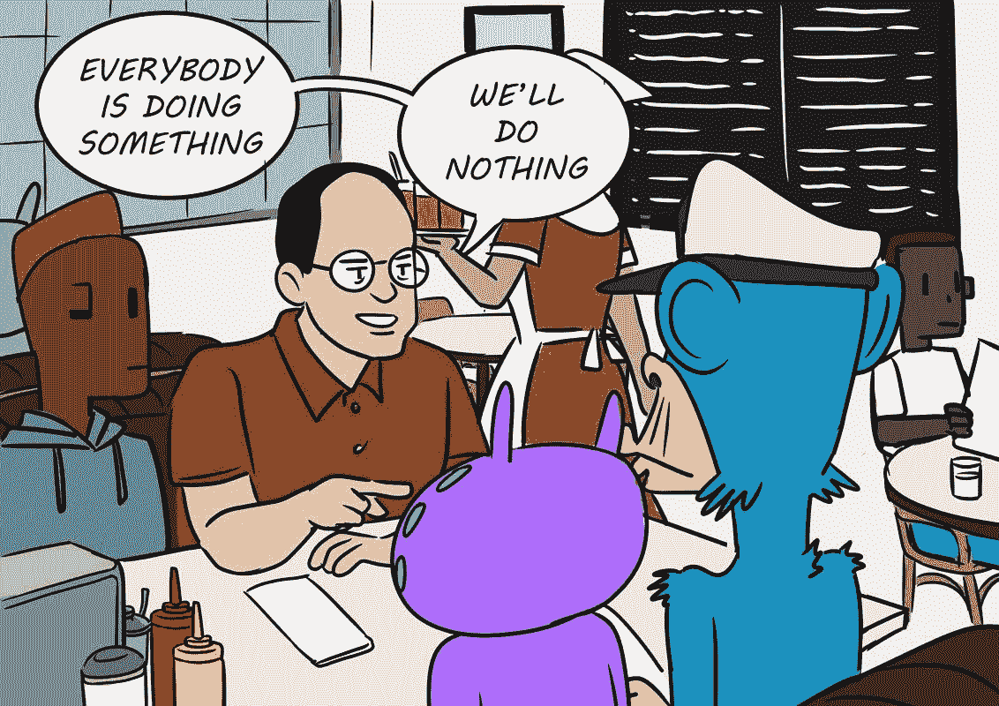
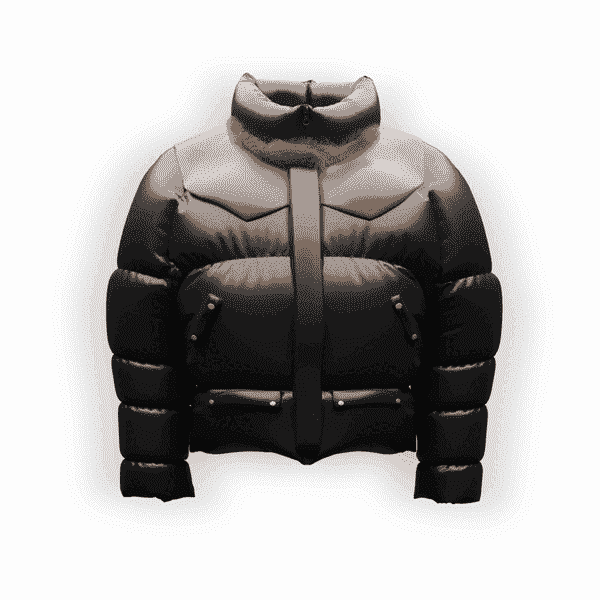

# 从无到有

> 原文：<https://medium.com/coinmonks/something-from-nothing-a843159c4654?source=collection_archive---------63----------------------->

## **从无到有。Wtf:一个“无所事事”的 NFT，由于其社区和分散自治组织(DAO)的存在，即将创造出一些特别的东西。**

**从无到有。Wtf 是一个新的和创造性的道驱动的 NFT 项目，其成员引导项目向前发展。**

大多数 NFT 项目采用基于创始人唯一愿景的自上而下的叙述方式。这些项目淹没在夸张和不切实际的路线图中，再加上区块链的快速发展，通常以失败告终。

从无到有。Wtf(或一无所有)，一个催化 NFT 项目，其命运牢牢掌握在其生态系统手中。

作为一个分散的自治组织(DAO)，Nothing 社区将拥有必要的工具来对项目的治理及其资源分配做出决策。给定的 DAO 成员资格将被限制为 FromNothing。Wtf 令牌持有者的决策将符合项目价值最大化的共同利益。通过利用 DAO 金库中的密码，会员们可以提议并投票表决可能会让所有参与者受益的计划。从开发游戏、电影和其他娱乐性的 NFTs 应用程序，到更短期的、面向社区的计划，如向全球事业捐赠紧急援助。

该项目在启动时已经取得了前所未有的成功，在公开宣布的头几天就聚集了超过 10，000 名 Twitter 追随者。

项目名称，从无到有。Wtf，即“无”，是对 90 年代流行情景喜剧《宋飞正传》的模仿，被粉丝和评论家广泛称为“无所事事的节目”，但实际上恰恰相反——通常专注于日常生活的细节。没有什么可以作为一个没有总体规划或路线图的项目推出，但它注定会迅速成为既令人兴奋又充满潜力的东西。我们的目标是塑造一个透明的、能引起每个人共鸣的动态叙事。

**获得传说中的河豚夹克加入虚无**

要想成为一无所有生态系统的成员，用户必须首先获得一件元宇宙现成的“传奇河豚夹克”NFT，这是根据乔治的大戈尔 Tex 外套改编的，穿着它去参加杰里、伊莱恩和克莱默参加的晚宴(第 77 集)。创始人已经在 Twitter 上公布了他们的身份，也使薄荷的价格非常实惠。

传说中的河豚夹克的铸造将于 0.07 开始。前 2000 件夹克将以 0.07 ETH 的价格出售，而接下来的 5000 件夹克将以 0.09 ETH 的价格出售。铸造日期将很快公布。

加入预售名单，保证你在传说中的河豚夹克上市时购买——已经有巨大的需求，预计会售罄。

*   预售名单链接:[http://lazyshort.com/miqZ6](http://lazyshort.com/miqZ6)
*   网址: [fromnothing.wtf](http://fromnothing.wtf)
*   推特:【www.twitter.com/hodlnothing 
*   不和:【https://discord.gg/CEGbnX95】T4