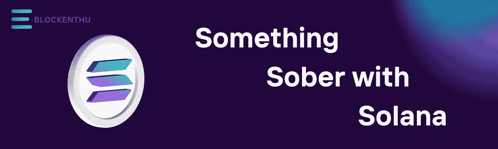

# 索拉娜很清醒

> 原文：<https://medium.com/coinmonks/something-sober-with-solana-c2f1c8e73015?source=collection_archive---------20----------------------->

**索拉纳(SOL)**

# 索拉纳到底是什么？

**Solana** 是一个快速可编程的分散式区块链平台，旨在创建一个无信任的分布式协议，而它**是一个单链、授权的利益相关证明协议**，其重点是在不牺牲分散性或安全性的情况下提供**可扩展性。SOL token 源自 Solana 区块链，这是一个专注于以最小拥塞交付快速交易的网络，声称它每秒可以处理 65，000 笔交易。**其市值超过 19，656，650.36 亿美元(根据 2022 年 2 月 16 日的 CoinMarketCap ),目前交易价格为 **102 美元**，在包括比特币基地和币安在内的几大密码交易所上市。该网络的交易成本估计为每百万笔交易 10 美元。索拉纳的使命是**支持所有高增长和高频率的区块链应用，并使世界金融系统民主化。**

# 索拉纳的独特之处。

仅在 2021 年的 12 个月里，索拉纳的涨幅就超过了 7000%，一个月内就超过了 250%。现在的问题是，Solana 能否成为№1 智能合约平台，废黜以太坊。索拉纳不使用工作证明或利害关系证明，相反，他们使用历史证明，这不是一个共识机制，在利害关系证明中整合时间就是我们所说的**历史证明。**

***混淆视听对吗？***

其他区块链国家面临的一个大问题是，他们必须商定一个时间，我们必须认为这是理所当然的， 但是计算机必须不停地走，现在是什么时间，因为它们不能做事情，看看它们的手机甚至太阳来确定它在区块链节点上，这是一个花哨的词，意味着网络上的计算机必须在提交块之前这样做，在计算机世界中，这种喋喋不休会占用很多时间，Solana 使用历史证明来解决这个问题， 为了让每个人都给他们的块打上时间戳并使用加密证明，这样他们就不必等待每个人都同意时间，基本上我们可以在事实发生后就块上的数据组织达成一致，这意味着我们不必等待其他验证者来检查或批准我们的工作。 通过这样做，Solana 可以执行约 1800 tps(每秒事务数)的事务，击败了事务速度为 13 的以太坊。

# 索拉纳就是它所代表的

SOL 是 Solana 的本地加密货币，是一种公用事业令牌。当进行转账或使用智能合同时，用户需要 SOL 支付交易费用。作为其通货紧缩战略的一部分，该网络烧掉了 SOL。sol 的持有者也可以作为网络验证者。像以太坊一样，Solana 允许开发者建立智能合同和基于区块链的项目。SOL 使用 SPL 协议。 **SPL 是索拉纳·区块链的令牌标准**，堪比以太坊的 ERC20。

# 索拉纳开发者体验

# 世界上最快的区块链被攻击到目前为止，索拉纳已经遭受了 2 次攻击和一次网络中断(在 2022 年 2 月 16 日写这篇文章时)

索拉纳基金会面临的第一次攻击称，机器人在 **Raydium 上以每秒 400，000 次交易**的速度发送垃圾邮件葡萄协议 IDO，使网络瘫痪。

索拉纳将遭受的 **17 小时中断**归因于针对 Grape Protocol 2021 年 9 月 14 日首次发行 DEX(I do)的拒绝服务攻击。

攻击导致 Solana 的网络验证器在内存耗尽后崩溃。结果，在 2021 年 9 月 14 日和 15 日的**期间，网络离线了大约 17 个小时。**

# 索拉纳最新的 DDoS 攻击导致网络性能不佳

**2021 年 12 月 10 日**索拉纳再次遭受 DDoS 攻击，但网络在此期间始终保持在线。基于 Solana 的不可替代令牌平台 **Blockasset** 在其令牌分发过程中出现延迟后，注意到了 DDoS 攻击。

**2022 年 1 月 4 日**索拉纳第三次下线四个小时。Solana 网络中断了大约四个小时，这表明区块链仍然存在一些问题。据知名加密记者吴区块链(Wu Blockchain)称，Solana network 上发生了一起导致交易缓慢和失败的事件。

根据 Wu Blockchain 的说法，一次**分布式拒绝服务** (DDoS)攻击使 Solana 网络瘫痪了大约四个小时。索拉纳。另一方面，Status 表示，在攻击期间，网络完全正常运行，100%正常运行。Solana 系统性能的实时和历史数据发布到 Solana.Status。

索拉纳(SOL)自 9 月 9 日达到 213 美元的历史高点以来一直在下跌。自那以来，SOL 已经下跌了 39%，在撰写本文时，SOL 的交易价格为 102 美元。

SOL 在经历了几个月的飞速发展后出现了回撤，自 7 月 31 日交易价 32 美元以来，SOL 已经上涨了 565%。

# 深入它的生态系统

## 索拉纳的钱包

Solana 的原生命令行应用，以及来自第三方的钱包，支持多种钱包类型。

我们建议大多数用户使用其中一个应用钱包或基于浏览器的 web 钱包，这将提供更熟悉的用户体验，而不是学习命令行工具。

命令行钱包可能更适合高级用户或开发人员，因为在集成到第三方解决方案之前，索拉纳区块链上的新功能将始终在命令行上得到支持。

# 移动应用钱包

Solana 由多个第三方应用程序支持，这些应用程序应该为大多数新手或有使用加密钱包经验的人提供熟悉的体验。

# Coin98

Coin98 是一款适用于 iOS 和 Android 的应用程序，可用于发送和接收 SOL 令牌。

*注意:Coin98 不支持股份账户或赌注操作*

# 《出埃及记》

在全球领先的桌面、移动和硬件加密钱包上轻松发送、接收和交换加密货币。Exodus 包括实时图表、内置交换和 24/7 人工支持。

# 太阳耀斑

Solflare Wallet 有适用于 iOS 和 Android 的移动应用程序。这些移动应用程序支持发送索拉纳和 SPL 令牌，赌注，以及功能齐全的 NFT 画廊中的 NFT 管理。

# 信任钱包

Trust Wallet 是一款适用于 iOS 和 Android 的应用程序，可用于发送和接收 SOL 令牌。

# 泽尔科尔

Zelcore 是一个多货币钱包，现在支持索尔和所有索拉纳令牌(SPL)。每个 Zelcore 账户的每项资产都有 3 个独立的地址。在单个应用程序中存储、交易、连接到 dapps，以及(很快)进行 DEX 交易，并与 BTC、ETH 和 270 多种其他密码一起持有 SOL 令牌。

# 网络钱包

# 比特保持

BitKeep 是一种数字货币钱包，可以发送和接收索尔/SPL 令牌。BitKeep 还支持带有 BitKeep 浏览器和 BitKeep Chrome 的 Solana DApps。

# 数学钱包

MathWallet 支持通过其浏览器扩展和 web 钱包接口发送和接收索尔和 SPL 令牌的钱包地址。

# 幽灵

Phantom 是一个友好的非托管、浏览器扩展的 Solana 钱包，使您可以安全轻松地存储、发送、接收、收集和交换代币。

# 太阳耀斑

Solflare 是 Solrise Finance 团队专门为 Solana 开发的非托管网络钱包。Solflare 不仅易于访问和使用，还具有非常全面的功能，包括:

# 索勒特

sollet.io 是由项目 Serum 团队创建的非托管网络钱包。io 可以用来发送和接收 SOL 和任何 SPL 令牌。

# 索拉纳 NFT 市场

**魔法伊甸园**

Magic Eden 称自己是“索拉纳上领先的 NFT 市场”。他们提供转售单个 NFT 的选项，以及通过他们的 Launchpad 列出和铸造整个系列的选项。

Magic Eden 目前是一个策划市场，这意味着你必须通过一个申请过程，才能列出或创造你的收藏。然而，被策划也有优势，可以控制将被列出的内容，从而产生更高质量的收藏。

索拉纳特

io 是一个 NFT 平台，目前处于测试阶段。虽然到目前为止它提供的集合数量非常有限，但是它为每个项目提供了有用的统计数据。所以如果你对底价、成交量等感兴趣。这个市场是一个良好的开端。

**索尔西**

Solsea.io 是 NFT 第一个允许卖家在其网站上制作艺术品时包含许可证的市场。这意味着你不仅可以出售你的数字作品的所有权，还可以指定买家如何使用你的作品。例如，私人使用许可证允许 NFT 的所有者仅将它用于私人目的，而商业许可证允许购买者自由分发你的作品。

**数字眼**

DigitalEyes 是一个索拉纳市场，目前处于 alpha 阶段。它只关注经过验证的收藏，包括许多最著名的项目。总的来说，搜索功能是相当有限的，所以如果你正在搜索一个特定类型的 NFT，这可能不是适合你的市场。然而，如果你想了解一些著名的索拉纳项目，你应该去看看。

# 索拉纳·DAPPS

**铷**

Raydium 是一个建立在 Solana 区块链基础上的自动化做市商(AMM ),它利用血清分散交易所(DEX)的中央订单簿来实现闪电般的交易、共享流动性和赚取收益的新功能。

**虎鲸**

Orca 是在索拉纳区块链兑换加密货币最简单的方式。在这里，你可以用最少的交易费用和比以太坊上任何 DEX 更低的延迟来交换代币，同时知道你得到了一个公平的价格。此外，您可以向交易池提供流动性，以赚取交易费用的一部分。

**索伦德**

Solend 是一个在 Solana 上进行借贷的算法化、去中心化协议。借贷已经被证明是 DeFi 生态系统的关键。然而，目前的产品又慢又贵。在 Solana 上，Solend 可以扩展到快 100 倍、便宜 100 倍。Solend 的目标是成为 Solana 上最容易使用和最安全的解决方案。

**索尔跳转**

Soljump 是世界上第一款基于索拉纳区块链的“玩赢”短游戏，它很高兴能带回经典短游戏的乐趣。由 Nerd 148 工作室开发，它使用 NFTs 以其玩赢模式彻底改变了短期游戏的世界。我们正在建立一个密码游戏玩家社区，不仅仅是 JPEGs 图片爱好者。我们制作了第一个 NFT 电子游戏盒！

# 想吃点茄汁吗？

在印度最受信任的交易所[https://coindcx.com/](https://coindcx.com/)购买 1 美元索尔

现在加入我们吧！！

 [## ⚡BLOCKENTHU⚡

### WhatsApp 群邀请

chat.whatsapp.com](https://chat.whatsapp.com/FTKme4XzkOU73ZDv99Oatj) 

[https://www.instagram.com/blockenthu](https://www.instagram.com/blockenthu/)

【https://www.linkedin.com/company/blockenthu 号

 [## ⚡·布洛克登胡·⚡

### 可以马上查看并加入@blockenthu。

t.me](https://t.me/blockenthu)