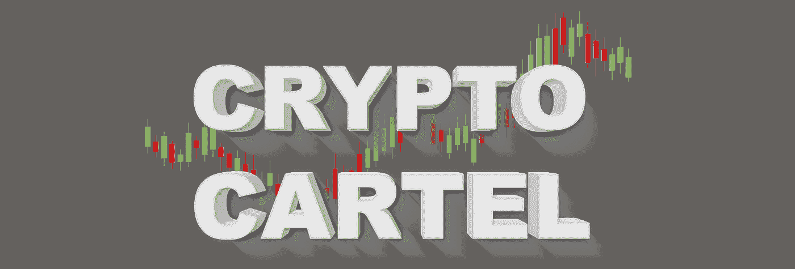

# 很快加密将接管我们的常规货币。这将是忍受即将到来的危机的一种方式

> 原文：<https://medium.com/coinmonks/soon-crypto-will-take-over-our-regular-currency-it-will-be-a-way-to-endure-the-coming-crisis-a6d87c38032f?source=collection_archive---------44----------------------->

由于世界上目前的局势，大多数加密货币将很快被那些甚至否认它和不承认它是一种货币的人所知和解决。在大众进入这个市场之前赶快行动，确保及时增加你的资本！

为什么我们是这个密码泄露市场的佼佼者？
1)第一手资料来源
2)原始资料来源之间没有延迟
3)包括来自世界上最聪明和最好的交易者的学习材料
4)友好支持
5)自 2017 年以来的首次泄露服务。不相信？查看我们的 discord 试用服务器上的帖子历史。这是我们的热情，我们的爱好——我们热爱我们所做的事情，我们努力做到最好，这样我们的用户就能从我们的服务中得到最好的回报。
7)消息来源在不和谐的服务器和电报渠道中被泄露。
8)我们提供最佳选择——比较 startegy(不要盲目跟随一个交易者，而是找到相似的确认思路，进行有利可图的交易)
9)以及更多让我们的服务成为最佳的好东西。

那些将转向加密货币的人将轻松克服即将到来的经济危机！！！

不要错过折扣:[https://cryptocartel.co/product-category/memberships/](https://cryptocartel.co/product-category/memberships/)
或使用电报机器人中的折扣代码:CCOSALE

_ _ discord 服务器中的试用选项:[https://discord.gg/z5fjSD5](https://discord.gg/z5fjSD5)
电报机器人:[https://t.me/CCOadminBot](https://t.me/CCOadminBot)(如果菜单有问题，请键入/help(加上斜杠/))

和我们在一起，因为我们支持你。

消息人士泄露:
CCO—Crypto King
CCO—Dan Margin
CCO—trade devils
CCO—Dan Alts
Wcse
kill MEX 分析
Palm Venice
income sharks
bit MEX savior
CCO-UB
TraderSZ
Yo Crypto
TraderX Trades
Ichi Trader
CCA—Trades
Platter VIp
CCO-克林
WWG
马金瓦尔斯
公牛
棕榈滩& CST
奥泽尔俱乐部
冷血的希勒
时事通讯
加密会议纪要
CCO — FRI VIP
Killmex 交易
Cryptocove 保证金
救世主头皮
Mayne
VIP 高级加密专区
蜥蜴保证金
CCO — Pierre
加密高级频道提供商【T4
RektProof Trades
CoinsCoach VIP
Cryptocove Alts
Trader X
Universal Signals
Rekt Proof
Fat Pig Signals
WWG—期货交易
Cco — Birb Nest
克朗代克保证金
Cco—cryptonds
zCrypto
克朗代克头皮交易
CCO-Loma
蜥蜴 Alts 【T63

> 加入 Coinmonks [电报频道](https://t.me/coincodecap)和 [Youtube 频道](https://www.youtube.com/c/coinmonks/videos)了解加密交易和投资

# 另外，阅读

*   [XT.COM 评论](https://coincodecap.com/profittradingapp-for-binance)币安评论 |
*   [SmithBot 评论](https://coincodecap.com/smithbot-review) | [4 款最佳免费开源交易机器人](https://coincodecap.com/free-open-source-trading-bots)
*   [杠杆令牌](/coinmonks/leveraged-token-3f5257808b22) | [最佳密码交易所](/coinmonks/crypto-exchange-dd2f9d6f3769) | [Paxful 点评](/coinmonks/paxful-review-4daf2354ab70)
*   [加密套利](/coinmonks/crypto-arbitrage-guide-how-to-make-money-as-a-beginner-62bfe5c868f6)指南| [如何做空比特币](/coinmonks/how-to-short-bitcoin-568a2d0b4ae5)
*   [币安期货交易](https://coincodecap.com/binance-futures-trading)|[3 commas vs Mudrex vs eToro](https://coincodecap.com/mudrex-3commas-etoro)