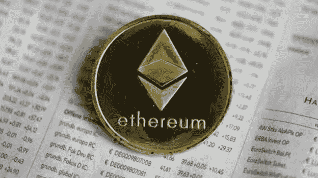

# 灵魂绑定令牌:下一件大事？

> 原文：<https://medium.com/coinmonks/soulbound-tokens-the-next-big-thing-1ce98bd57585?source=collection_archive---------13----------------------->

Vitalik Buterin 和两位合著者提交了一篇论文，他们在论文中推测了以太坊的未来。布特林认为，“灵魂绑定令牌”，或 SBTs，一种被收购后不能转让给另一个用户的 NFT，将决定区块链的未来。

让我们探索一下 SBT 是什么，它们将做什么，以及它们如何成为智能合约领域的下一个大事件。预计到 2022 年底，SBT 将会在以太坊发售。SBT 是一种特殊类型的不可转让的 NFT。如果你不熟悉 NFT，NFT 基本上是一个数字存储的项目，被认为是独一无二的，可以证明其所有权。NFT 可以代表艺术，现实生活中的事物，等等。现在，SBT 的酷之处在于，它们是 NFT，一旦发送给你，就不能再转移。

让我们来谈谈 SBT 的用例:

●假设你获得了一个 SBT 颁发的大学学位。不可转让的毕业证复印件绑定钱包，不可转让。这将证明你有大学学位，但不能移动它，或出售它。它是独一无二的，它的目的地也是单一的。

●可在 Dao 中使用 SBTs 来限制不良行为者参与决策。阿刀可以给好演员发 SBT 来建立自己的名声。假设你在 Defi 平台上完成了五次精彩表演。该平台可以为你的每一个行为颁发一个 SBT，这意味着你是这个项目的好管家，可以对政府的提案进行投票，使 DAO 更加安全。

● SBTs 也可以作为你的社会信用，你的信用度可以由你钱包里的 SBTs 来决定。假设你借了一些贷款并偿还了。你可以得到一个代表债务的 SBT 和另一个代表你按时还清贷款的 SBT。

●该文件列出了更多的使用案例，例如 KYC 的 SBTs，作为参加社交聚会的证明，等等。如果你已经决定深入 SBTs 的兔子洞，这里有一个[链接](https://bit.ly/3G9z0Yr)【https://bit.ly/3G9z0Yr】到原文。

让我们来看看 SBT 的一些特性。SBT 可能会被撤销。如果不符合 SBT 规定的条件，签发人可以吊销你的 SBT。以之前的贷款为例，当你还清贷款时，贷方可以撤销你的贷款 SBT，并为你铸造一张按时支付的 SBT，作为还款凭证。SBT 的另一个特点是它可以恢复。因此，如果你丢失了存放 SBT 学位的钱包的钥匙，你可以根据作为你监护人的 SBT 设置一个你非常信任的地址。守护者可以帮你找回钥匙。

你认为 SBTs 会是即将到来的加密夏天的下一个大事件吗？在此之前，没人能预料到一个存储奇怪图像的存储槽会成为一个价值十亿美元的生态系统。唯一可以保证的是，看到 crypto 的构建者为灵魂绑定令牌提出有趣的用例会很有趣。

> 加入 Coinmonks [电报频道](https://t.me/coincodecap)和 [Youtube 频道](https://www.youtube.com/c/coinmonks/videos)了解加密交易和投资

# 另外，阅读

*   [币安期货交易](https://coincodecap.com/binance-futures-trading)|[3 commas vs Mudrex vs eToro](https://coincodecap.com/mudrex-3commas-etoro)
*   [如何购买 Monero](https://coincodecap.com/buy-monero) | [IDEX 评论](https://coincodecap.com/idex-review) | [BitKan 交易机器人](https://coincodecap.com/bitkan-trading-bot)
*   [尤霍德勒 vs 科恩洛 vs 霍德诺特](/coinmonks/youhodler-vs-coinloan-vs-hodlnaut-b1050acde55a) | [Cryptohopper vs 哈斯博特](https://coincodecap.com/cryptohopper-vs-haasbot)
*   [顶级付费加密货币和区块链课程](https://coincodecap.com/blockchain-courses)
*   [MXC 交易所评论](/coinmonks/mxc-exchange-review-3af0ec1cba8c) | [Pionex vs 币安](https://coincodecap.com/pionex-vs-binance) | [Pionex 套利机器人](https://coincodecap.com/pionex-arbitrage-bot)
*   [如何在印度购买比特币？](/coinmonks/buy-bitcoin-in-india-feb50ddfef94) | [瓦济克斯审查](/coinmonks/wazirx-review-5c811b074f5b)