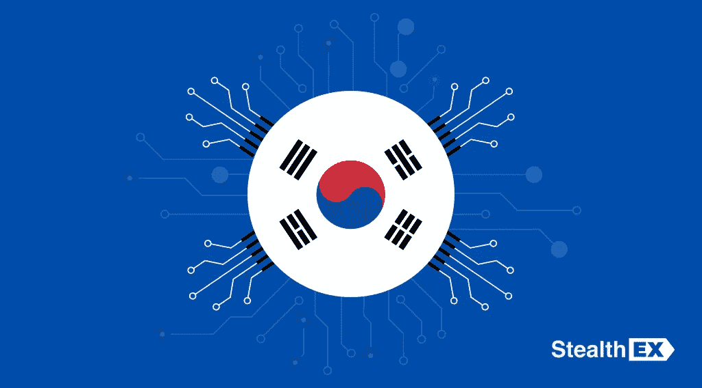

# 南韩正在进入元宇宙:在国家数字世界的 1 . 87 亿美元投资

> 原文：<https://medium.com/coinmonks/south-korea-is-going-into-metaverse-a-187m-investment-in-a-national-digital-world-dbd67ee39086?source=collection_archive---------24----------------------->

2022 年 2 月 27 日，韩国信息通信技术、科学和未来规划部宣布向他们的祖国[元宇宙](https://www.publish0x.com/stealthex/what-is-the-metaverse-for-dummies-xnxdlyl)承诺 2237 亿韩元(约合 1.867 亿美元)。

正如该国代表所注意到的，这一举措将促进那里的数字技术发展，并将成为名为“**数字新政**”运动的一部分。

根据[部的声明](https://doc.msit.go.kr/SynapDocViewServer/viewer/doc.html?key=dcc6cbad6011442e8caf03550a0e7ea7&convType=html&convLocale=ko_KR&contextPath=/SynapDocViewServer/)，这项投资将分为 4 个部分来实现几个主要目标，所有这些都将帮助南韩创造**扩展的虚拟世界**。由于进入这一现实需要 VR 和 AR 小工具，这些计划也包括了这一小众领域公司的支持。

按照政府的计划，先进的元宇宙将有助于加强城市基础设施、教育和媒体的发展。这些技术将会得到加强，这要归功于内容创作者，他们将会参加开发者竞赛和黑客马拉松。

## 普通人的改变

这样的改进不仅有助于那些工作与技术直接相关的人，也有助于普通公民。据韩国政府称，到 2023 年，将在元宇宙境内提供处理民事投诉的服务。唯一需要的就是一个 VR 头戴设备。

专家认同韩国迈向数字化的这一步。哈希德首席执行官西蒙·金(Simon Kim)注意到，这将通过为参与者提供资金支持来推动商业扩张。多链生态系统加速器解扩的联合创始人叶长胜也注意到，专注于元宇宙项目的科技公司更容易与政府合作。

# 之前的步骤

尽管这项投资是迈向国家元宇宙的重大举措，但它并不是韩国政府迈出的第一步。

## 元宇宙 120 中心

2021 年 11 月，首尔市政府指出，首都将成为第一个进入元宇宙的城市，它被称为“元宇宙 120 中心”。这发生在两家最大的韩国零售商宣布进入元宇宙之后。

首尔政府计划实施此类技术，以方便城市管理部门的虚拟通信。它将推动所有重要因素，如教育、文化、旅游和经济。实现这一目标的第一步是将首尔灯会推向数字世界。

## 新的工作场所

2022 年 1 月，该国还宣布，到 2026 年，它将成为第五个元宇宙市场。它将与这一领域的大约 200 家领先公司合作。根据政府的说法，如果一切顺利，从事此类技术的工作将在数字世界创造约 150 万个就业机会。

此外，政府的计划包括在元宇宙建立一个在线韩语学院。它将变得国际化，让世界各地的用户了解韩国流行音乐、文化、医学和艺术。所有这些应该会让中国在 2026 年成为第五大元宇宙市场。

# 潜在的困难

虽然南韩对于建立一个全国性的元宇宙雄心勃勃，但仍有一些缺点需要考虑。

1.  **禁止 NFT 游戏。**主要的担忧是该国监管机构已经禁止了 NFT 应用的游戏，称玩这些游戏会导致赌博成瘾。原因是，像 MIR4 这样的游戏让用户继续玩下去，因为这样他们可以通过购买游戏中的装备、装备和武器获得更多收入。然而，不可替代的令牌和元宇宙项目携手并进，它们一起可以给用户带来比独立的元宇宙更好的体验。
2.  **NFT 税收**。另一个担忧是，2021 年 11 月，韩国金融服务委员会宣布将从 2022 年开始对非金融服务业征税。这一要求包括对至少 250 万韩元(约合 2086 美元)的虚拟资产的所有收入征收 20%的税。
3.  **元宇宙的用户隐私。**还有一个缺点与用户隐私有关，这不仅关系到韩国元宇宙，也关系到整个行业。尽管基于这些的第一批项目在 2021 年秋季才启动，但这种生态系统已经被证明对儿童和女性用户有害。之所以出现多起骚扰案件，是因为虚拟现实还没有被监管。正如索恩公司对外事务副总裁莎拉·加德纳指出的那样，这对孩子尤其不利，因为没有人保护他们。既然这个元宇宙不仅有助于娱乐，而且有助于解决公民的问题，政府应该考虑这个问题，以避免对其国民产生消极后果。

# 韩国不是唯一一个

韩国并不是第一个对元宇宙话题感兴趣的亚洲国家。

*   2021 年 12 月 27 日，一家中国公司**百度**在**西让**应用中推出了它的虚拟世界。一个大约有 100 名演讲者的会议成为了其中最盛大的活动，但是正如开发者承诺的那样，大约有 10 万用户可以同时参加。越来越先进，这个元宇宙将成为从教育到娱乐和商业的一切平台。
*   拥有**全球速卖通**的阿里巴巴集团，可能成为百度在中国的主要竞争对手。2021 年 12 月 6 日，针对元宇宙发展，注册了袁晶生生公司。
*   此外，**腾讯**为其游戏 metaverses 申请了 100 多项商标注册。2021 年 11 月，它承诺在遵守中国法律的前提下，获得北京方面的支持。腾讯现在是游戏行业的巨头之一，拥有《堡垒之夜》的创作者 Riot Games 100%的股份和 Epic Games 40%的股份。该公司还在与西方版本的开发商合作开发中国版本的 Roblox 元宇宙。

科技巨头之间如此巨大的竞争可能导致中国的元宇宙市场达到 52 万亿 CNY(约 8 万亿美元)。专家说，阿里巴巴集团和百度并不是这里唯一的公司。这份名单还包括腾讯、网易和字节跳动。

最后，如果你决定加入元宇宙社区，你可以开始在[即时加密交易所 StealthEX](https://stealthex.io/) 购买自己的硬币。这项服务免注册，不将用户的资金存放在平台上。

直接上 [StealthEX](https://stealthex.io/?from=btc&to=eth&amount=0.1) 。它会自动引导您进入 Exchange 加密窗口。

1.  选择您想要交换的货币。比如 [BTC](https://stealthex.io/coin/btc) 到 [ETH](https://stealthex.io/coin/eth) 。
2.  输入您的加密钱包地址。
3.  把押金寄到 StealthEX 生成的地址。
4.  收到存款后，您会将兑换的资金发送到步骤 3 中提供的地址。

你也可以用你的借记卡或信用卡购买 ETH。为此，您需要打开购买窗口，而不是步骤 1 中的交换窗口。

在 [Medium](https://stealthex-io.medium.com/) 、 [Twitter](https://twitter.com/Stealthex_io) 、 [Telegram](https://t.me/StealthEX) 、 [YouTube](https://www.youtube.com/channel/UCeES_XBesX76ge7xf1meuSw) 和 [Reddit](https://www.reddit.com/user/Stealthex_io) 上关注我们，获取 [StealthEX.io](https://stealthex.io/) 更新和关于加密世界的最新消息。对于所有请求，请通过 support@stealthex.io 给我们发消息。

此处表达的观点和意见仅代表作者个人。每一次投资和交易都有风险。做决定时，你应该进行自己的研究。

**非常欢迎你来参观** [**StealthEX 交易所**](https://stealthex.io/) **，看看它有多快多方便**。

> 加入 Coinmonks [电报频道](https://t.me/coincodecap)和 [Youtube 频道](https://www.youtube.com/c/coinmonks/videos)了解加密交易和投资

# 另外，阅读

*   [如何在印度购买比特币？](/coinmonks/buy-bitcoin-in-india-feb50ddfef94) | [瓦济克斯审查](/coinmonks/wazirx-review-5c811b074f5b)
*   [隐翅虫替代品](/coinmonks/cryptohopper-alternatives-d67287b16d27) | [HitBTC 审查](/coinmonks/hitbtc-review-c5143c5d53c2)
*   [CBET 评论](https://coincodecap.com/cbet-casino-review) | [库科恩 vs 比特币基地](https://coincodecap.com/kucoin-vs-coinbase)
*   [折叠 App 审核](https://coincodecap.com/fold-app-review) | [Kucoin 交易机器人](/coinmonks/kucoin-trading-bot-automate-your-trades-8cf0ca2138e0) | [Probit 审核](https://coincodecap.com/probit-review)
*   [如何匿名购买比特币](https://coincodecap.com/buy-bitcoin-anonymously) | [比特币现金钱包](https://coincodecap.com/bitcoin-cash-wallets)
*   [币安 vs FTX](https://coincodecap.com/binance-vs-ftx) | [最佳(索尔)索拉纳钱包](https://coincodecap.com/solana-wallets)
*   [比诺莫评论](https://coincodecap.com/binomo-review) | [斯多葛派 vs 3Commas vs TradeSanta](https://coincodecap.com/stoic-vs-3commas-vs-tradesanta)
*   [Capital.com 评论](https://coincodecap.com/capital-com-review) | [香港的加密借贷平台](https://coincodecap.com/crypto-lending-hong-kong)
*   如何在 Uniswap 上交换加密？ | [A-Ads 审查](https://coincodecap.com/a-ads-review)
*   [WazirX vs coin dcx vs bit bns](/coinmonks/wazirx-vs-coindcx-vs-bitbns-149f4f19a2f1)|[block fi vs coin loan vs Nexo](/coinmonks/blockfi-vs-coinloan-vs-nexo-cb624635230d)