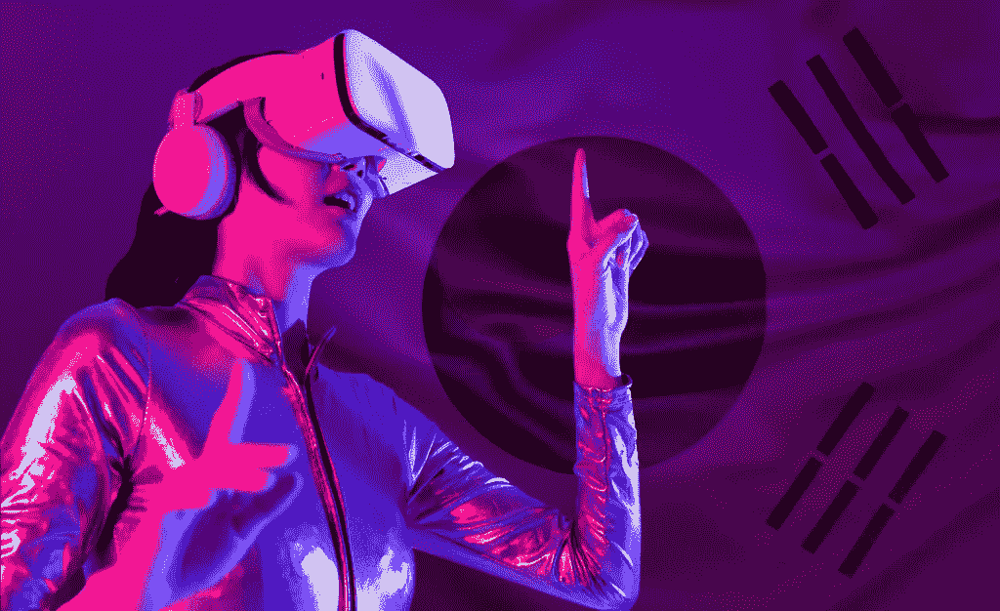

# 南韩将向元宇宙项目投入 1 . 77 亿美元

> 原文：<https://medium.com/coinmonks/south-korea-to-pour-177-million-into-metaverse-projects-658737571976?source=collection_archive---------56----------------------->

韩国将向元宇宙拨款约 1.77 亿美元，为这一领域的公司和就业提供资金。

元宇宙，或生活在虚拟世界中，并不是一个新概念，但只是到了现在，围绕它的炒作才迅速获得许多行业的关注。

随着人工智能和增强现实的出现，投资元宇宙对许多公司来说似乎有利可图。甚至韩国政府也同意元宇宙的未来。

南韩最近宣布有意直接投资元宇宙的公司和项目。

科学与信息通信技术部部长林惠淑(Lim Hyesook)宣布了这项投资计划，并指出元宇宙加上先进的技术拥有巨大的潜力。

这项投资是这个亚洲国家的数字新政的重要组成部分，这是政府制定的旨在平稳过渡到完全数字化的指导方针。

首尔正在迎头赶上可能在未来几年成为主流的元宇宙。这一举措也为其他国家提供了一个遵循的蓝图。

各国政府目前没有动用元宇宙。但是索科尔政府决定此时此地乘着这股浪潮进入所谓的“大科技”。

上海的公共服务也是根据元宇宙设计的。阿里巴巴和腾讯目前都在开发基于元宇宙的产品。阿里巴巴最近投资了一家以 AR 眼镜为主要产品的创业公司。

# 南韩元宇宙—连接社区

政府是否开始将元宇宙视为社区聚会或联系的未来？

投资元宇宙是有风险的，因为你正在把钱投入到一些不可持续的东西中，或者那些价值取决于需求和炒作的东西中。

然而，首尔希望成为建设阶段的一部分。SoKor 的许多大公司，如 BTS 和 LG 电子，也加入了新的加密和 NFT 计划的行列。

涉足元宇宙是有风险的，因为它具有不稳定性。任何未知的颠覆性技术都会遇到阻力。人们会不知何故地更多地关注风险而不是机会，特别是在过去几周与加密和非功能性加密相关的诈骗增加的情况下。

法律、安全和隐私问题是元宇宙投资面临的共同挑战。