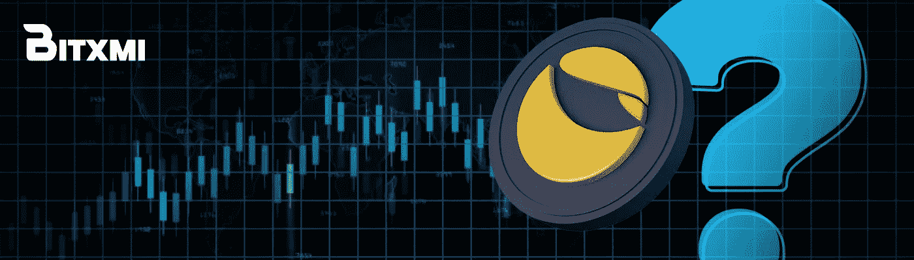
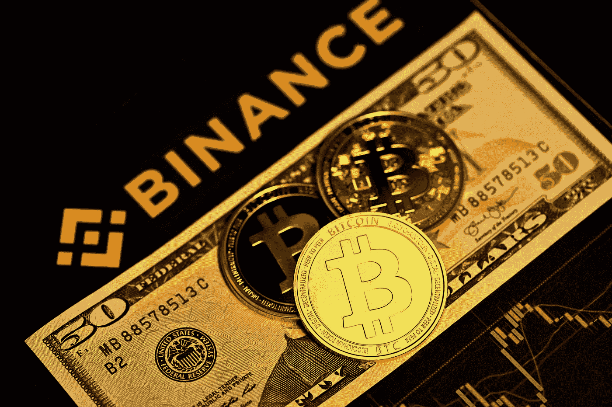

# 由于“月亮”号和“UST”号的相撞事故，韩国将加强对加密交换的监管。

> 原文：<https://medium.com/coinmonks/south-korean-will-increase-regulation-of-crypto-exchanges-as-a-result-of-the-luna-ust-crash-4f2c6def3114?source=collection_archive---------58----------------------->

Source: news.bxmi.io

Terra 生态系统的消亡给整个加密生态系统带来了冲击波，把整个市场拉了下来。这一惨败不仅让人们对算法稳定积分的有效性和长期可行性产生了怀疑，也增加了市场监管的必要性。

据《韩国时报》报道，灾难发生后，韩国监管机构正试图加强对加密货币交易所的监控和监管。

> **参见:**[**Terra/Luna 会从崩溃中恢复吗？**](http://Will Terra/ Luna Recover From The Crash?)

召开了一次为期两天的紧急全国研讨会，讨论密码法规和防止此类事件再次发生的策略。会议于 5 月 23 日和 24 日举行，有来自 Bithumb、Korbit 等韩国主要交易所的代表参加。

在会议期间，FSC 副主席金素英表示，“当加密交易所违反规则时，他们应该承担责任。”这是生态系统中信任得以保证的唯一方式。据他说，UST 号和月球号的相撞事故影响了超过 28 万韩国人。

Terraform 实验室的首席执行官 Do Kwon 正在接受调查

Source: Unsplash.com

Terra 生态系统背后的公司 Terraform Labs 及其首席执行官 Do Kwon 已经在接受韩国当局的调查。据消息人士称，Terra 的白皮书目前正在接受审查，以找出坠机的原因，造成的损害程度，以及防止未来发生的方法。

另一方面，检方正在调查权在这场灾难中的角色，以及他是否在 Terra-Luna 项目中犯有任何欺诈行为。Do Kwon 和 Terraform 的另一位联合创始人 Shin Hyun-sung 已被一家代表受崩溃影响的投资者的韩国法律公司起诉。

> **另见:** [**以太坊可能在 8 月过渡到股权证明。**](/coinmonks/ethereum-may-transition-to-proof-of-stake-in-august-b1908ee99df7)

由于缺乏立法和权力有限的监督机构，尚不清楚 Terraform Labs 是否会对损失负责。根据韩联社的一篇文章，国会正在考虑 13 项加密市场监管提案。

Terra 的灭亡始于本月初，当时 TerraUSD (UST)货币失去了与美元的挂钩。帮助维持 UST 联系汇率的姊妹货币卢纳也下跌了。

一周之内，这两种硬币的市值暴跌了近 450 亿美元。Luna 的价值从 5 月初的 80 美元左右暴跌至 5 月 12 日的零。

虽然道权一直致力于恢复地球生态，但目前情况看起来很糟糕。Terra 灭亡后，更大的加密市场仍在遭受损失。

**币安首席执行官 CZ 就 UST/露娜坠机事件发表讲话**

Source: Pixabay.com

币安首席执行官赵昌鹏在 Reddit AMA 会议上表达了他对 UST 大规模崩溃和脱钩以及即将到来的 LUNA hard fork(即 Terraform Labs 所称的 genesis chain)的担忧。

币安的 CZ 表示，Terraform Labs 的算法稳定性 coin UST 已经被世界上最大的交易所列入锚协议。然而，这是交易所 earn 计划的一部分，该计划得到了用户教育和明确披露的支持。币安清楚地知道将 UST 置于锚协议之上是如何运作的，以及随之而来的风险。CZ 解释了为什么当网络不稳定时，交易所冻结资产交易，以及代币的区块链因崩溃而暂停，从而缓解了币安 UST 和卢娜持有者的焦虑。

> **参见:** [**Terra 的 LUNA 2.0 Testnet 现已上线。**](https://wire.insiderfinance.io/terras-luna-2-0-testnet-is-now-live-ec63bb60eff6)

Terra 社区充满希望，因为 Hardfork testnet 目前已经上线。快照可能发生在 5 月 26 日，mainnet 的发布可能发生在 5 月 27 日星期五，标志着 LUNA fork 的完成。

> **用 Bitxmi 进行交易**

BXMI 提供了一个独特的机会来交易加密资产和享受一个活跃的加密社区的好处，无论你是新手还是有经验的交易者。

Bitxmi 交易者享受的好处包括最低交易费用、24/7 客户支持、闪电般的快速交易，以及每天高达 1500 美元的无 KYC 取款。

Bitxmi 的长期目标是不仅提供兑换服务，还教育人们如何交易和投资加密货币。

**从这里开始:**[**https://www.bitxmi.com/en_US/register**](https://www.bitxmi.com/en_US/register)

**这里加入我们的电报社区:**[**https://t.me/bitxmiexchange**](https://t.me/bitxmiexchange)

**在这里阅读我们的白皮书:**[**https://drive . Google . com/file/d/1 ptwx 8 rrepkwvvvjwj 8 psidb 1 pnz 5 uacx/view？usp =分享**](https://drive.google.com/file/d/1PTWX8rRePkWVvjwJ8pSIdb1pPnZ5uacx/view?usp=sharing)

> 加入 Coinmonks [电报频道](https://t.me/coincodecap)和 [Youtube 频道](https://www.youtube.com/c/coinmonks/videos)了解加密交易和投资

# 另外，阅读

*   [Bookmap 点评](https://coincodecap.com/bookmap-review-2021-best-trading-software) | [美国 5 大最佳加密交易所](https://coincodecap.com/crypto-exchange-usa)
*   最佳加密[硬件钱包](/coinmonks/hardware-wallets-dfa1211730c6) | [Bitbns 评论](/coinmonks/bitbns-review-38256a07e161)
*   [新加坡十大最佳加密交易所](https://coincodecap.com/crypto-exchange-in-singapore) | [购买 AXS](https://coincodecap.com/buy-axs-token)
*   [红狗赌场评论](https://coincodecap.com/red-dog-casino-review) | [Swyftx 评论](https://coincodecap.com/swyftx-review) | [CoinGate 评论](https://coincodecap.com/coingate-review)
*   [投资印度的最佳密码](https://coincodecap.com/best-crypto-to-invest-in-india-in-2021)|[WazirX P2P](https://coincodecap.com/wazirx-p2p)|[Hi Dollar Review](https://coincodecap.com/hi-dollar-review)