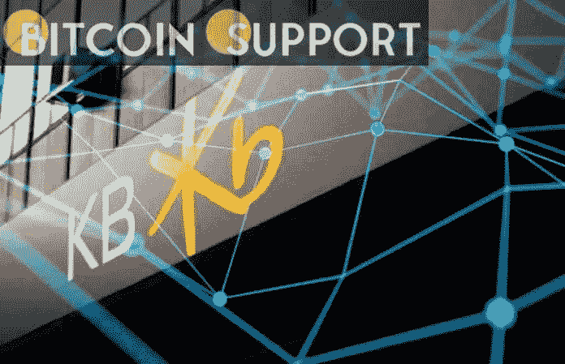

# 韩国首个加密资产类别将由 KB 银行推出

> 原文：<https://medium.com/coinmonks/south-koreas-first-crypto-asset-class-will-be-launched-by-kb-bank-a274cddcfbcd?source=collection_archive---------66----------------------->

[https://bitcoinsupports.com/](https://bitcoinsupports.com/)

这只投资基金将是中国首只由银行发行的基金，计划推出一种加密指数和 ETF。国民银行即将成为韩国首家为普通客户提供加密投资产品的银行。

2 月 21 日，KB 宣布成立数字资产管理筹备委员会，审查数字资产和 AI 投资基金的产品和战略能力。该行预计将推出加密交易所交易基金(ETF)和期货产品。该委员会还将评估投资基金的风险和合规问题。该行指数量化管理主管 Honggun Kim 在一份官方声明中证实了这一计划。“例如，我们将推出一只以虚拟资产为主题的股票基金，”他表示。我们还打算出版期刊。根据研究平台 MacroTrends 的数据，截至 2021 年 9 月，该国净利润最大的 KB 金融集团拥有约 5200 亿美元的总资产。

目前的计划是开发一个加密投资指数基金和一个聘请外包首席投资官(OCIO)的基金，也就是所谓的外包投资管理，给予初级投资保障。OCIO 基金也可以用于退休金。

灰度和富达资产管理是要考察的两个 OCIOs，都提供加密投资基金。去年 12 月，富达加拿大推出了现货比特币交易所交易基金，尽管这种产品尚未在美国获得许可。

为了应对日益接受加密和不可伪造令牌(NFT)投资的市场，KB 为其客户推出了一种新的投资基金。实力相当的竞争对手新韩银行(Shinhan Bank)将其手机银行应用的整个一部分专门用于帮助客户在该国最大的区块链克莱顿(Klaytn)上进行 NFT 收款。

紧随新加坡大型银行 DBS 的脚步，KB 宣布推出新的零售加密货币投资产品。2 月 14 日，星展银行首席执行官比于什·古普塔表示，该行将努力在 2022 年扩大其加密活动的规模。

**免责声明:以上为作者观点，不应视为投资建议。读者应该自己做研究。**

> 加入 Coinmonks [电报频道](https://t.me/coincodecap)和 [Youtube 频道](https://www.youtube.com/c/coinmonks/videos)了解加密交易和投资

# 另外，阅读

*   [最佳以太坊钱包](https://coincodecap.com/best-ethereum-wallets) | [电报上的加密货币机器人](https://coincodecap.com/telegram-crypto-bots)
*   [交易杠杆代币的最佳交易所](https://coincodecap.com/leveraged-token-exchanges)
*   [最佳加密分析或链上数据](https://coincodecap.com/blockchain-analytics) | [Bexplus 评论](https://coincodecap.com/bexplus-review)
*   [NFT 十大市场造币集锦](https://coincodecap.com/nft-marketplaces)
*   [AscendEx Staking](https://coincodecap.com/ascendex-staking)|[Bot Ocean Review](https://coincodecap.com/bot-ocean-review)|[最佳比特币钱包](https://coincodecap.com/bitcoin-wallets-india)
*   [Bitget 回顾](https://coincodecap.com/bitget-review) | [双子星 vs BlockFi](https://coincodecap.com/gemini-vs-blockfi) | [OKEx 期货交易](https://coincodecap.com/okex-futures-trading)
*   [美国最佳加密交易机器人](https://coincodecap.com/crypto-trading-bots-in-the-us) | [经常性回顾](https://coincodecap.com/changelly-review)
*   [在印度利用加密套利赚取被动收入](https://coincodecap.com/crypto-arbitrage-in-india)
*   [霍比审核](https://coincodecap.com/huobi-review) | [OKEx 保证金交易](https://coincodecap.com/okex-margin-trading) | [期货交易](https://coincodecap.com/futures-trading)