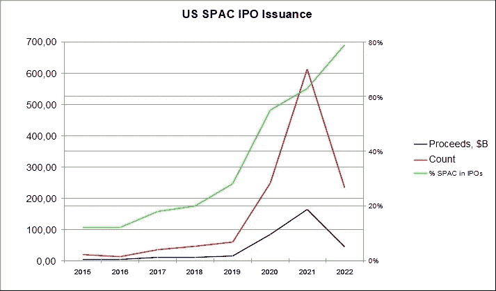
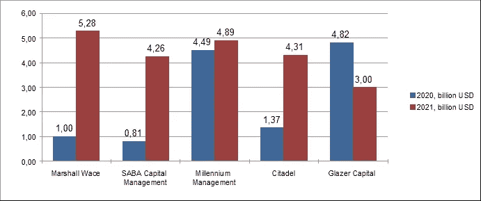

# 特殊目的收购公司——泡沫还是不泡沫…

> 原文：<https://medium.com/coinmonks/spac-to-bubble-or-not-to-bubble-dffd1cea6e4f?source=collection_archive---------13----------------------->

对特殊目的收购公司市场泡沫的谈论引发了对 Universal Synthetics 的试点产品——合成标记 uspac 10——的相关性的质疑。在我们看来，特殊目的收购公司市场仍然吸引着用户，尽管它经历了一些重组。

关于特殊目的收购公司市场泡沫的讨论是在 2021 年进行的，到 2022 年，人们已经认为特殊目的收购公司的“泡沫”已经破裂。在一些出版物中，自 20 世纪 70 年代以来就为人所知的反向并购的负面经验，延伸到了表面上看起来像特殊目的收购公司的公司([特殊目的收购公司泡沫即将破裂，作者 Ivana Naumovska，HBR，2021 年 2 月 18 日](https://hbr.org/2021/02/the-spac-bubble-is-about-to-burst))。在某些情况下，投资特殊目的收购公司股票的风险只能通过与 D. Trump 有关的 DWAC 的例子来解释([当心:这只特殊目的收购公司泡沫股票可能在 2022 年破裂，作者 Justin Pope，NASDAC，The Motley Fool，2022 年 1 月 25 日](https://www.nasdaq.com/articles/beware%3A-this-spac-bubble-stock-could-burst-in-2022))，这表明了政治偏见。然而，美国消费者新闻与商业频道特殊目的收购公司邮报交易指数在 2022 年 1 月下跌了 23%，该指数由已完成合并并将其目标公司上市的 SPAC 组成。(【2022 年伊始，特殊目的收购公司股市损失惨重，交易被放弃。美国消费者新闻与商业频道李云，2022 年 2 月 2 日。毫不奇怪，许多投资者认为所有这些都是极其负面的信号——毕竟，市场在很大程度上是心理作用。然而，投资者现在真的应该远离特殊目的收购公司股票吗？

# **特殊目的收购公司的特色**

特殊目的收购公司是特殊项目公司，其股票在证券交易所交易。SPACs 是作为传统首次公开募股的一种替代方式，通过收购目标公司将公司带到证券交易所。就其本质而言，特殊目的收购公司的股票在有消息传来，甚至只是有传言说目标公司已经被收购时，就会受到推动性上涨的影响。

根据管理特殊目的收购公司的要求，通常必须在 24 个月内确定可以与之合并的公司，否则特殊目的收购公司将被清算，资金将退还给投资者。与此同时，筹集的资金放在一个信托中，从 ultrasafe securities 获得利息。在合并完成之前，特殊目的收购公司的所有者保证他们的净资产值，通常是每股 10 美元。即使合并被同意，不喜欢的投资者也可以随时退出，并获得他们在信托中的份额。这也适用于特殊目的收购公司以清算结束的情况。

> 因此，理论上，特殊目的收购公司股票的交易价格不应远低于其信托价值。否则，投资者可以通过简单地购买股票并等待还款的时刻来获利，这几乎与持有国债一样安全。

# 特殊目的收购公司的过剩

A 根据[特殊目的收购公司研究](https://www.spacresearch.com /)的数据，2021 年是特殊目的收购公司市场创纪录的一年:在美国交易所筹集了超过 1600 亿美元，几乎是 2020 年水平的两倍。在长达一年的发行激增之后，近 600 家特殊目的收购公司公司目前正在寻找目标公司进行收购。随着市场变得越来越竞争激烈、过度饱和，一些已宣布的交易并未实施。与此同时，拒绝在特殊目的收购公司上市的数量正在增加，这意味着保荐人在提交最初的 S-1 文件后决定终止上市。根据特殊目的收购公司研究，一月份报告了近 20 起此类案件，与前两个季度的类似数字相比，这是一个跳跃。2022 年第一季度新增 SPACs 数量仅为 58 个，与 2021 年相比几乎减少了三分之二。

# **市场重组**

答根据[特殊目的收购公司分析](https://www.spacanalytics.com /)的数据，特殊目的收购公司在所有 IPO 交易中的份额持续增长，2022 年已经达到 79%,而“创纪录”的 2021 年为 63%,一年前为 55%。考虑到众所周知的政治事件导致市场普遍下跌，新特殊目的收购公司数量和美国消费者新闻与商业频道特殊目的收购公司邮报交易指数的下降不再像看起来那样引人注目。

应该指出的是，随着散户投资者在泡沫幽灵的影响下逃离，SPACs 的股价跌至每股 10 美元左右的 IPO 价格。这促使更多的对冲基金玩家进入市场，导致对冲基金拥有价值 1705 亿美元的特殊目的收购公司——是 2020 年底的两倍多(2022 年 3 月 11 日)随着特殊目的收购公司泡沫破裂，对冲基金将机构投资者 Michelle Celarier 的持股增加了一倍。

下图显示了五家冠军对冲基金在特殊目的收购公司的投资动态:

截至 2021 年底，其他拥有 SPACs 的顶级对冲基金包括:d . e . Shaw(42.5 亿美元)、Magnetar Financial(42.5 亿美元)、Aristeia Capital(37.8 亿美元)、Periscope Capital(35.9 亿美元)、Radcliffe Capital(30.4 亿美元)、雕塑家资本(30 亿美元)。

关于散户投资者，考虑到特殊目的收购公司股票目前的交易地点，他们的购买不再是上一代狂热投资者的高风险、高利润的冒险。新来者应该把它们主要视为一种保守的投资([)特殊目的收购公司泡沫正在破裂。可能是时候投资了。乔恩·辛德瑞，华尔街日报，2021 年 9 月 14 日](https://www.wsj.com/articles/the-spac-bubble-is-burst-it-may-be-time-to-invest-11631619621)。鉴于特殊目的收购公司监管的具体规定——特殊目的收购公司股票的交易价格不能比其信托价值低很多——仲裁是有可能的。许多特殊目的收购公司股票跌幅如此之大，以至于它们的交易价格低于信托价值。数据显示，如果工具被清算，没有交易目标的特殊目的收购公司的平均收益率为 2.4%，相比之下，6 个月期国债的平均收益率为 0.06%。而且，如果并购的目标公司被找到，投资者总是有机会从冲动增长中获利。

过去 2021 年的经验表明，许多 spac 贪婪于迷人的未经测试的企业，这些企业热衷于电动汽车、太空飞行和飞行出租车等热门话题。2021 年冬天，个人投资者为了寻找迷因股票而将它们买下，使 SPACs 成为市场过饱和的象征。当谈到 SPACs 时，几乎无风险的押注市场将再次对空中出租车感到兴奋，似乎比押注真正的出租车有一天会飞起来更合理。在任何情况下，为了赚取高于上述几乎无风险的 2.4%的收益，投资者应该仔细分析他收购的 SPACs:谁是发起人，团队有什么经验，正在寻找的目标公司属于哪个行业，在分配给寻找合并公司的 24 个月期限到期前还剩多长时间。

*******

> 从参与特殊目的收购公司市场的价格变动中受益而不必分析数百只特殊目的收购公司股票的一个好方法是使用 Universal Synthetics 提供的合成令牌，其价格与纳斯达克和纽约证券交易所交易最活跃的 10 只特殊目的收购公司股票的指数挂钩。

T[Universal Synthetics](https://unisx.xyz/)的使命是通过向所有感兴趣的人(无论其年龄、性别、残疾、种族、民族、血统、宗教、经济或其他状况如何)提供发达金融市场的盈利机会，促进机会平等，减少结果不平等。

Universal Synthetics 的目标是创建复合合成数字资产，在一个数字工具中结合不同的工具，包括平面和加密工具。

Universal Synthetics 不仅仅是一个特殊目的收购公司，它还是一个创建复杂合成数字资产的平台，这些资产可以是代表一个指数的几只股票的简单组合，也可以是股票、债券、ETF、股票指数和加密资产等异质资产的组合——实际上是一个投资组合。

> 加入 Coinmonks [电报频道](https://t.me/coincodecap)和 [Youtube 频道](https://www.youtube.com/c/coinmonks/videos)了解加密交易和投资

# 另外，阅读

*   [最佳期货交易信号](https://coincodecap.com/futures-trading-signals) | [流动性交易所评论](https://coincodecap.com/liquid-exchange-review)
*   [火币的加密交易信号](https://coincodecap.com/huobi-crypto-trading-signals) | [Swapzone 审查](/coinmonks/swapzone-review-crypto-exchange-data-aggregator-e0ad78e55ed7)
*   最佳[密码交易机器人](https://coincodecap.com/best-crypto-trading-bots) | [购买索拉纳](https://coincodecap.com/buy-solana) | [矩阵导出评论](https://coincodecap.com/matrixport-review)
*   [Coldcard 评论](https://coincodecap.com/coldcard-review) | [BOXtradEX 评论](https://coincodecap.com/boxtradex-review)|[uni swap 指南](https://coincodecap.com/uniswap)
*   [比特币基地评论](/coinmonks/coinbase-review-6ef4e0f56064) | [德里比特评论](/coinmonks/deribit-review-options-fees-apis-and-testnet-2ca16c4bbdb2) | [FTX 评论](/coinmonks/ftx-crypto-exchange-review-53664ac1198f)