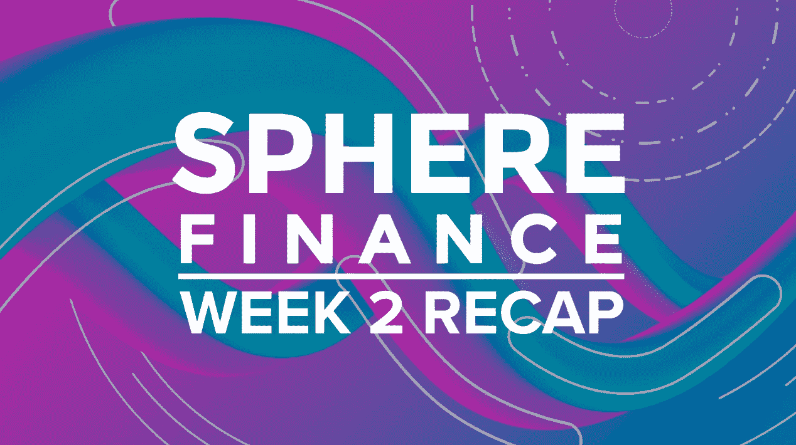
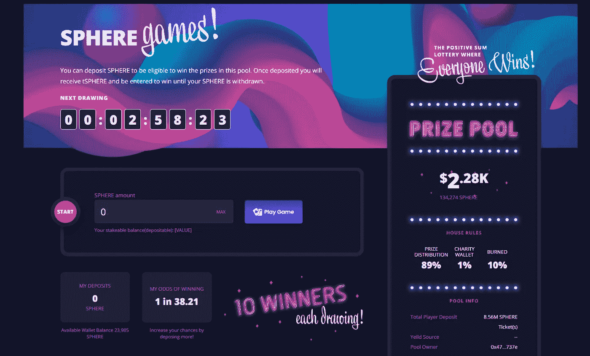
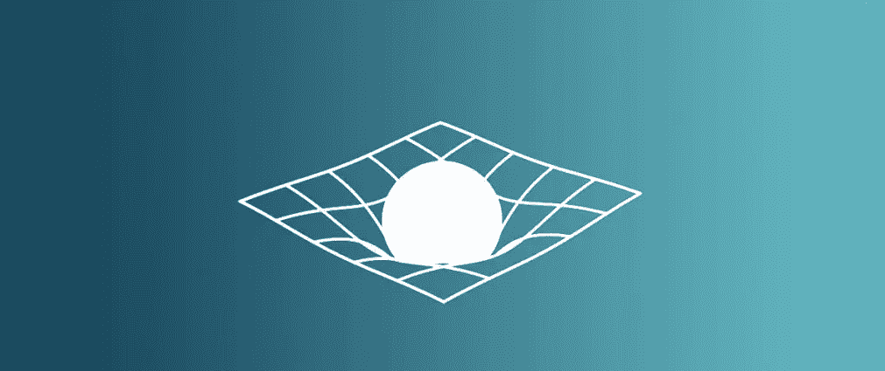
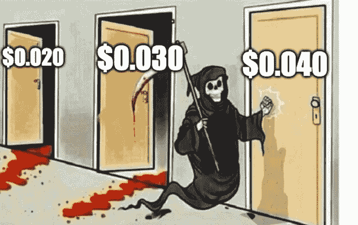
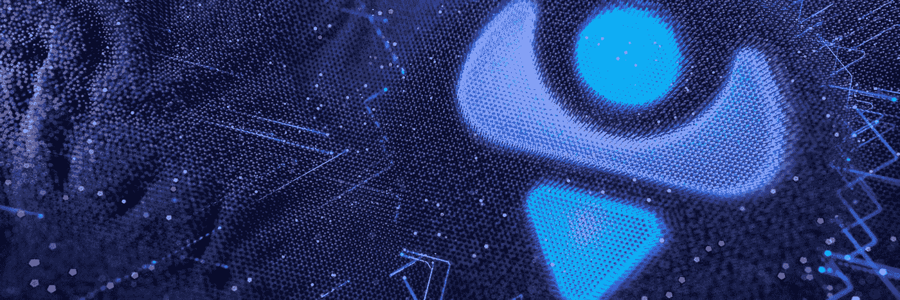
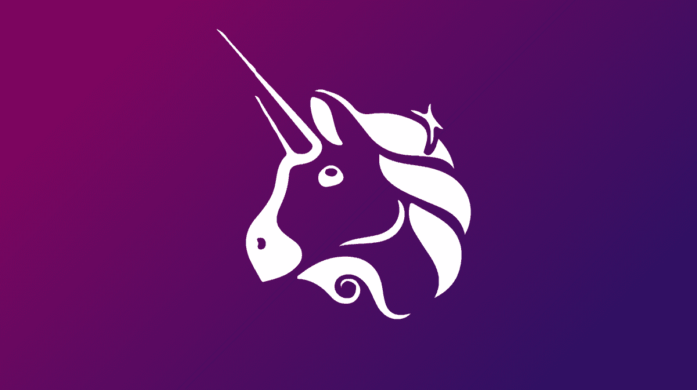

# 环球金融第 2 周回顾；3 美分，BSC 桥和黑洞

> 原文：<https://medium.com/coinmonks/sphere-finance-week-2-recap-3-cents-bsc-bridge-and-the-blackhole-c0ca9d5320?source=collection_archive---------3----------------------->

2022 年 3 月 29 日

我已经决定开始每周一期的系列报道，内容包括环球金融的最新消息和更新，以及当周 AMA 发生的故障。另外提醒一下，我不是 Sphere 团队的成员，这些文章中陈述的任何内容都是我的观点，并不反映这个项目。我不是理财顾问，请自行研究

## 本周的重要事件

*   球体令牌集会 400%形成一个新的 0.03 美元的 ATH
*   市值超过 5000 万美元。
*   财政部即将达到 1000 万美元
*   超过 10，000 个独特的球体持有人和 Discord 社区增长到 17，500 名成员。
*   黑洞燃烧机制已经通过并实施了，2%的销售税被烧掉了。
*   Sphere 已经在 [Coinmarketcap](https://coinmarketcap.com/currencies/sphere-finance/) 和 [Coingecko](https://www.coingecko.com/en/coins/sphere-finance) 上市，本周，我们甚至数次登上 Coinmarketcap 的涨幅榜。

## SIP005 —黑洞

正如你们大多数人所知道的，决定黑洞税燃烧是否会在协议中实施的 SIP005 提案几乎一致通过。该提案将减少分配给 RFV 国库(无风险价值国库)的销售税，该税收用于支持 Sphere 的价格，本质上是代币永远不应低于的价格。

您可以通过以下公式计算 Sphere 的无风险价值:
**无风险价值= RFV 国库资金/流通供给**

在撰写本文时，Sphere 的无风险价值为:
$943，691.70 / 1，839，316，239 = **$0.00051**

这项提案将 RFV 财政部的税收分配从 10%减少到 8%，剩下的 2%被烧掉了。发送到 RFV 财政部的球体被出售以换取 miMATIC，这意味着财政部的资金为球体创造了额外的出售压力。将这种分配减少 2%并代之以令牌烧录对协议有双重帮助；通过减少代币的销售压力来帮助维持协议的寿命，并且抵消长期通货膨胀，因为代币燃烧意味着从流通中移除更多的代币。球体持有者的又一大胜利。

## 球体游戏

球体游戏的 alpha 测试取得了巨大的成功，没有出现任何大的问题。游戏的正式发布应该很快就会到来，并将在奥斯汀的 youtube 频道上进行直播。alpha run 的成功意味着已经有一些代币准备被烧掉(10%)，慈善钱包中的一些代币(1%)准备分发给有需要的社区成员。剩下的 89%在 10 个赢家之间平均分配。如果您还有任何资金，请删除这些资金，因为您不会在这些资金上获得任何退款。

## 戴森指数

你们中的一些人可能已经在你们的球体仪表盘上看到了戴森指数。显示的数字，目前 1.2584x 代表每个戴森目前值多少球体，所以 1 个戴森= 1.2584 球体。

这个二级代币，Dyson，是为球体持有者设计的一个解决方案，在这些国家里，使用代币获得的利息或排放被算作应税事件。这意味着你需要为你的领域赚取的每一笔返利申报纳税。哎哟。相反，戴森指数的工作原理是通过一个叫做“包裹”的过程将你的球体换成戴森。把戴森当成你的球体存钱罐。

你从包裹中获得的戴森数量会遵循这个公式:
***戴森获得=球体包裹量/当前戴森指数***

比方说，我目前持有 10，000 个球体，我可以把它包装起来，得到 7946 个戴森(10，000/1.2584)作为交换。随着每一次重新调整基数，戴森指数本身将增加，而不是赚取新的球面代币，这是一个应税事件。这意味着随着时间的推移，我的 7946 戴森将会越来越值钱；我的存钱罐在增长，而我却没有收到任何新的代币。从本质上说，虽然你并没有直接从每一次退款中获得更多的代币，但是你的戴森所代表的领域数量却在增加。这意味着当我后来打开我的戴森回到球体，我会收到同样数量的球体，我会简单地让它在我的钱包里。这样，我在解包时只有一个应税事件，而不是在我的球体被包裹时发生的每个 rebase 事件。

## 币安重力桥

Sphere Finance 的 v2 版本即将完成，预计将于 4 月中下旬发布。正如我们所说，用于 BSC(币安智能链)的包装戴森令牌正在开发中。该团队目前正在与 Multichain 合作推出重力桥，以便将投资者和流动性从 BSC 带到 Polygon。这个想法是，在未来，你可以通过虫洞 Zap 点击一下，在 BNB/USDT 的 BSC 上购买球体，然后可以在球体网站内将你的球体连接到多边形。你不能在 BSC 上将你的 Dyson 展开成球体，只能在多边形上。球体只能在多边形上，交叉链支持最终是为了增加多边形的流动性。

## 银河债券

动态税收制度只是第一步。在这一现行制度下，当任何大规模抛售发生时，它们不仅需要根据所持股份支付 30%—45%的税率，还必须直接出售给流动性池。这增加了池中球体的数量(不是我们想要的),并降低了球体的价格。

银河债券被创造来补救这一点。通过债券，鲸鱼(那些拥有大量资本的人)将能够直接向财政部而不是流动性池出售他们的代币。这将有每日最高限额，但为了激励使用这些债券，他们将能够以低于当前税率的税率出售债券。这一系统不仅允许鲸鱼以较低的税率出售球体，还将有助于维持球体的价格。此外，这意味着更多的代币被从流通中移除，因为这些出售的代币将直接进入国库，而不是 LP。流通中的代币越少，最终意味着球体的无风险价值越大，因为 RFV 国债被球体分割得越小。

## 鲸鱼加入了聊天

我们本周看到了一些鲸鱼活动，过去几天有 8 笔超过 20，000 美元的购买，如果你感兴趣，向社区成员 Zytwo2 大喊，他们制作了这个[鲸鱼跟踪器电子表格](https://docs.google.com/spreadsheets/d/1hIFXEI9k8oG1D7_g-uRLvdXi9rlAixL1n9HcCLDknMA/edit?usp=sharing)。

甚至一些其他协议也一直在购买 Sphere，特别是[星云节点](https://nebulanodes.finance/)在周四做了一笔[10 万美元的巨额购买](https://polygonscan.com/tx/0xce03cf64a81bbabacf1af8e4860e5599f62dab1b85ad52287b7eccbd7e52f711)，引发了从 0.019 美元到 0.027 美元的一路狂奔。看到其他协议这么早就相信 Sphere，并加入我们的旅程，真是令人惊讶。

## 治理收购

在我们的治理收购背景下，有许多令人兴奋的事情正在发生。Polygon Alliance 正在开发新功能，Tetu 正在用 quantum liquidity 升级他们的 Tetuswap。

许多人仍然没有完全理解治理收购的重要性，但它们将真正使 Sphere Finance 与其他公司区分开来。像大多数其他国债一样，将国债投资于收益率为 5%的稳定投资品种，这当然很好。Sphere Protocol 更进了一步，它优先获取大量“治理令牌”,这将允许协议决定自己的成功。持有大量治理令牌意味着我们可以极大地影响其他协议的治理提议，确保结果为领域持有者提供最大利益。

## 礼宾伙伴关系

我们不想在这里透露任何名字或过早透露任何东西，但我们正在幕后进行一些大的协议。tvl 超过 10 亿美元的协议。仅仅因为我们自己的市值只有 5000 万美元，并不意味着我们是一条小鱼，我们才刚刚开始。

我们已经在这一领域获得认可，这使我们能够直接向其他协议提供 OTC(柜台交易)服务。通常，要购买或出售代币，你必须通过公共交易所，相反，场外交易允许 Sphere Protocol 以折扣价大量购买有价值的代币。将这些场外交易以点对点方式在公开交易所之外进行，有助于普通代币持有者避免代币价格突然大幅上涨或下跌。

## 二进制基础

对 ekinox 大声喊出来，他是帮助我们构建二进制重定基础机制的社区成员。这将意味着未来没有 rebases 会偏离计划或延迟，而是像时钟一样运行。本周早些时候，我们确实遇到了一些问题，由于一些多边形问题，重定基础有些延迟，但在未来，这应该不会再发生了。

## Universe Finance 和 Uniswap v3

该团队还与 [Universe Finance](https://www.universe.finance/) 合作，为即将推出的 Uniswap v3 池添加一个非常酷的东西，称为“智能流动性”,我们将很快对此进行深入探讨。下一个小小的里程碑是让环球金融在 T2 上市。这将允许[在 Polygon 上进行 PLM 流动性挖掘](/trustfi/trustfi-the-plm-model-a-different-approach-to-liquidity-the-nft-liquidity-ecosystem-3d7c967682cf)，以便接收 MATIC，然后我们可以将其用于 [Polygon 联盟](https://www.polygonalliance.com/)。

## 免费分类账转账

该团队一直致力于创建一个新的 **balance mover 功能**，允许用户将他们的球体从他们的热钱包发送到一个账本。这将是一次严格的事情，在使用该功能后，您的钱包将被列入黑名单，禁止以后使用。如果这项功能最终被发布，那些已经这样做并支付了 13%的转让税的人将被退还他们最初被征税的领域。必须有充分的转让和税收证明，否则就不会发生。转让税的全部目的是防止一个二级 P2P 市场被创造出来，以逃避销售税。

## 仪表板升级

该团队还与创建了 [Olympus DAO Dashboard](https://app.olympusdao.finance/#/dashboard) 的团队合作，在不久的将来发布升级的 dashboard 2.0，显示金融收购、财务业绩、收益率、合作伙伴等。真正令人兴奋的事情来了。

## 公用事业 NFTs

你们中的一些人可能还没有看到，但是公用事业 NFT 已经在路线图上有一段时间了。这原本是为 v2 版本设计的，但是团队决定将这些推回到 v3，同时他们优先考虑他们目前在 v2 中构建的核心基础设施和机制。

## 结束语

很高兴看到这么多的成功和建设正在进行，我们只是在我们的第二周。明晚(世界协调时 3 月 30 日晚 10 点)将在[黑曜石之宫](https://discord.gg/hQsZbU3Z)举行 AMA，所以一定要来参加，以防万一，我会在我的媒体上做一个回顾。

快乐重组。

> 加入 Coinmonks [电报频道](https://t.me/coincodecap)和 [Youtube 频道](https://www.youtube.com/c/coinmonks/videos)了解加密交易和投资

# 另外，阅读

*   [火币加密交易信号](https://coincodecap.com/huobi-crypto-trading-signals) | [HitBTC 审核](/coinmonks/hitbtc-review-c5143c5d53c2)
*   [如何在 FTX 交易所交易期货](https://coincodecap.com/ftx-futures-trading) | [OKEx vs 币安](https://coincodecap.com/okex-vs-binance)
*   [OKEx vs KuCoin](https://coincodecap.com/okex-kucoin) | [摄氏替代品](https://coincodecap.com/celsius-alternatives) | [如何购买 VeChain](https://coincodecap.com/buy-vechain)
*   [ProfitFarmers 回顾](https://coincodecap.com/profitfarmers-review) | [如何使用 Cornix 交易机器人](https://coincodecap.com/cornix-trading-bot)
*   [如何匿名购买比特币](https://coincodecap.com/buy-bitcoin-anonymously) | [比特币现金钱包](https://coincodecap.com/bitcoin-cash-wallets)