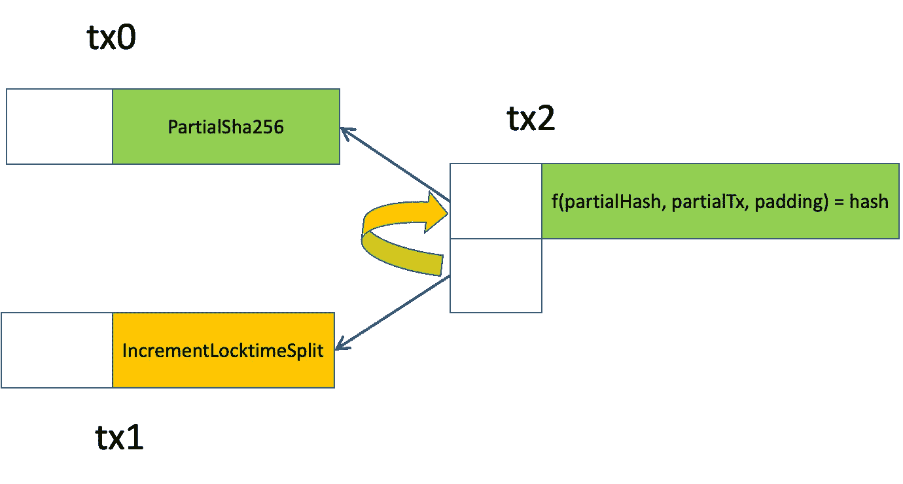
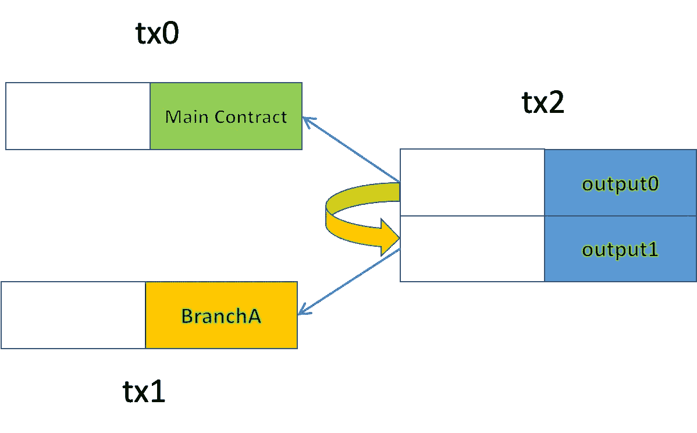

# 使用 P2CH 拆分合同

> 原文：<https://medium.com/coinmonks/split-contracts-using-p2ch-84b44199bdab?source=collection_archive---------11----------------------->

## 如何停止担心 sCrypt 中的大循环

我们提出了一种优化技术，将一个大合同分割成多个较小的合同，以在保持正确性的同时大幅减少其大小。我们演示了它如何在具有大型循环和许多公共函数的契约中工作。

# 环

[循环](https://scryptdoc.readthedocs.io/en/latest/loop.html)在 sCrypt 中采用以下格式:

因为循环是静态展开的，所以最大循环计数 **maxLoopCount** 必须在编译时知道。如果设置过小，合约可能无法解锁成功，资金被永久烧毁。因此，它是为最坏的情况保守设置的，当最常用的循环数明显小于最坏的情况时，通常会导致脚本过度膨胀。

我们在最后一篇文章的[中展示了如何使用契约支付哈希(P2CH)来减少契约**中的循环数*increment locktime*在最普遍的情况下，同时在需要最大循环数时保持契约工作。**](/coinmonks/the-partial-preimage-technique-b60498c47ba)

如下图所示，我们将函数***partialsha 256()***移动到一个单独的契约***partialsha 256***。循环中的每次迭代处理 SHA256 的原映像中的一个块。我们使用 P2CH *从主契约***IncrementLocktimeSplit****中调用该函数。**

**

*Inter-Contract Call using P2CH*

*Contract [*IncrementLocktimeSplit*](https://github.com/sCrypt-Inc/boilerplate/blob/master/contracts/incrementLocktimeSplit.scrypt)*

****IncrementLocktimeSplit***与契约[***IncrementLocktime***](https://github.com/sCrypt-Inc/boilerplate/blob/master/contracts/incrementLocktime.scrypt)相同，只是从第 15 行到第 30 行删除了***partialsha 256()***并使用 P2CH 间接调用。*

*数组 ***中的每个元素 calleecontracthasses***都是契约***partialsha 256***的散列，具有不同的 *MAX_CHUNKS* 。因此，该数组包含主契约支持的所有 *MAX_CHUNKS* 。*

*Contract****partialsha 256****computes****partialsha 256()***(与原 Contract***IncrementLocktime***中的函数相同)并将函数调用参数和结果值存储在输出中，该输出由 Contract***IncrementLocktimeSplit****访问*****

***[Contract *PartialSha256*](https://github.com/sCrypt-Inc/boilerplate/blob/master/contracts/partialSha256.scrypt)***

***相比***IncrementLocktime*******IncrementLocktimeSplit***要小很多。它可以根据待哈希数据的长度动态调用***partialsha 256()***，即 *MAX_CHUNKS* 。在大多数情况下，我们只需要 *MAX_CHUNKS* 为 1。在极少数情况下，锁时间被分割到最后两个块，我们使用 2 的 MAX_CHUNKS。这带来了显著的节约，因为每个额外的块都会给最终的脚本增加 **~60KB** 。****

# **多重公共功能**

**Original Contract**

**我们可以将一个包含多个公共函数的契约分解成多个更小的契约，每个契约只包含一个公共函数。我们用一个新的主契约替换原来的契约，这个新的主契约可以使用上一节中的相同技术调用任何较小的契约。**

**Main Contract after Splitting**

****

**Main Contract Calling BranchA**

**当每个公共函数都很大并且有很多公共函数时，这种规模缩减最为突出。**

**除了减小大小之外，这种优化还允许同一契约的其他输入中的契约识别在当前主契约中调用了哪个公共函数，否则由于无法访问 OP_PUSH_TX 中的解锁脚本而无法识别该公共函数。这可以通过注入较小的合同事务来访问，例如 *tx1* 。**

# **讨论**

**我们已经说明了如何通过将大型合同分解成多个较小的合同来减少其规模。示例合同是一次性的、无状态的。对于有状态契约来说，减少会更显著，因为有状态契约会被连续调用，并且节省会被累积。**

**使用许多公共函数优化契约的另一种方法是使用 [Merklized 抽象语法树](https://xiaohuiliu.medium.com/merkelized-abstract-syntax-tree-6a49b2008435)。**

# **承认**

**这个想法源于[感性契约](https://sensiblecontract.org/)，在生产中广泛使用。**

> **加入 Coinmonks [电报频道](https://t.me/coincodecap)和 [Youtube 频道](https://www.youtube.com/c/coinmonks/videos)了解加密交易和投资**

# **另外，阅读**

*   **[Botsfolio vs nap bots vs Mudrex](/coinmonks/botsfolio-vs-napbots-vs-mudrex-c81344970c02)|[gate . io 交流回顾](/coinmonks/gate-io-exchange-review-61bf87b7078f)**
*   **[CoinFLEX 评论](https://coincodecap.com/coinflex-review) | [AEX 交易所评论](https://coincodecap.com/aex-exchange-review) | [UPbit 评论](https://coincodecap.com/upbit-review)**
*   **[AscendEx 保证金交易](https://coincodecap.com/ascendex-margin-trading) | [Bitfinex 赌注](https://coincodecap.com/bitfinex-staking) | [bitFlyer 审核](https://coincodecap.com/bitflyer-review)**
*   **[Bitget 评论](https://coincodecap.com/bitget-review) | [双子星 vs BlockFi](https://coincodecap.com/gemini-vs-blockfi) cmd| [OKEx 期货交易](https://coincodecap.com/okex-futures-trading)**
*   **[AscendEx Staking](https://coincodecap.com/ascendex-staking)|[Bot Ocean Review](https://coincodecap.com/bot-ocean-review)|[最佳比特币钱包](https://coincodecap.com/bitcoin-wallets-india)**
*   **[霍比审核](https://coincodecap.com/huobi-review) | [OKEx 保证金交易](https://coincodecap.com/okex-margin-trading) | [期货交易](https://coincodecap.com/futures-trading)**
*   **[网格交易机器人](https://coincodecap.com/grid-trading) | [Cryptohopper 审查](/coinmonks/cryptohopper-review-a388ff5bae88) | [Bexplus 审查](https://coincodecap.com/bexplus-review)**
*   **[7 个最佳零费用加密交换平台](https://coincodecap.com/zero-fee-crypto-exchanges)**
*   **[氹欞侊贸易评论](https://coincodecap.com/anny-trade-review) | [火币保证金交易](/coinmonks/huobi-margin-trading-b3b06cdc1519)**