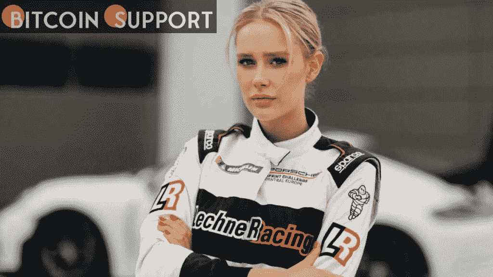

# 体育赞助正被 NFT 资助的赛事所扰乱

> 原文：<https://medium.com/coinmonks/sport-sponsorships-are-being-disrupted-by-nft-funded-racing-2544fbb69a9f?source=collection_archive---------30----------------------->

**Visit our website:-** [**https://bitcoinsupports.com/**](https://bitcoinsupports.com/)

劳拉-玛丽·盖斯勒作为 GT 车手的职业生涯将由一个分散的赞助模式决定，该模式旨在为赛车运动员创造公平的竞争环境。德国 GT 车手劳拉-玛丽·盖斯勒与创意公司 Amsterdam Berlin 和不可兑现的代币(NFT)公司 Unblocked 合作，组建了第一支由 NFT 资助的赛车队。LMG 车队已经决定完全通过 NFT 的销售来资助盖斯勒的赛季，而不是依赖外部赞助商。她能否筹集到足够的资金在未来的赛季参加比赛，完全取决于她的追随者。

盖斯勒和她的合作者在得克萨斯州奥斯汀的西南偏南展(SXSW)的第一个周末，首次向亲自参观保时捷看不见的装置空间的参观者发起了他们的活动。LMG 的首个 NFT 系列预计将在一周后推出。盖斯勒向媒体讲述了她参与这项实验的动机，以及她冒着丢掉工作的风险。

传统上，赛车运动中几乎所有的车手都依赖外部公司赞助他们的比赛，而成功取决于表现和有效的营销。据盖斯勒说，她的表演不是她的主要卖点。

“女人很难开口要钱，因为这变成了一种交易关系。对我来说，保持平衡并说服他人因为我的驾驶方式而钦佩我，而不仅仅是因为我是女性或因为我有特定的外表，这很有挑战性。”

**Visit our website:-** [**https://bitcoinsupports.com/**](https://bitcoinsupports.com/)

阿姆斯特丹柏林的创始人和创意总监 Moritz Grub 表示，赛车运动是一个非常男性主导和“大男子主义”的行业，部分原因是大多数赞助商都是男性。“也许如果更多女性领导的企业和公司资助赛车，我们会看到更多的女性粉丝和观众，”他推测道。当被问及为什么选择 NFTs 作为可能的解决方案时，Grub 评论道:“这是一项有趣的技术，但目前没有得到很好的利用。”。他认为 NFT 的众筹模式是“不得不按照我的赞助商希望我的方式行事，以便我的赞助合同每年都得到更新”的替代方案，认为大多数 NFT 的 PFP 项目都是“计划”

盖斯勒和阿姆斯特丹柏林与总部位于洛杉矶的 NFT 公司 Unblocked 合作，在 Flow network 上构建 NFT 系列。在 OpenSea 上拍卖的 LMG GT №1 赛车的 1:1 360 渲染图包含在收藏中。获胜者的名字将被刻在汽车上，还有一个 Arai GP-6 头盔的签名。

**Visit our website:-** [**https://bitcoinsupports.com/**](https://bitcoinsupports.com/)

据制造商称，LMG GT №1 的设计令人想起保时捷“粉红猪”模型，其特点是整形外科医生在手术过程中使用的“X”标记。它旨在代表女性赛车手因其外表而被寄予的期望，以及促进赛车界的性别平等。

一套 1001 个数字头盔和 100 套数字赛车服也在畅通的交易所里以固定的价格出售，品种多样，稀缺性强。NFT 的收藏者将会得到见面会、签名商品和独一无二的内容。据盖斯勒称，保时捷将为她配备一辆汽车，但这家德国汽车制造商不会参与这项计划。出售的收益将完全用于 LMG 车队的需要，由阿姆斯特丹柏林和 Unblocked 双方放弃赔偿。虽然 2022 赛季的目标是筹集至少 15 万欧元，但盖斯勒“抱着最好的希望”

【https://bitcoinsupports.com/】访问我们的网站:-

****免责声明:以上为作者观点，不应视为投资建议。读者应该自己做研究。****

> **加入 Coinmonks [电报频道](https://t.me/coincodecap)和 [Youtube 频道](https://www.youtube.com/c/coinmonks/videos)了解加密交易和投资**

# **另外，阅读**

*   **购买 Dogecoin 的 7 种最佳方式**
*   **[最佳期货交易信号](https://coincodecap.com/futures-trading-signals) | [流动性交易所评论](https://coincodecap.com/liquid-exchange-review)**
*   **[用于 Huobi 的加密交易信号](https://coincodecap.com/huobi-crypto-trading-signals) | [Swapzone 审查](/coinmonks/swapzone-review-crypto-exchange-data-aggregator-e0ad78e55ed7)**
*   **最佳[密码交易机器人](https://coincodecap.com/best-crypto-trading-bots) | [购买索拉纳](https://coincodecap.com/buy-solana) | [矩阵导出评论](https://coincodecap.com/matrixport-review)**
*   **[Coldcard 评论](https://coincodecap.com/coldcard-review) | [BOXtradEX 评论](https://coincodecap.com/boxtradex-review)|[uni swap 指南](https://coincodecap.com/uniswap)**
*   **[比特币基地评论](/coinmonks/coinbase-review-6ef4e0f56064) | [德里比特评论](/coinmonks/deribit-review-options-fees-apis-and-testnet-2ca16c4bbdb2) | [FTX 评论](/coinmonks/ftx-crypto-exchange-review-53664ac1198f)**