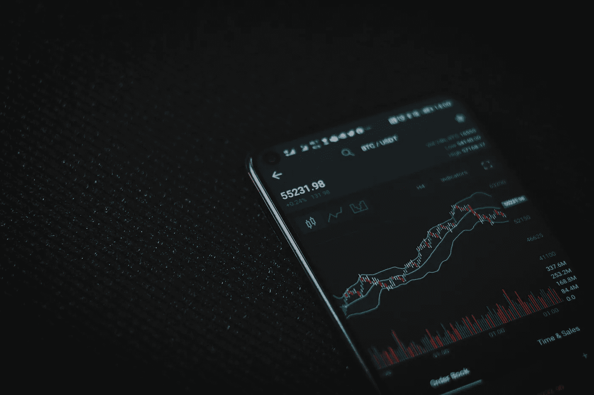

# 现货交易:钻石手的真正“天堂”💎🤲s

> 原文：<https://medium.com/coinmonks/spot-trading-real-haven-for-diamond-hands-ab1789bddcc5?source=collection_archive---------35----------------------->

Photo by [Viktor Forgacs](https://unsplash.com/@sonance?utm_source=unsplash&utm_medium=referral&utm_content=creditCopyText) on [Unsplash](https://unsplash.com/photos/3PyBkxgTiL0)

我们都见过投资者声称他们手握钻石，拯救了整个货币，或者他们团结起来拯救了他们所信仰的金融体系。我曾经痴迷于市场，就像这样，我有一些我的股票和货币加密，我不卖，像从来没有。它们就在我的现货钱包里，等待着盈利日的到来，这样当我的硬币在图表顶部时，我就可以兑现了。

# 简介:

我从很小的时候就开始了我的旅程，当我还只是一个高中生的时候，我就梦想着来加拿大，当我刚刚大学毕业的时候，我第一次想到投资我的钱，我的钱在一个月内翻了两番。生活不会总是给你一个激励性的开始，给你一个最初的开始。

从那以后，我一直在用我的密码做各种各样的事情。我投资过一些项目，我也尝试过把我的硬币借出去六个月，只是为了学习我的硬币赚取利息的过程。我的经历就是为什么我认为我的方式是不同的，就像其他人的一样。这就是为什么总是 DYOR。

## 背景:

1.  选择加密货币市场的最佳交易方式
2.  当人们说他们是什么意思💎🤲s
3.  **现货交易的加分**
4.  用加密赚钱的其他聪明方法
5.  重要链接

让我们在下面讨论几点，在这个加密货币和 FUD 的蛮荒西部，现货交易对于新手投资者来说是一个真正明智的选择。

## 选择加密货币市场的最佳交易方式

每个月你都会发现有人用不同的策略用 crypto 赚钱，但是唯一一次你会像开门一样睁大眼睛的时候是当你看到某人的增益帖子的时候。我打赌你会后悔为什么错过了那个机会，所以这就是为什么我在这里给你一些建议，告诉你如何在正确的时间利用正确的机会。

**现在，你如何在加密货币市场选择正确的交易方式？**

嗯，这很简单。简单来说，与其他购买、借贷、投资小项目或使用期货交易的投资者相比，你不会一直感到有压力。

我丰富多彩的投资方式是通过**现货交易**，现货交易就像购买加密货币，当利润对我来说可以接受时就卖出(用利润计算税费)。我甚至不会对硬币将要经历的涨跌感到紧张，我的主要动机是给它时间，并专注于它们所基于的区块链的更新。如前所述，你必须做你的研究，你可以随时套现，但只有当你的损失远远超过你的投资时才应该这样做。

其他方式有，

**期货交易**，这种交易方式与众不同，因为你是在投机未来加密货币的价格。交易者基本上买卖衍生品合约，这代表了硬币的价值会增加或减少。关于这一点的一个主要问题是，您可以设置从 5 倍到 100 倍的杠杆比率。是不是很酷？100 倍的杠杆，基本上一次就对了，赚了很多钱。有一天当我有时间和精力的时候，我会用它来给你，现在我真的很忙。

其次，**借贷**你币。当你借出你的硬币来获得一定的利息时，你就在某种程度上投资了。我使用过这种方式，我不得不说，不是所有的借款人都有相同的回报率，所以如果你选择借给你的硬币，请明智地选择。它可以在交易所进行，应该有一个选项。

我想说的第三种方式是**赌上**你的密码，我的朋友们在一些情况下真的很有收获，在一些情况下很令人失望。现在，在你说这与贷款有何不同之前，我已经说过这是不同的，因为在下注时，你的硬币进入了区块链，而不是借款人。就像我的情况，我押了我的 BTT，所以我每五分钟就能赚几个 BTT，我会展示一张我真的喜欢奖励的照片。

请继续查看我在这个[链接](https://ko-fi.com/i/II3I7BZKGB)上获得的利息。

Forth 是一种既新颖又古老的方式，众筹无疑是一种古老的方式，但当涉及到安全的分类账户进行透明交易时，这种古老的趋势可能会被新一代或当前的新技术用户群所选择。谈论我投资小项目的经历是模糊的，我有过损失，也有过收获，但我并没有获得那么多，所以为了我自己的利益，我暂停了使用这种方式。目前，我的 ADA 被委托在 Yoroi，当我投资一个项目时，获得一些额外的好处感觉很好。

最后，任何你选择走的路都是你的选择，但是如果你不想要压力，那么这是一条路，否则许多路会帮你赚很多钱。

现在来看下一个，社交媒体上的这种新趋势“钻石手”意味着什么？

## 当人们说他们是什么意思💎🤲s

这是当有人买了很多硬币，决定不卖，即使市场波动，他们深入亏损。这是关于坚持投资，当有一个强大的社区和成员之间的信任时，这是最有可能的。

**怎么开始的？**钻石手这个术语在互联网上已经存在很长时间了，只是在社区选择阵营并对他们喜欢的项目进行大量投资时才重新出现。

我是 AMC，BB 和 Doge 的钻石手。

# 中点:

谈到现货交易，它在某种程度上是一块宝石。如果我是最投机的人，我会选择现货交易，因为它可以让我购买和获得我名下的硬币，这样我就可以放心，我不会整天看着图表，而不是我可以一直持有，等到我投资的项目达到路线图的最后阶段。我看到了只会让我高兴的收益，但我真的没有在比特币或以太坊或索拉纳反弹中获得收益。我赚的大部分是总督和许多 DeFi 代币。

## 现货交易的加分

1.  当你决定你想套现的时间时，你就决定了你的利润
2.  人们可以进行日内交易，因为现货交易允许你一天内多次同时买入和卖出
3.  现货交易的立场是为市场建立利益和金钱，因为大多数人兑现是为了赚钱
4.  在现货交易中，加密可以与菲亚特交易，使交易更加可信，因为市场上的许多交易对都与 USDT 配对

我不得不承认，我不想只坚持一种方式，因为我已经用其他方式赚了钱，所以每个方向都有机会，你只需要停下来，理清你的思路。我不是财务顾问，但我可以告诉你一些不同的方法，把你的钱变成被动收入的来源。

让我们来看看最后一点，它基本上解释了在区块链使用 crypto 赚钱的几种方法，通过出售某些东西，通过对服务收取费用，或者通过投资小项目。

## 用加密赚钱的其他聪明方法

1.  销售一件产品，并要求顾客用比特币或 dogecoin 支付:这非常重要，因为你现在可以制作一件产品，比如一件手工制作的可销售或定制的衣服，并要求任何你喜欢的硬币作为付款。我会说艺术家可以卖画，但这就是 NFT 市场的作用。
2.  **赌上一把**:赌上你的硬币让你松了一口气，因为在区块链上非常安全。我不确定你是否在网站上下注，是否有不同的下注规则，但当你在区块链上下注时，它是安全的。
3.  **在区块链投资或资助一个小型的发展项目**:有没有想过投资你的硬币而不先提现。crypto 和区块链使这变得更简单，这样银行的介入可以最小化。我们正在支付几种费用，除此之外，银行账户也可能在任何危机时刻被冻结。如果有一种方法可以让我转移资金，投资于同一个区块链的一个增长项目，我会更喜欢它。如果我不必与银行进行很多交易，或者不必亲自跟踪这些交易，那就太好了。
4.  **成为 NFT 收藏家/投资者**:投资 NFT 可以帮你赚很多钱。我的意思是，想象一下你从一位艺术家那里买了一幅 NFT，随着时间的推移，如果这位艺术家太受欢迎，那就意味着你的 NFT 更值钱了。有一些奇怪的方法可以让你用 NFTs 赚钱，我会发一个帖子，但是我从来没有投资过。
5.  **用比特币或任何你喜欢的货币进行演出并收费**:任何人，从平面设计师到摄影师，从派对 DJ 到特殊厨师，你都可以随时随地收到 crypto 作为报酬。享受这种数字货币，在你觉得有利可图的时候随时兑现。

# 最终点:

很好地找到了这篇文章的结尾，所以这取决于你想选择什么方式投资加密货币。现货交易意味着你买入并持有，期货交易意味着押注未来硬币的价格(高杠杆)，边际交易允许交易者使用第三方的资金。

我所知道的是没有一种方法，我们选择方法，所以这取决于个人和他/她的情况。

> 下面是我在过去几年中经历的一些增益帖子的链接。我会在月底带着新的故事回来，感谢你阅读我的帖子。祝你愉快。

## 重要链接

1.  现货交易(币安):[链接](https://academy.binance.com/en/articles/what-is-a-spot-market-and-how-to-do-spot-trading)
2.  我在 BTTC 区块链的赌注结果:[链接](https://ko-fi.com/i/II3I7BZKGB)
3.  获得 Dogelon 和 Shib 的帖子:[链接](https://www.instagram.com/p/CYKRSnsLIjS/?utm_source=ig_web_button_share_sheet)
4.  获得澳洲牧羊犬令牌的帖子:[链接](https://www.instagram.com/p/Cb-g6aoL4P5/?utm_source=ig_web_copy_link)
5.  获得我早期作品集的帖子:[链接](https://www.instagram.com/p/CYKP7D-LVqJ/?utm_source=ig_web_copy_link)

> 加入 Coinmonks [电报频道](https://t.me/coincodecap)和 [Youtube 频道](https://www.youtube.com/c/coinmonks/videos)了解加密交易和投资

# 另外，阅读

*   [比特币基地僵尸程序](/coinmonks/coinbase-bots-ac6359e897f3) | [AscendEX 审查](/coinmonks/ascendex-review-53e829cf75fa) | [OKEx 交易僵尸程序](/coinmonks/okex-trading-bots-234920f61e60)
*   [如何在印度购买比特币？](/coinmonks/buy-bitcoin-in-india-feb50ddfef94) | [瓦济克斯评论](/coinmonks/wazirx-review-5c811b074f5b)
*   [隐翅虫替代品](/coinmonks/cryptohopper-alternatives-d67287b16d27) | [HitBTC 审查](/coinmonks/hitbtc-review-c5143c5d53c2)
*   [CBET 评论](https://coincodecap.com/cbet-casino-review) | [库科恩 vs 比特币基地](https://coincodecap.com/kucoin-vs-coinbase)
*   [Fold App 审核](https://coincodecap.com/fold-app-review) | [Kucoin 交易机器人](/coinmonks/kucoin-trading-bot-automate-your-trades-8cf0ca2138e0) | [Probit 审核](https://coincodecap.com/probit-review)