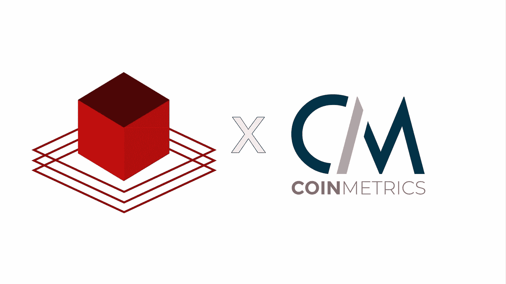

# 与 CoinMetrics 一起启动春季项目

> 原文：<https://medium.com/coinmonks/spring-kickoff-with-coinmetrics-744810731aa1?source=collection_archive---------9----------------------->

## 你通向革命的大门

这学期我们以 CoinMetrics 的启动活动开始。在这次活动中，我们谈到了 NEU 区块链与 a16z 在 Fei 协议上的新治理合作伙伴关系；创建新的研究团队；邀请 CoinMetrics 谈论他们的工作以及他们对市场的看法。

以下是事件发生的细节！这是我们的[演示文稿](https://docs.google.com/presentation/d/162n5zElOm9rtB2fAqmv_hXysD4X4I7mWf0xEhtIzgQE/edit?usp=sharing)的链接。

## a16z 和 Fei 协议

a16z 是硅谷最受欢迎的风险投资公司之一。他们给了我们**250 万美元部落**代币进行投票，并为一个叫做**费协议的算法稳定硬币协议写提案。**

为了成功地管理协议，我们将创建一个 NEU 区块链团队，并与其他学校合作，如加州大学伯克利分校和加州大学洛杉矶分校。我们希望把这个机会给任何渴望并愿意学习更多关于治理和稳定的公司的人。

您可以使用下面的链接申请加入治理团队

[加入治理](https://docs.google.com/forms/d/e/1FAIpQLSf8QZBvrSGbk77VTzBDA7msiI2tM5D3aMjze5U5Ge6PKgru3A/viewform)

## 春季研究团队

如果您有兴趣深入研究这项技术，并了解更多关于区块链、共识机制、各种平台等如何工作的信息，我们邀请您加入我们的研究团队。

如果这些术语听起来让人不知所措，不要担心。我们有从初学者到专业人员的所有技能水平的研究团队。我们所要求的是你有学习的意愿，并投入时间来写中等文章或研究论文。

我们期待在街区聚会上见到你！

> 街区聚会是每两周一次的有趣聚会，在那里我们可以开心地享受免费披萨！

加入研究团队和 RSVP 参加 Block Bash。

[研究团队](https://docs.google.com/forms/d/e/1FAIpQLScXPpL9bww-Maw0SzVhlZD3-cYJSRP2wv1xL_Z4ELTTL-7oMQ/viewform)

 [## 研究团队的 Block Bash #1 RSVP - Zoom

### 欢迎来到这学期的第一次街区狂欢！本次活动面向所有有兴趣加入区块链的同学…

陆.马](https://lu.ma/BlockBash) 

## 技术和发展

我们的技术和开发团队将亲自参与区块链的项目。你可以使用智能合同、web 开发、NFTs 等等。

如果你对编程感兴趣，加入我们的技术团队—

 [## NEU 区块链组织-学生领导的组织，致力于推进区块链教育…

### 由学生领导的组织，致力于推进区块链的教育、发展和研究。

陆.马](https://lu.ma/neublockchain) 

# 共计量学

来自 Coin Metrics 的 Katie 和 Kyle 加入了我们。Katie 已经在 Coin Metrics 工作了 2 年多，之前在 Fidelity 工作过。她加入了 CoinMetrics 的研发团队。凯尔从事每周报告和时事通讯的工作。在过去的几个月里，他一直在大量研究 NFTs。

> CoinMetrics 分析链上/链下数据，并向其用户提供干净、透明的数据。他们提供超过 [100 个免费指标](http://www.bitcoinkpis.com)，并提供超过 400 个指标的订阅访问。为了收集这些数据，CoinMetrics 有 33 个节点跟踪区块链发生的事情。

未来的共同计量计划:

*   2022 年，CoinMetrics 将把数据放在上下文中，进行数据分析并提供这些服务。
*   他们将更加关注不同区块链网络的各种风险指标
*   他们将扩展到第 1 层以外，专注于 DeFi、NFTs 和许多其他区块链。
*   Coinmetrics 实验室将沉迷于更多的孵化活动
*   筹集新一轮投资

凯蒂和凯尔就以太坊 2.0、比特币闪电网络、Solana、Avalanche、NFTs、元宇宙和空间未来的发展发表了自己的见解。

*   他们讨论了即将到来的以太坊网络更新合并的经济后果。在这次更新中，以太坊将从电源转移到 PoS。
*   他们解释说，Solana 每天消耗大约整个比特币区块链大小的硬件需求！DDOS 攻击引发的 Solana 安全问题。
*   NFT 太空仍处于起步阶段。比特币基地将在 2022 年发布他们的市场，twitter 发布了 NFT 的个人资料，因此 NFT 将变得更容易接近。
*   由于美元和许多依赖美元的货币的通货膨胀，许多货币正在大幅贬值。这促进了比特币、以太坊和稳定币在土耳其、缅甸、萨尔瓦多和其他国家的使用。
*   Crypto 也不能免受股票市场、通货膨胀和利率的影响。

我们这学期的第一个活动非常成功，我们从 CoinMetrics 中学到了很多。这学期我们将有更多的活动、研讨会、教育内容、合作伙伴关系以及研发机会。别忘了在 [Instagram](https://www.instagram.com/neublockchain/) 上关注我们，了解最新动态。