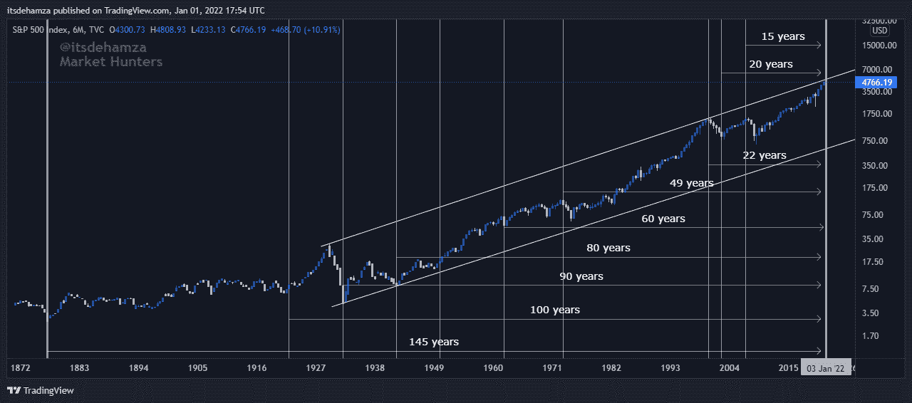
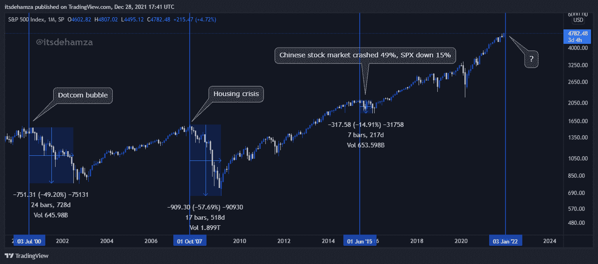
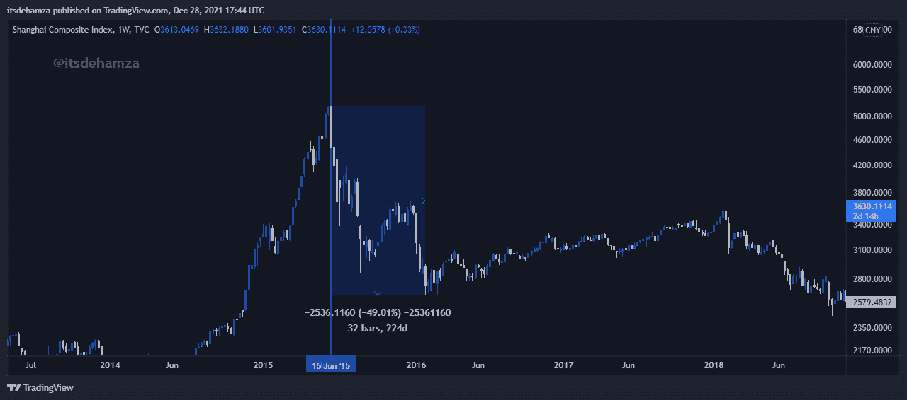
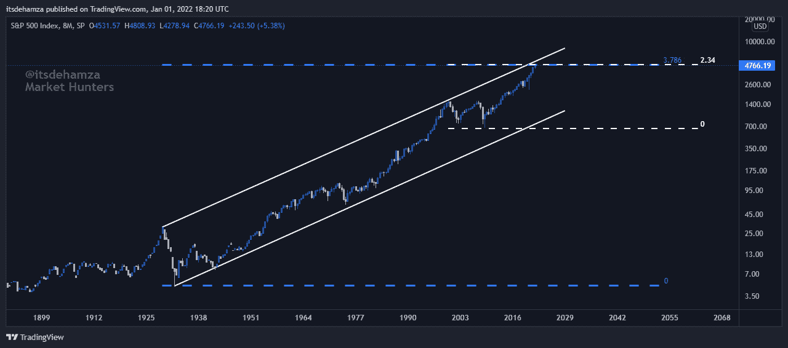
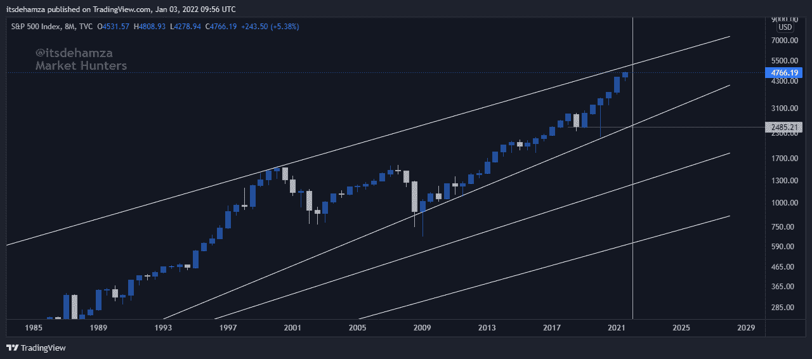
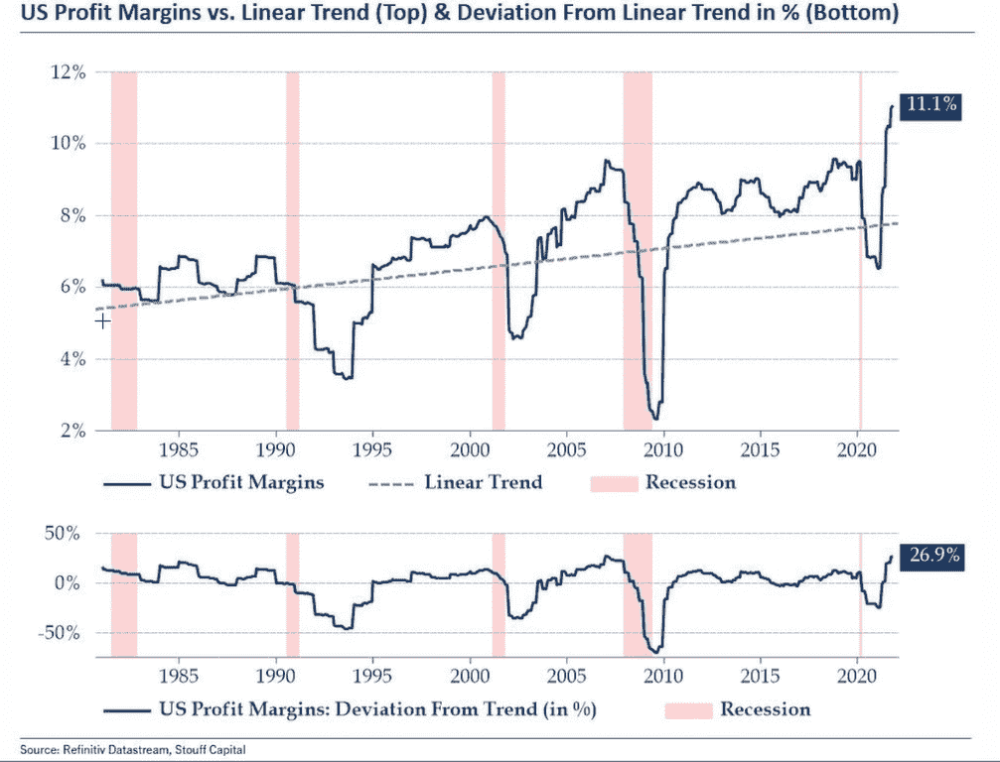
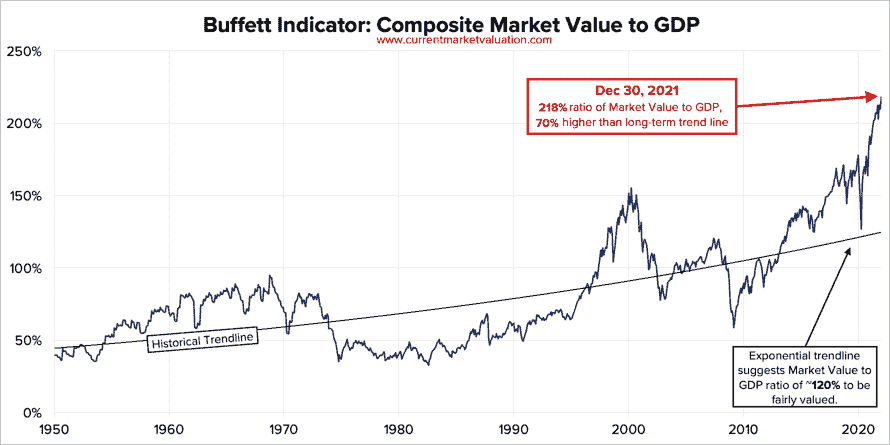
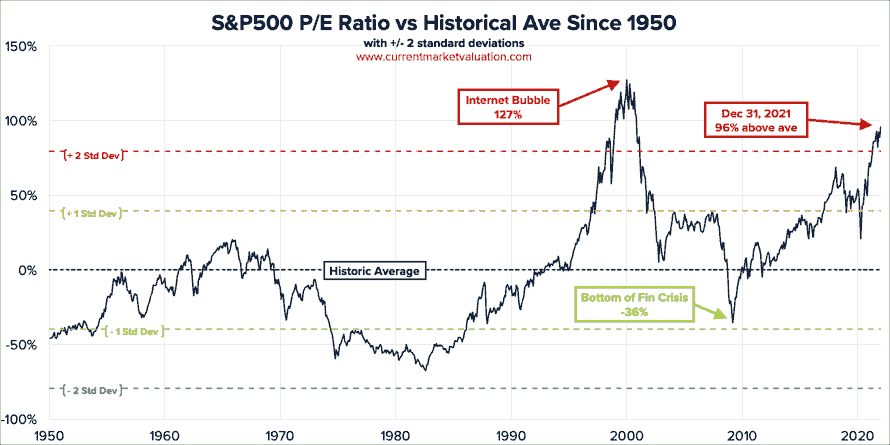
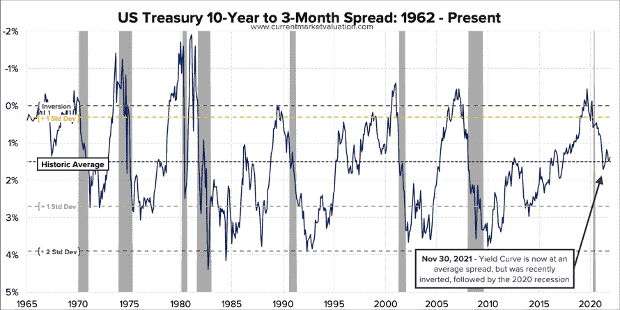
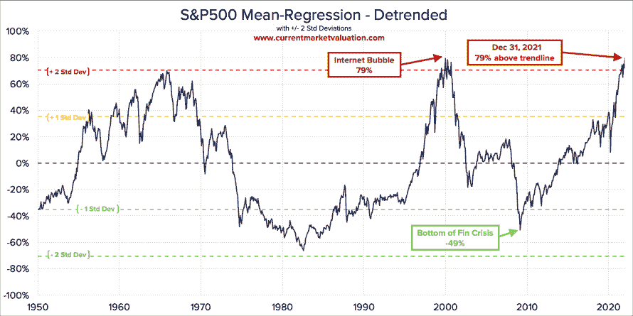

# SPX 模型(美国股票市场指数)

> 原文：<https://medium.com/coinmonks/spx-model-us-stock-market-index-83cb6a132d88?source=collection_archive---------5----------------------->

2008 年全球危机后，美联储宽松的货币政策引发了长达 13 年的股市牛市。货币宽松有利于提振经济，但会带来高通胀的副作用。美国通胀率创下 6.8%的新高，这是自 1982 年以来的最高水平。

从技术上、周期上、数字上和占星术上，我们有足够的证据支持美国股市(纸牌屋)正处于崩溃边缘的事实。

## 【2022 年的循环重要性

我们有几个微观和宏观周期将在 2022 年完成。周期完成标志着市场的重要高点或低点。我将在下面讨论的周期完成预示着 2022 年的一个主要高点。考虑以下周期:
**年周期:**
从 2007 年高点算起 15 年= 2022 年
从 2002 年低点算起 20 年= 2022 年
从 2000 年高点算起 22 年= 2022 年
从 1973 年算起 49 年如何= 2022 年(49 年具有重大的圣经意义)
从 1962 年低点算起 60 年= 2022 年
从 1980 年算起
从第一次多年牛市开始算起 100 年(7 年牛市)= 2022 年
从 SPX 历史低点算起 145 年= 2022 年
从第二次世界大战结束算起 77 年= 2022 年(数字 77 也具有圣经的重要性，它发生在计算七个七天完美周期之后，每个周期在第七天安息日结束)
(利未记 23:10–16)。

## **所有循环计数到 2022 年**

**舍米塔年份:** *7 年周期和重要性 7 号*

"《托拉》要求犹太人在土地上劳作六年，第七年就让它休息。"作为穆斯林，我们所有人都有义务信仰 4 部神奇的圣书。

犹太人一在圣地定居，就开始计算和遵守七年周期。每个周期都会在一个休假年达到高潮，被称为 Shemitah，意思是“释放”Shemitah 是一个有 3000 年历史的神秘周期。

第二圣殿被毁后的第二年是七年休假周期的第一年。在犹太历中，从创世算起，这是世俗历中的公元 3829 年，68-69 年。通过计算从那时起的七年周期，我们看到下一个示米他年将是创造后的 5782 年，从 2021 年 9 月 7 日到 2022 年 9 月 25 日。

这些 7 年周期可以应用于金融市场。如果我们回到 7 年前的 2014-2015 年，中国股市暴跌了 49%。7 年前的 2007-2008 年房地产危机中，SPX 下跌了 57%。7 年前的 2000-2001 年是网络泡沫时期。

每隔 7 年就会有更多的人。

这个 shemitah 年的结束日期是 2022 年 9 月 25 日，所以我们更有可能在 9 月 25 日之前目睹股市暴跌。有一些线索表明，崩溃开始于一个特定的月份，这些都是在标题下讨论命理和占星术。

## **重要性№7:**

数字 7 是最重要的数字之一，主要是因为它在宗教和自然方面的重要性。

## **宗教重要性**

**1。**古兰经第一章，第一章有 7 节。7 曼齐尔古兰经。在《古兰经》中，安拉命令我们 700 次供奉萨拉赫。
**2。**穆斯林绕卡巴 7 圈，在萨法和马尔瓦之间 7 圈。
**3。**七海七天。天堂的七层和地狱的七道门。
**4。**真主爱他的男人比爱他的母亲多 70 倍。
**5。**圣经最初分为 7 大部。
**6。《创世纪》告诉我们，上帝在六天内创造了天地，完成后，上帝在第七天休息(创世纪 1；2:1–2).
**7。**根据利未记，禧年是从每四十九年(7 乘 7)之后开始。**

## **自然重要性:**

**1。**有 7 大洋，7 大洲。
2。颈部有 7 块椎骨。
**3。** 7 种彩虹色。
**5。** 7 层皮肤。
**6。**有 7 个方向。
**7。**一周 7 天。

## **2022/222 的命理重要性:**

在我的一篇文章中，我提到了 2 月 22 日，为什么我要提到它呢？
因其命理之美，22/2/22。222 的象征意义是一个神圣的标志，让你知道一个新的周期即将开始，这是关于信仰，福祉和正义。

数字 2 可以解释为若干对立，在一定程度上，是人与神分离的象征。在这种情况下，你的信息可能是一个警钟，重新点燃你的精神成长的努力。

## **即将到来的撞击的占星证据:美国冥王星回归**

美国冥王星回归意味着自美国建国以来冥王星的一次完整公转，耗时约 248 年。从占星学的角度来看，冥王星是死亡和重生、动荡的行星。冥王星的回归将会在 2022 年 2 月 20 日出现在美国出生图的第二宫。这使得从 2022 年 2 月 20 日+-1 日开始的市场崩盘极有可能发生。这永远不会在一夜之间发生，相反，这将是美国股市的缓慢出血，其间会有一些下行波动。

“大萧条 1929-1932”的一个主要占星原因是冥王星的半回归，它使 SPX 崩溃了 84%,而道琼斯下跌了 90%。令人震惊的是，1930 年至 1931 年也是“谢米塔”年。

这种情况还会发生吗？或者我们可以预期下降多少？继续往下读，寻找答案。

## **技术证明:**

从 2022 年开始，SPX 将完成 13 年的牛市，进入第 14 年。标准普尔 500 指数正在逼近 93 岁的趋势线阻力，该阻力与大萧条时期从高点到低点的 3.786 fib 和从 2000 点网络顶部到房地产泡沫底部的 2.34 fib 汇合。12M 图中 RSI 在 87。考虑下面的图表。

**我们能预期会有多大程度的下降？**

我们可能会看到至少 40-49%的修正，直到第一个趋势线的支持。如果 SPX 调整到第二条趋势线，那么将下跌 70%。这些是对即将到来的调整幅度的逻辑推测。70–75%确认量级只能在顶部确认后计算。

## **对密码市场的影响:**

自 2010 年比特币 1 号开始交易以来，没有出现过股票熊市。因此，这将是一个关于加密市场将如何受到即将到来的崩溃影响的实验。从投资者的角度来看，这两种资产都被认为是有风险的。因此，在我看来，SPX 最低修正 50 %, BTC 将修正超过 50%。alt 可能会遭受高达 75–90%的损失。

最近的黑天鹅事件(电晕危机)导致了许多金融工具的大规模 V 型复苏。与 SPX 和其他器械相比，BTC 和 alt 恢复迅速。因此，我们可以预期，在危机之后，加密市场将出现快速的 V 型复苏。

## **基本证明:**

在无限制的印钞和刺激下，股市大幅上涨。所有发生的事情都要被记录下来。考虑遵循基本指标。

## **美国利润率:**

美国的利润率正处于历史最高水平，这在整个周期中对股市有利。下图显示了其与线性线的偏离，这表明美国利润率已达到 2007 年和 2000 年的衰退估值。

## **抖振指示器:**

抖振指标是 2.3 标准差，表明市场被极度高估。

**市盈率:** 市盈率是衡量任何证券价值的经典指标，它表明要收回股票投资需要多少年的利润(按当前利率计算)。目前的 S & P500 10 年市盈率为 39.2。这比现代市场平均水平 19.6 高出 96%，使当前市盈率 2.4 倍的标准差高于现代市场平均水平。这表明市场被严重高估了。下图显示了这一比率的历史趋势。

## **收益率曲线:**

美国国债收益率曲线最近出现了反转。这在历史上一直是即将到来的衰退的一个非常可靠的指标，因为它反映了投资者对未来经济表现的情绪。自二战以来，每一次收益率曲线反转都会在接下来的 6-18 个月内伴随着衰退，而衰退自然会与股市回报下降相关联。

## **S & p500 均值-回归-去趋势:**

我们可以看到，S&P500 目前的价格略高于趋势线+2 标准差。+2 标准差是除 2007 年峰值之外的先前牛市峰值。

## **关键要点:**

**1。【2022 年主要重要周期完工。
**2。2021 年 9 月 21 日至 2022 年 9 月 25 日。
**(7 年周期)3** 。美国冥王星于 2022 年 2 月 20 日回归。死亡和重生的星球。
**4。SPX 正在逼近 93 岁的趋势线阻力。12M RSI 在 87(极度超买)。
**5。**最低 40–49%，预计最高 75–85%的修正。
**6。随着 SPX 的最小修正，BTC 将下跌超过 50%,澳元将贬值 75-90%。
**7。SPX 重要低点和完整底部日期将在稍后分享。**********

## **SPX 的重要日期:**

1.2 月 20 日+-3。
2。5 月 10 日+-1。
3。4 月 25 日+-3。
4。10 月 5 日

## **结论:**

鉴于上述所有原因和概念，美国经济更有可能在 2 月下旬开始崩溃。这一模型完全基于历史数据、时间周期和占星术。在这个模型中，所有的事实、证据和假设都是共享的。这一切都可能出错，我不介意出错。到目前为止，我对这个模型有 63%的信心。我的信心水平是可变的，会随着事情的发展而改变。

**免责声明:**这个模型不是让你做财务决策的。这个模型是让你学习和理解市场和周期是如何运作的。我们计划如何在崩盘期间保护我们的资本和投资，稍后将在《市场猎人》分享。

**2022 年 1 月 3 日
市场猎人，
Twitter @itsdehamza**

> 加入 Coinmonks [电报频道](https://t.me/coincodecap)和 [Youtube 频道](https://www.youtube.com/c/coinmonks/videos)了解加密交易和投资

## 另外，阅读

*   [Bookmap 评论](https://blog.coincodecap.com/bookmap-review-2021-best-trading-software) | [美国 5 大最佳加密交易所](https://blog.coincodecap.com/crypto-exchange-usa)
*   [八大加密附属计划](https://blog.coincodecap.com/crypto-affiliate-programs) | [eToro vs 比特币基地](https://blog.coincodecap.com/etoro-vs-coinbase)
*   [最佳以太坊钱包](https://blog.coincodecap.com/best-ethereum-wallets) | [电报上的加密货币机器人](https://blog.coincodecap.com/telegram-crypto-bots)
*   [交易杠杆代币的最佳交易所](https://blog.coincodecap.com/leveraged-token-exchanges) | [购买 Floki](https://blog.coincodecap.com/buy-floki-inu-token)
*   [3 commas vs . Pionex vs . crypto hopper](https://blog.coincodecap.com/3commas-vs-pionex-vs-cryptohopper)|[Bingbon Review](https://blog.coincodecap.com/bingbon-review)
*   [加密复制交易平台](/coinmonks/top-10-crypto-copy-trading-platforms-for-beginners-d0c37c7d698c) | [如何在 WazirX 上购买比特币](/coinmonks/buy-bitcoin-on-wazirx-2d12b7989af1)
*   [CoinLoan 评论【Crypto.com】|](https://blog.coincodecap.com/coinloan-review)[评论](/coinmonks/crypto-com-review-f143dca1f74c)
*   [最佳网上赌场](https://blog.coincodecap.com/best-online-casinos) | [币安评论](/coinmonks/binance-review-ee10d3bf3b6e) | [BitMEX 评论](https://blog.coincodecap.com/bitmex-review)
*   [麻雀交换评论](https://blog.coincodecap.com/sparrow-exchange-review) | [纳什交换评论](https://blog.coincodecap.com/nash-exchange-review)
*   [美国最佳加密交易机器人](https://blog.coincodecap.com/crypto-trading-bots-in-the-us) | [经常性评论](https://blog.coincodecap.com/changelly-review)
*   [在印度利用加密套利赚取被动收入](https://blog.coincodecap.com/crypto-arbitrage-in-india)
*   [Godex.io 审核](/coinmonks/godex-io-review-7366086519fb) | [邀请审核](/coinmonks/invity-review-70f3030c0502) | [BitForex 审核](https://blog.coincodecap.com/bitforex-review)
*   [最佳比特币保证金交易](/coinmonks/bitcoin-margin-trading-exchange-bcbfcbf7b8e3) | [萝莉点评](/coinmonks/lolli-review-e6ddc7895ad8) | [比特币保证金交易](https://blog.coincodecap.com/bityard-margin-trading)