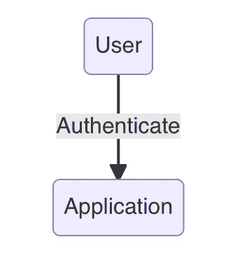
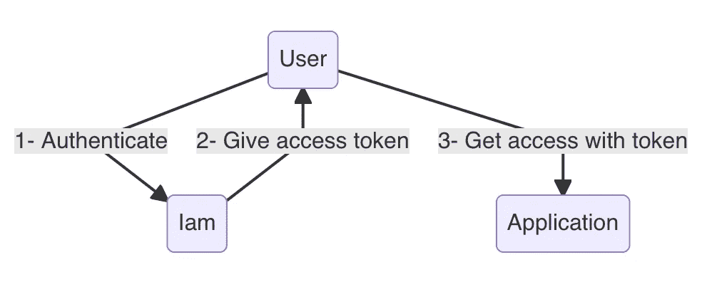
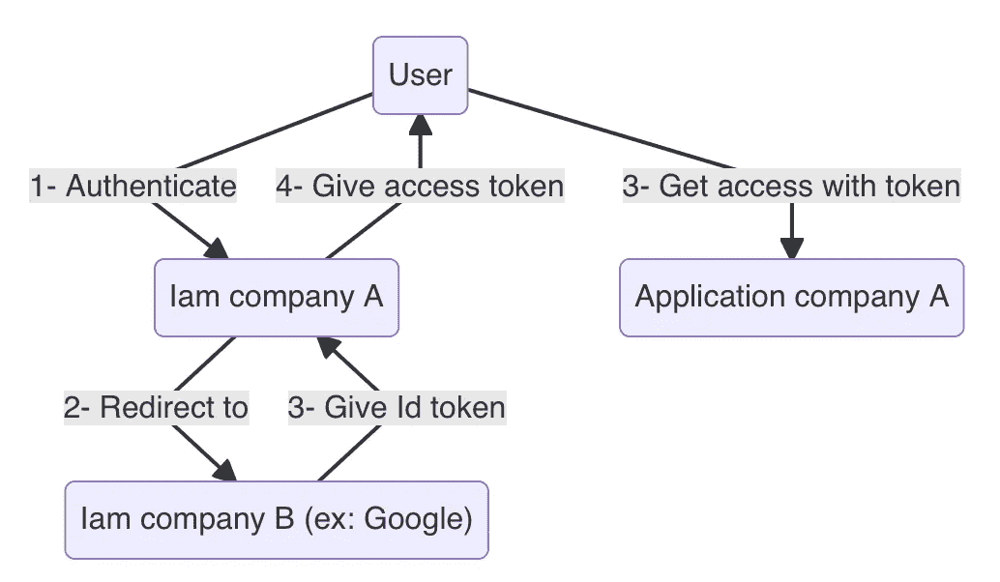
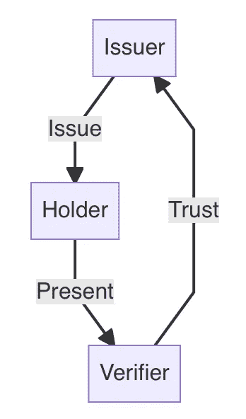

# SSI:身份管理的未来，它是如何工作的？

> 原文：<https://medium.com/coinmonks/ssi-the-future-of-identity-management-how-does-it-work-93cb40733ddc?source=collection_archive---------21----------------------->

# 要解决的问题

"互联网的设计没有安全层."

这种直率、冷酷但事实性的陈述是思维的起点，导致了 SSI 的概念，自我主权身份。

互联网被设计成可靠而有弹性地连接机器，首先是在大陆范围内，然后是在地球范围内。

因此，互联网主要是一个机器网络，而不是个人网络。

这些机器没有意图(好的或坏的)，只是需要能够在网络上定位它们，而不必认证或授权它们，TCP/IP 就是从这种需要中诞生的。

互联网最初由科学和学术团体使用，在一定的道德规范指导下，在 90 年代初逐渐向公民和企业开放。

身份管理和访问控制的需求变得普遍起来。

# 本地身份管理

第一个反应采取了地方倡议的形式。

每个站点、每个部门、每个公司、每个应用程序都继承了一个身份管理和访问控制系统。

第一次集成在应用层，它意味着用户为他们每个人创建(和记忆)一个帐户。

不太方便，而且可靠性/安全性水平参差不齐，很快就显示出它的局限性。

# 单点登录（single sign-on 的缩写）

公司内部的发展催生了 SSO(单点登录):公司所有应用程序的通用标识系统。

微软通过其 Active Directory 推广了这一原则，然后 SAML、SAMLv2 或 OpenID Connect 等开放标准取而代之。

# 联邦

如果这个问题在公司内部得到全面管理，个人就不会从中受益。

新公司订购的每项新服务都意味着一个新账户。

互连企业 SSO(从那些为个人提供服务的 SSO 开始)的想法由此诞生，OpenID Connect 就是基于这一点而设计的。

身份联盟”允许用户使用来自公司“A”的账户向公司“B”的服务进行认证。

当你用你的 Google、Twitter 或 GitHub 账户认证与这些公司无关的服务时，就会发生这种情况。

# 临界物质

虽然从用户的角度来看，联合身份管理的原则似乎令人满意，但它也存在一些问题。

首先，为了工作，服务“B”必须将“A”识别为身份提供者。

例如，您的在线医疗预约服务必须承认谷歌或 FaceBook 为其身份提供者。

由于网站和服务不能提供一个无限的被认可的身份提供者的列表，他们倾向于选择最有代表性的，因为每个人都有一个谷歌帐户，对吗？

事实上，该系统有利于参与者的集中:服务提供商将倾向于选择聚集最大潜在用户的身份提供商，并且用户将倾向于选择在最大网站和应用上被引用的提供商来管理他们的身份，该系统是自我延续的。

因此，主要的互联网参与者处于中心地位。

尽管他们并不直接从用户的身份管理服务中获利，但通过他们的每一次连接和每一次身份验证都是巨大信息的来源，代表着潜在的巨大经济利益。

如果身份提供者(理论上)在您被识别后无法访问您在“B”服务上的活动，那么知道您已经验证了自己的身份并在某日某时访问它这一简单事实就是可货币化的信息。

保险公司愿意花多少钱来了解你登录在线医疗预约网站的频率？

这种高度集中也带来了安全问题:如果身份提供商的系统遭到破坏，对其用户的影响可能是灾难性的。

# 发生了什么变化

尽管联邦系统存在风险和缺点，但它们仍然代表了当今使用的大多数身份管理系统。

这是因为当时可用的技术不允许我们做得更好。

但是我们能做得更好吗？在互联网的规模上，最佳系统的特征是什么？

让我们试着想象一下:

*   一个允许个人和机器进行自我认证的系统，甚至可以提供做出授权决定的必要元素。
*   该系统将避免用户必须管理/记忆大量账户/密码，而不管他们认证的服务的数量。
*   一个非集中化的系统，可以避免上一章提到的过度集中现象。
*   允许用户仅披露使用相关服务所需信息的系统(例如:我必须能够证明我已经成年，而无需披露我的出生日期或年龄)。
*   最后，一个明显可靠(安全)且易于使用的系统。

许多研究人员在过去二十年中一直致力于这个问题，但直到最近才找到令人满意的解决方案，最复杂的是设计一个在互联网规模上既分散又“可扩展”的系统。

2008 年，互联网见证了一项新技术的诞生:区块链。

在其“应用示范者”即加密货币的背后，区块链首先是第一个完全分布在互联网规模上的“数据库”系统。

准确地说，它是一个分布式分类帐，即，像分类帐一样，只能在其中添加数据，而不能删除或修改数据的数据库。

尽管这些性能(以每秒事务数表示)在全球范围内都很差，但对于我们感兴趣的事情来说已经足够了:创建一个 PKI(公钥基础设施)。

PKI 是实现基于非对称加密的认证和签名系统的基本系统。

到目前为止，它们本质上是集中式的(或者说是层级式的，这是一回事)，并且处于一个实体(公司、组织、政府)的控制之下，这使得它们不可能扩展到互联网。

区块链为分布式 PKI 原则开辟了道路，不再需要中央组织来管理密钥和相关信息。

这种完全分布式的 PKI 在技术上使得 SSI(自我主权身份)概念的出现成为可能，这是一种新的身份管理模式(人们花了 6 年时间才理解它)。

# SSI:操作原则

SSI 的原理相对容易理解，特别是对于非专业人士(他们通常对它所代表的颠覆性创新最困惑):我们只是在虚拟世界中复制你在现实世界中管理你的标识符的方式。

我所说的“标识符”指的是任何能够表征你的信息:名和姓、出生日期、实际地址、国籍、眼睛颜色、头发颜色、身高等等。

# 现实世界

在物理世界里，**第一步**通常是买个钱包。

它变成了“你的”钱包，但当它是空的时，它本身并不包含任何个人信息。

它是“你的”钱包，因为它在“你的”口袋里，只有你能决定往里面放什么:一切都在你的掌控之中。

**第二步**:你开始在里面存放身份证件:你的身份证、驾驶证、护照、运动俱乐部会员卡、员工胸卡、信用卡等。这些文件代表由你的雇主发布的信息。

这些文件代表由发行人发行的信息。

例如，您的身份证或护照代表由您所在国家的民事登记处签发的身份信息。

**第三步，也是最后一步**:你用你的文件访问服务。

要租车，你要从钱包里拿出驾照(钱包一直在你的掌控之中)，并出示给租车公司。要进入你最喜欢的健身房，你需要拿出你的会员卡并出示它。要进入一个新的国家，你要拿出护照并出示它。

你向人们展示身份属性，这些实体将对他们进行检查。

例如，海关官员检查你护照上的照片、眼睛颜色、身高是否与他正在看的人相符，但最重要的是，他检查文件是否真实，即它是否由他(或更确切地说是他的国家)信任的实体(在这种情况下是一个国家的政府)签发，并且它没有被伪造(信息被修改)。

因此，这是一种可传递的信任关系:海关官员信任你向他提供的信息，因为他信任向你提供信息的实体(你的政府)。

他不需要了解你，更不用说信任你了。

如果我们简要总结一下参与的参与者，可能会是这样:

在业内，我们称之为“信任三角”。

正是这个原理，让不直接认识的人，可以放心地相互交往，无论是关于身份信息，还是关于金钱(虚拟的或实物的)。

# 虚拟世界

让我们把这个转换到虚拟世界。

对于**的第一步**我们需要两样东西，一个钱包，就像在现实世界中一样，除了这里它是一个软件(可以安装在你的智能手机上)，但也是一个支持。

在虚拟世界中，没有纸张，没有塑料卡片，没有安全的小册子，简而言之，没有可以打印信息的物理介质，也没有你可以控制的物理介质。

该媒体将采用由您创建的唯一随机标识符的形式。

它绝对不携带任何个人信息，它只是一个随机的数字和字符序列。但是它是“附加”在加密方法上的，您将使用加密方法来证明您对该标识符具有“控制权”。

简单地说，这个数字标识符，或者说 [DID](https://www.w3.org/TR/did-core/) ，与你自己创建的私钥/公钥对绑定在一起。

当身份信息的发布者“制作”了你的驾照或电子护照的等价物时，它将通过指示该信息是用于该特定 DID(通过`credentialSubject`字段)来做到这一点。

如果你控制了 DID(即私钥)，那么你就可以用密码证明其中引用的信息是关于你的。

这个 DID 是一个 [URI](https://www.w3.org/TR/uri-clarification/) (唯一资源标识符)，这个资源就是你的公钥。

这种 DID/公钥配对(存储在 DID 文档中，其本身存储在区块链中)是上述分布式 PKI 的基础。

**第二步**包括，如在现实世界中一样，接收表征你的认证信息。

发卡行，在我们的例子中是公民身份，将发布一组属性(名字、名字、地址、身高、眼睛颜色……)，这些属性将附加到您的 DID(通过`credentialSubject`字段)并用其私钥加密签名。

这个相对简单的原理允许以密码方式证明信息:

*   由该特定发行人(如政府)发行。
*   未被更改或伪造(签名将不再可验证)。
*   它是发给你的(你的 DID 是签名信息的一部分)。

你收到的“文件”被称为[可验证凭证](https://www.w3.org/TR/vc-data-model/)。

在**第三步**中，你通过[可验证演示](https://www.w3.org/TR/vc-data-model/#presentations-0)向验证者(例如海关官员)展示属性。

海关官员可以用密码核实:

*   呈现给他/她的信息是完整的(即没有被更改)，
*   由于发行人的签名，它们是真实的(它们已经被发行给你的政府),
*   它们与您有关(因为您将使用与发布信息的 DID 相对应的私钥签署您的演示文稿)。

为了核实这一点，海关官员需要使用发行人的公钥和你的公钥。

这就是区块链发挥作用的地方，它只是作为 DID/公钥对的存储介质。

使用发行者的 DID 和包含在呈现的属性中的您的 DID，它将使用该存储介质“解析”这些标识符，以找到相应的公钥并执行签名检查。

区块链是不可更改的(信息一旦写入就不能修改)，他保证如果签名对应于找到的公钥，那么一切都是正常的。

剩下的就是确定他是否信任包含在您的可验证演示中的可验证凭证的颁发者，在我们的示例中，就是您的政府。

就像在现实世界中一样，我们有一个信任三角:

“发行者”是你的政府。

“持有者”就是你。

“核查人”是海关官员。

# 可能性的领域

这种相对简单的技术(我自愿省略了一些细节)，允许想象非常具体的应用。

*   如上例所示，身份证件(护照、驾照、身份证等)的非物质化。)以及由此带来的控制自动化(在海关不再排队)，
*   合同文件或由商业合同产生的文件的非物质化:你刚刚在网上租的汽车的虚拟钥匙(发行人是租车人，验证人是汽车)，你刚刚从某个日期在网上租的酒店房间的虚拟钥匙(发行人是酒店网站，验证人是……门的电子锁)
*   保护您的计算机访问意味着(不再需要密码，发布者可以是您的公司，但也可以是您的政府发布的身份属性)
*   你的支付手段的非物质化手段的标准化(发行者是你的银行，验证者是商家)，
*   您的健康信息的非物质化(这些信息将仅存储在您的钱包中，由您控制；Covid 疫苗接种证书在许多国家都是基于这种技术)，
*   验证某些特征以获得某些服务(进入酒吧或色情网站的年龄)。

最后一个例子使用了一个名为“[选择性披露](https://www.w3.org/TR/vc-data-model/#dfn-selective-disclosure)的可验证凭证函数。

它允许持有人在他从发行人处收到的属性中选择他希望在提示中包含或不包含的属性。

例如，你可以选择只提供你的出生日期，从你的身份证，进入一个色情网站，但不是你的名字或你的名字或其他任何东西。

更进一步，甚至有可能通过某种密码机制( [ZKP](https://www.w3.org/TR/vc-data-model/#presentations-using-derived-credentials) )来证明你已经成年，而不需要透露你的出生日期或年龄。

无论何种应用，总是由持有者同意(或不同意)提供所请求的信息。

这一信息只为持有者所有，并受其独家控制。

不再有一个中央系统，不再有垄断来跟踪你在一个在线医疗预约网站上的认证。

DID、可验证的凭证和可验证的展示这三者代表了一种通用的方式，在保护我们的隐私的同时，实现了非物质化、加速和保护我们的经济。

但这还不是全部。

所有前面的例子都假设持有者和`credentialSubject`是人类(并且持有者是凭证主体)。

SSI 完全适用于其他类型的实体:

*   物体，比如:集装箱、你的冰箱、你的电视、运送你的飞机的右引擎
*   在一个[零信任](https://en.wikipedia.org/wiki/Zero_trust_security_model)环境中相互协作的程序，
*   动物，持有者可以是例如农民和已经向其提供可追溯性或健康信息的牛，

# 结论

IMS 不仅仅是一个新的认证或授权系统，它还是一个信任非物质化的通用模型。

每个演员选择**他信任谁**，他向谁**呈现他的个人信息**以及他呈现什么**信息。**

在“机器对机器”的世界中，它为系统的互操作性开辟了一条迄今难以想象的道路，例如 [Gaia-X](https://gaia-x.eu/) 项目就是基于这一原则，这只是众多例子中的一个。

> 加入 Coinmonks [电报频道](https://t.me/coincodecap)和 [Youtube 频道](https://www.youtube.com/c/coinmonks/videos)了解加密交易和投资

# 另外，阅读

*   [印度最佳 P2P 加密交易所](https://coincodecap.com/p2p-crypto-exchanges-in-india) | [柴犬钱包](https://coincodecap.com/baby-shiba-inu-wallets)
*   [8 大加密附属计划](https://coincodecap.com/crypto-affiliate-programs) | [eToro vs 比特币基地](https://coincodecap.com/etoro-vs-coinbase)
*   [最佳以太坊钱包](https://coincodecap.com/best-ethereum-wallets) | [电报上的加密货币机器人](https://coincodecap.com/telegram-crypto-bots)
*   [交易杠杆代币的最佳交易所](https://coincodecap.com/leveraged-token-exchanges) | [购买 Floki](https://coincodecap.com/buy-floki-inu-token)
*   [3Commas 对 Pionex 对 Cryptohopper](https://coincodecap.com/3commas-vs-pionex-vs-cryptohopper) | [Bingbon 评论](https://coincodecap.com/bingbon-review)