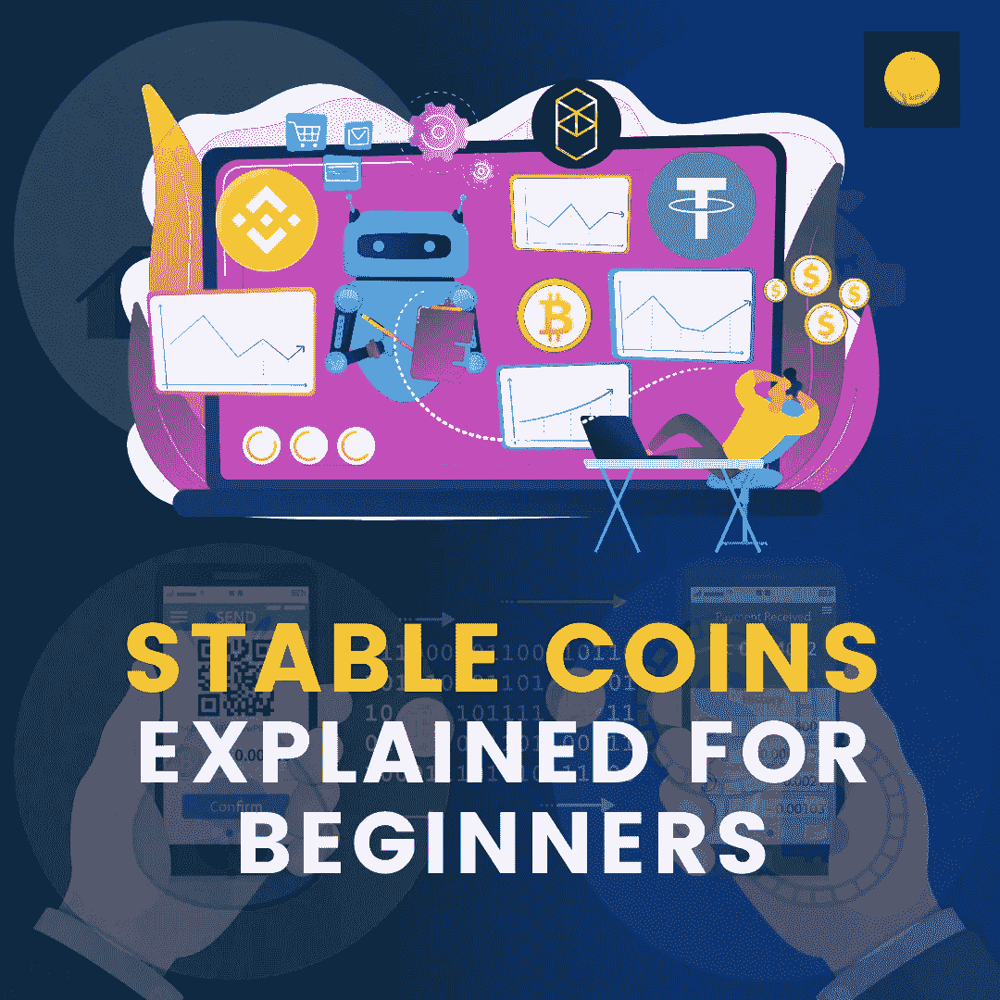

# 为初学者解释的稳定硬币

> 原文：<https://medium.com/coinmonks/stable-coins-explained-for-beginners-d47b2addf87?source=collection_archive---------50----------------------->

作为一个狂热的密码爱好者或采纳者，为了换取法定货币，你更喜欢获得报酬或持有稳定的硬币。你可能会问为什么？持有稳定的硬币有两个好处:(1)不受市场波动的影响(2)容易实现溢价。让我从这个角度来看，假设你在 USDT 做了一份写作工作并获得报酬。在这里，我们将 1000 美元作为演出费用。好处是 1000 美元的演出对你来说仍然是 1000 美元。除此之外，储存在 USDT 或其他稳定硬币中的 1000 美元甚至可以溢价出售。

既然你能很好地衡量持有稳定硬币的好处。让我们更深入地研究一下，用实用程序找出它们的变种。

# 菲亚特抵押稳定硬币

一个菲亚特抵押稳定硬币是 1:1 挂钩令牌。因此，每铸造一枚稳定的硬币，就必须有 1 美元存入国库。一些臭名昭著的提及未能遵守规则，迫使 SEC 将其置于扫描之下。USDT 就是这样一个令牌，据称在 2017 年牛市期间造成了一个假泵。

# 抵押稳定硬币的利与弊

赞成的意见

1.  对冲波动风险
2.  易于握持
3.  很难破解
4.  加密和菲亚特之间的桥梁
5.  中央政府在违约的情况下承担责任。

骗局

1.  不创新
2.  通货膨胀的
3.  有偏见的审计
4.  [高度集权](https://blog.coindhan.com/2022/06/20/how-is-bitcoin-different-from-other-cryptocurrencies/)

# 使用菲亚特抵押稳定硬币

进行为持有人带来利益和好处的日常交易。

**无抵押**

非抵押稳定硬币由代码管理，并调整供求以维持其挂钩。你可以把泰拉 UST 和安普尔福思作为非抵押贷款的最好例子。然而，当市场不利时，它们可能会适得其反，正如 UST 和 Terra Luna 的惨败所表明的那样。

# 非抵押稳定硬币的利弊

**优点:**

1.  不需要抵押
2.  货币发行是以完全自主的方式进行的
3.  高度透明和可审计

**缺点:**

1.  涉及太多的实验
2.  由于严格的评估，维持钉住汇率制度看起来颇具挑战性
3.  很难计算增长。

使用无抵押的稳定硬币

大多在 [DeFi](http://defi/) 空间

**加密抵押**

加密抵押稳定硬币是一种由一篮子加密资产支持以维持其价格稳定的代币。由于代币由不同的加密货币支持，它通过暴露于具有不同市场暴露和反应的不同加密货币来对冲市场波动。也就是说，这些稳定的货币完全消除了依赖中央系统来维持联系汇率的需要。

**加密抵押稳定硬币的利弊**

**优点**

1.  抵制审查
2.  没有系统性风险
3.  不受地缘政治风险的影响
4.  很容易清算，费用很少
5.  高度透明

**缺点**

1.  在粗糙的密码市场中会非常不稳定
2.  自动清算面临更大的风险
3.  令牌的可伸缩性高度依赖于底层资产
4.  非优化资本
5.  暴露于比固定抵押稳定硬币更大的波动

使用加密抵押稳定硬币

在 DeFi 以及传统的[密码市场](https://www.coindhan.com/)。

> 加入 Coinmonks [电报频道](https://t.me/coincodecap)和 [Youtube 频道](https://www.youtube.com/c/coinmonks/videos)了解加密交易和投资

# 另外，阅读

*   [WazirX vs CoinDCX vs bit bns](/coinmonks/wazirx-vs-coindcx-vs-bitbns-149f4f19a2f1)|[block fi vs coin loan vs Nexo](/coinmonks/blockfi-vs-coinloan-vs-nexo-cb624635230d)
*   [本地比特币审核](/coinmonks/localbitcoins-review-6cc001c6ed56) | [加密货币储蓄账户](https://coincodecap.com/cryptocurrency-savings-accounts)
*   [什么是保证金交易](https://coincodecap.com/margin-trading) | [美元成本平均法](https://coincodecap.com/dca)
*   [支持卡审核](https://coincodecap.com/uphold-card-review) | [信任钱包 vs 元掩码](https://coincodecap.com/trust-wallet-vs-metamask)
*   [Exness 回顾](https://coincodecap.com/exness-review)|[moon xbt Vs bit get Vs Bingbon](https://coincodecap.com/bingbon-vs-bitget-vs-moonxbt)
*   [如何开始通过加密贷款赚取被动收入](https://coincodecap.com/passive-income-crypto-lending)