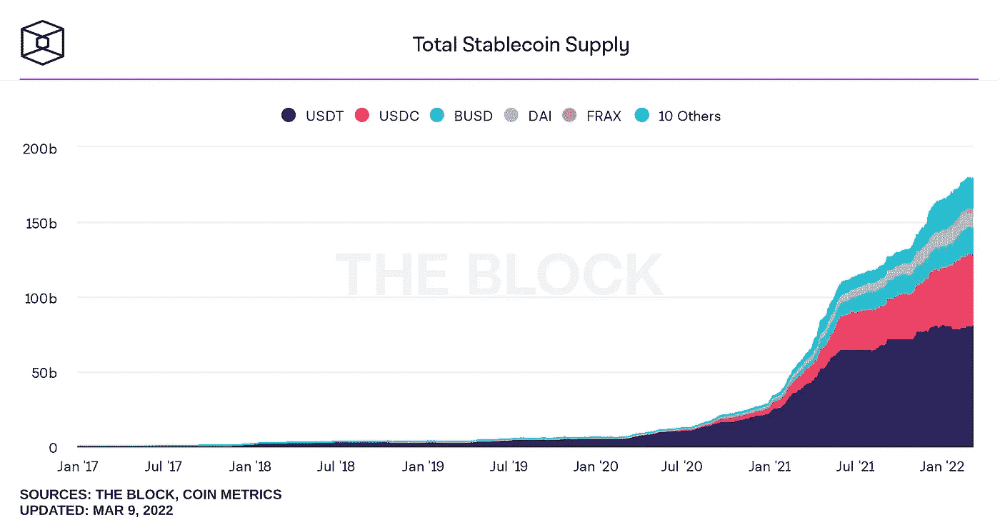
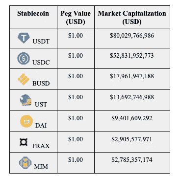
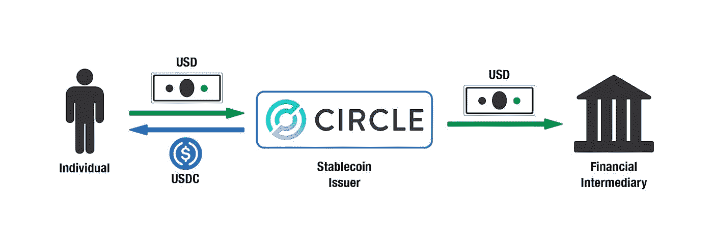
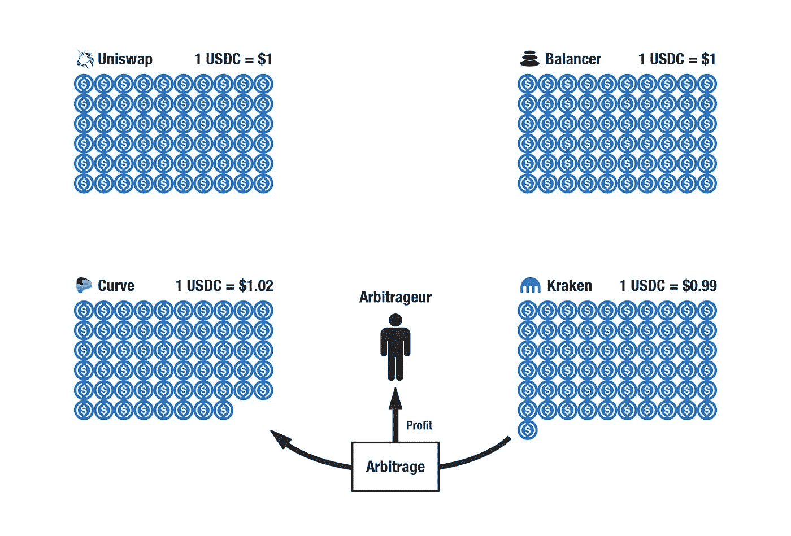
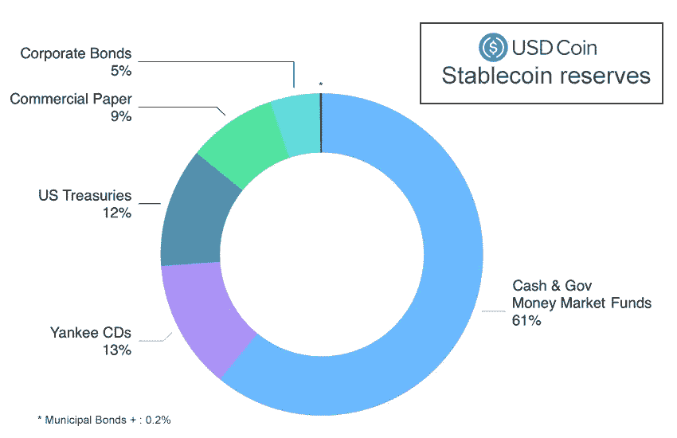
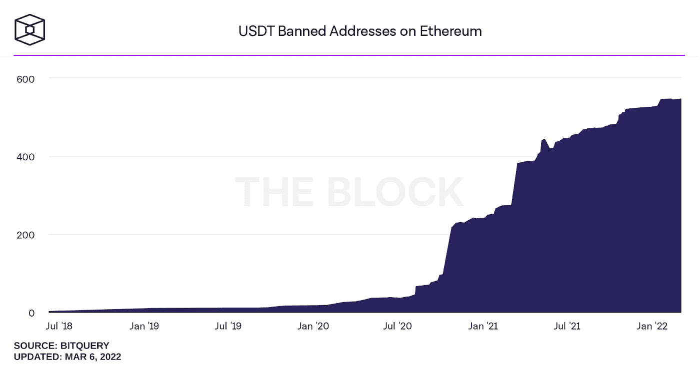
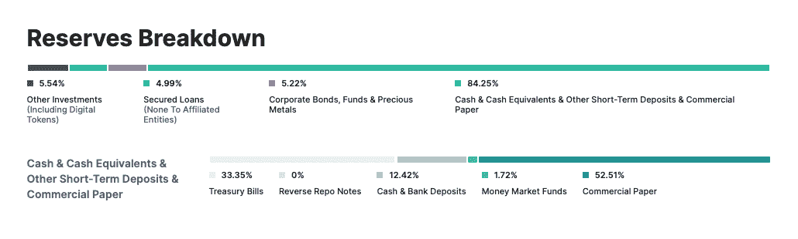

# 稳定的天才:稳定连杆机构设计简介(一)

> 原文：<https://medium.com/coinmonks/stable-genius-5833092f2950?source=collection_archive---------19----------------------->

# 介绍

世界是一个复杂的地方，充满了复杂的创造。Stablecoins 就是其中之一，这篇文章以及随后的文章，试图为读者简化 stablecoins。

稳定密码是一种加密资产，无论市场现象如何，都寻求保持稳定的设定价格。它们支撑着超过 1700 亿美元的加密货币生态系统，并且只会随着加密技术的不断采用而增长。尽管它们在加密货币和大量学术工作中被广泛使用，但公众对这些资产的内部工作原理及其各自的风险的理解仍然模糊不清。本系列试图描述 stablecoins 的发展，通过将 stablecoins 系统化的学术著作浓缩为三篇文章，每篇文章关注不同的 stable coins 设计并概述其资产模型、机械设计和基本风险。我们将 Stablecoins 设计简化为三种机制范式:**保管准备金支持的 Stablecoins** (USDT 和 USDC)；**基于算法杠杆的 Stablecoins** (戴和 Frax)，以及**算法准备金支持的 Stablecoins** (Celo、Fei 和陀螺仪)。这项工作旨在更好地教育公众关于稳定资本的内部运作和风险，以扩大理解，培养健康的怀疑精神，并鼓励进一步的创新。

加密货币和数字资产是世界上最不稳定的金融工具之一。它们的易变性对新用户来说是一种威慑。用价值不断变化的东西来命名价格是不方便的，这反过来使得在支付商品或服务的过程中很难公平和可预测地补偿某人。由于这种波动性，与资金更雄厚的机构投资者相比，新用户在投资和使用加密货币时会承担更多风险。这造成了一个进入壁垒，直到今天仍在限制加密货币的采用。稳定的货币试图将价格稳定在一定水平，以减少波动。稳定货币可能与各种价格挂钩，如黄金和白银的价格，或法定货币，如美元或欧元。

*Market Capitalization Price Data as of 3/8/22

# **托管准备金支持的稳定参与机制**

托管储备支持的稳定资产通过让一个可信的托管人维持资产储备(美元、债券、股票、黄金等)来维持固定价格。)支持稳定的非链币(银行或储备)。保管人发行代表在该储备中持有的资产的链上令牌的数字令牌。用户发送抵押品(资金、资产等。)到发行(铸造)新的链上稳定硬币并将抵押品存储在金融机构如银行的储备。然后，他们可以通过将其代币送回储备来赎回其在储备中的份额，以赎回基础储备资产，该资产随后从流通中移除(烧毁)。这些行为扩大和缩小了流通中稳定硬币的数量，减少或增加了稳定硬币的稀缺性，以响应市场需求增加或降低价格。

The Custodial Reserve-Backed Stablecoin Model (Graphic Courtesy of Yugheng Chen)

这种一对一的交换机制通过为用户创造可靠的赎回价值并保持稳定币的流通供应与其支持之间的平衡，支持稳定币资产的挂钩价格目标。通过从稳定的硬币价格相对于其挂钩的偏差中获利，用户被激励维持稳定的硬币的挂钩价格。如果稳定币的价值趋向于高于其挂钩，用户可以向储备发送资金，以折扣价购买稳定币代币，将代币添加到供应中，将价格提高回挂钩。同样，如果稳定币的价格高于挂钩价，用户将赎回他们的稳定币以获取利润，从而减少供应量并将价格降低到挂钩价。由于用户的预期(用户认为稳定币的价格是 1 美元，因为储备中持有的抵押品支持与 1 美元挂钩)集中在稳定币的挂钩价格上，因此挂钩得以维持。**保管准备金支持模型的一个关键假设是，用户必须相信保管人维持着稳定存款的有偿付能力和稳定的准备金支持**，否则，用户会怀疑其稳定存款的价值，并试图提取它们，从而导致保管准备金的耗尽。

Arbitrageurs are incentivized to support the price peg by profiting from discrepancies in price across exchanges.

用户进行套利进一步推高了稳定的硬币价格:市场参与者利用不同交易所的资产价格差异获利的过程。套利者(不直接使用协议来铸造/兑换代币的外部参与者)试图通过在一个交易所以较低的价格购买稳定的硬币，并在另一个交易所以较高的价格出售它来从这些差异中获利。如果一种稳定的货币突然跌破其挂钩汇率，套利者可以在市场上迅速买入价格较低的稳定货币，并在另一个交易所以更高的价格卖出，从而导致价格朝着预定的挂钩汇率上涨。最终，追求利润的套利者有助于维持稳定的硬币的固定价格，更重要的是使稳定的硬币价格在许多独特的交易所正常化。

# **问题**

保管准备金支持的稳定存款的缺陷是依赖信托保管准备金的结果。**这种信任导致了与银行挤兑、集中黑名单和一般商业透明度相关的担忧**，这反过来会影响用户对稳定币的信心。与传统金融一样，如果用户对稳定币的价值失去信心，他们会像银行一样通过保管准备金来赎回稳定币。在对稳定硬币的价值极度丧失信心的情况下；例如对其抵押品支持的破产担忧，用户可能会试图通过立即赎回他们的稳定债券来大量退出。这种被称为“银行挤兑”的现象可能会导致准备金耗尽，如果准备金缺乏足够的支持，用户资金就会损失，或者准备金违约。因此，托管准备金支持的 stablecoins 应努力为 stablecoins 维持一对一的准备金支持，以确保用户信心，防止银行挤兑，并在银行挤兑的情况下确保用户可以用 stablecoins 兑换其存款资金。

**细分化&偿付能力:**

然而，与传统银行一样，**保管稳定的银行可能会使用其储备**作为抵押品，借出、借入或购买不同的资产，以赚取利润并激励自己。这种储备的“细分”导致 stablecoin 协议的储备比率小于 1 比 1，引发了对破产的担忧，这可能导致用户不信任和银行挤兑。更令人担忧的一点是，在细分其储备的过程中，托管人可能会购买需要定期利息(或期权融资付款)的资产，或使其成为不良投资的交易对手，从而进一步扩大破产风险。在 USDT 的例子中，贷款和公司债券等资产带来了潜在的额外收入，随后打破了一对一的支持。此外，托管的、基于储备的稳定账户依赖于中央集权，在大规模退出的情况下可能会关闭交易，进一步锁定损失。

Circle published asset backing showing the fractionalization issue

**黑名单:**

保管稳定币协议对用户进行重要控制。**当用户将资金存入托管准备金时，托管人对抵押物行使完全控制权**。具体来说，这些协议保留自行决定将用户帐户列入黑名单的权利。列入黑名单的账户不能发送、接收或赎回相关资产，使其持有的任何资产变得一文不值。USDC 和 USDT 过去都曾参与将账户列入黑名单，冻结了总价值超过数亿美元的资产。两家公司都根据政府法律和经常性调查开展了这些流程。就目前情况而言，这对于普通用户来说并不是最相关的威胁，但会引起人们的担忧，即**在任何时间点，任何用户的资金都可能被无限期锁定，并且没有正当程序**。此外，它强调指出，当用户存放抵押品时，他们将该抵押品的完全控制权交给了托管人，托管人可以做他们认为合适的事情，如投资风险资产、非法业务或在危机时期限制用户资金的使用。

**透明度:**

关于托管准备金支持的稳定债券，最紧迫的问题是透明度。**与许多通过区块链公开审计准备金的链上 Defi 协议不同，保管准备金支持的 stablecoins(如 USDT)避免公开这些信息，**引发了对其偿付能力和交易对手风险的担忧。当然，美国的法规和传输法可以解决这一问题，并强制托管人根据美国政府对一些美元支持的应用程序(如 USDT、USDC)的法规公布其资产列表。然而，大多数托管稳定币协议并未寻求遵守此类严格的规定，因此将投资和承担此类风险的决策完全留给个人投资者。一个主要的例子就是 Tether 的空头承诺，提供一个完整的财务审计他们的协议。虽然，直到今天，这个承诺还没有实现，因为没有发布完整的审计，只有自我发布的补充文件。这种缺乏透明度的情况引起了监管机构对托管准备金支持的稳定硬币的关注，由于在货币和法定货币领域都有立足点，它们成为监管打击和用户资金完全损失的主要嫌疑人。

Tether reserves breakdown

# **结论**

保管保留支持 stablecoin 代表了 stable coin 设计的第一次演变。它们的相对简单性和与传统金融模式的一致性导致了它们在稳定货币领域的主导地位。然而，其基本的集中机制对偿付能力、用户资金控制和透明度提出了合理的关注。这些因素推动了算法稳定账户的发展，利用智能合约消除了对集中托管人的需求。这些算法稳定币寻求在不需要任何监管监督或任何外部方干预的情况下运行，仅依赖于市场参与者(如用户和套利者)与智能合约的交互来启动适应稳定币价格并保持稳定挂钩的控制机制。这导致了他们自己独特的挑战，这些挑战源于这些系统不可改变的本质。一旦部署到区块链，算法稳定币的机制就无法适应不断变化的长期市场机制，并且在稳定资产出现危机时几乎无力干预。本系列的下一篇文章将通过描述杠杆支持的算法稳定资本的挑战来开始我们对算法稳定资本的讨论。

# 来源:

*   系绳，“透明”，最后更新:2022 年 3 月 7 日【https://tether.to/en/transparency 
*   Tether 提交的法院文件承认他们并非 100%支持，2019 年 4 月 30 日，[https://www . scribd . com/document/408190969/Zoe-Phillips-Filing-4-30](https://www.scribd.com/document/408190969/Zoe-Phillips-Filing-4-30)
*   “数字美元”，Circle，[https://www . Circle . com/en/Digital-Dollar-stable coin-solutions-for-defi](https://www.circle.com/en/digital-dollar-stablecoin-solutions-for-defi)
*   Manoylov，“Centre Consortium 周三将七个 USDC 地址列入黑名单”，The Block，04/23/2021[https://www . The Block crypto . com/linked/102761/Centre-Consortium-黑名单-Seven-usdc-Addresses-周三](https://www.theblockcrypto.com/linked/102761/centre-consortium-blacklisted-seven-usdc-addresses-wednesday)
*   Ledger Insights，“Circle 公布 USDC Stablecoin 资产支持的详细信息”，2021 年 7 月 21 日，[https://www . ledger Insights . com/Circle-Publishes-details-of-usdc-stable coin-Asset-Backing/](https://www.ledgerinsights.com/circle-publishes-details-of-usdc-stablecoin-asset-backing/)
*   “Stablecoins”，块加密，[https://www . theblockcrypto . com/data/decentralized-finance/stable coins](https://www.theblockcrypto.com/data/decentralized-finance/stablecoins)
*   Klages-Mundt 等人，“稳定资本 2.0:经济基础和基于风险的模型”，2020 年 6 月 12 日。第二届 ACM 金融技术进步会议论文集(AFT '20)，[https://ssrn.com/abstract=3633542](https://ssrn.com/abstract=3633542)
*   Sirer 等人，“稳定币设计的分类框架”，康乃尔大学，2019 年 9 月 18 日，[https://doi.org/10.48550/arXiv.1910.10098](https://doi.org/10.48550/arXiv.1910.10098)

# 作者:

由不稳定的天才写的:Patrick(阅读量很大)，Jacob(想法的家伙)，Niko(我们不能读他的姓)，Rohan(总是有一个热门的约会)，和 Yughen(我们的内部 Pable Picasso)都是 UW 麦迪逊分校的学生，领导着一个稳定的 coin 研究小组。如果你喜欢他们的作品，一定要捐赠给俱乐部加密钱包 badgerblockchain.eth